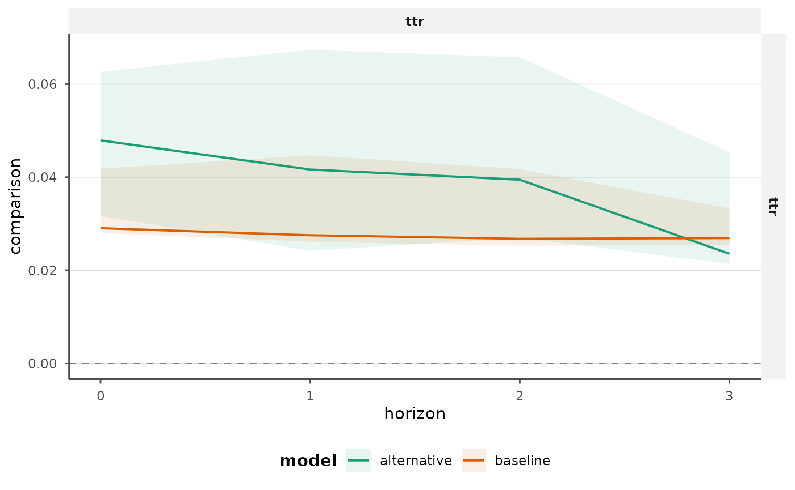
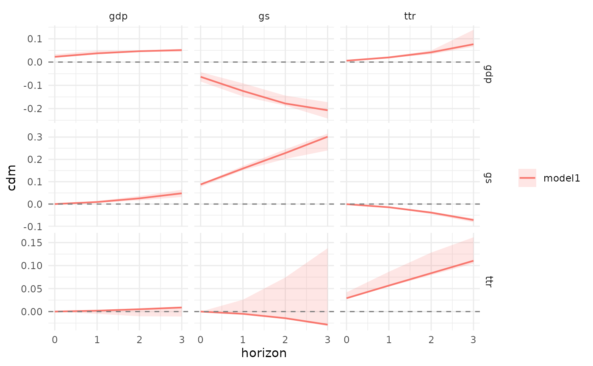
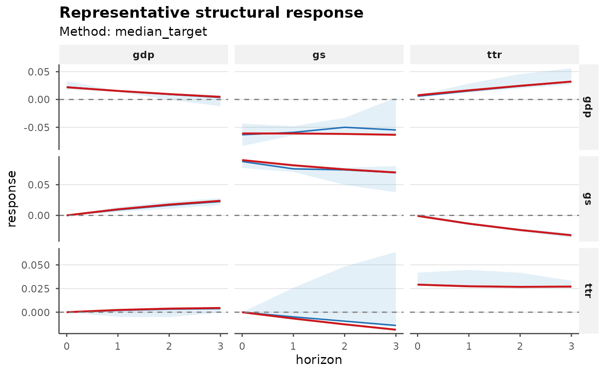

# Getting Started with bsvarPost

`bsvarPost` is a companion post-estimation package for `bsvars` and
`bsvarSIGNs`. It does not estimate models itself. Instead, it adds a
consistent layer for:

- cumulative dynamic multipliers via
  [`cdm()`](https://davidzenz.github.io/bsvarPost/reference/cdm.md)
- tidy extraction helpers
- model comparison utilities
- `ggplot2` plotting methods
- bridges to downstream workflows such as `tsibble` and `APRScenario`
- representative-model summaries and posterior audit helpers

The usual workflow is:

1.  estimate one or more models with `bsvars` or `bsvarSIGNs`
2.  extract tidy posterior summaries or CDMs
3.  compare specifications or identifying assumptions
4.  move the results into publication-oriented tables and plots

## Example: `bsvars`

The code chunks below are written as workflow examples. To keep the
vignette lightweight, most of them are shown but not evaluated during
the build. A small evaluated showcase appears at the end of the vignette
so the rendered document still includes an actual table and plot.

This example uses two lag specifications of the same fiscal model:

- `post`: a baseline model with `p = 1`
- `post_alt`: an alternative specification with `p = 2`

That gives a realistic comparison surface for CDMs, IRFs, and reporting
helpers.

``` r
library(bsvars)
library(bsvarPost)

data(us_fiscal_lsuw)
set.seed(1)

spec <- specify_bsvar$new(us_fiscal_lsuw, p = 1)
post <- estimate(spec, S = 100, thin = 1, show_progress = FALSE)

spec_alt <- specify_bsvar$new(us_fiscal_lsuw, p = 2)
post_alt <- estimate(spec_alt, S = 100, thin = 1, show_progress = FALSE)
```

Compute cumulative dynamic multipliers:

``` r
cdm_obj <- cdm(post, horizon = 8)
cdr_cmp <- compare_cdm(baseline = post, alternative = post_alt, horizon = 8)
summary(cdm_obj)
plot(cdm_obj)
ggplot2::autoplot(cdr_cmp)
```

Normalize by the sample standard deviation of the shocked variable only
if that is the reporting convention you want:

``` r
cdm_scaled <- cdm(post, horizon = 8, scale_by = "shock_sd")
```

Interpretation note:

- `scale_by = "shock_sd"` is a reporting normalization
- the default unscaled output remains the standard CDM object

Extract tidy tables for downstream analysis:

``` r
irf_tbl <- tidy_irf(post, horizon = 8)
cdm_tbl <- tidy_cdm(post, horizon = 8)
fevd_tbl <- tidy_fevd(post, horizon = 8)
fc_tbl <- tidy_forecast(post, horizon = 8)
```

Plot tidy outputs with `ggplot2` defaults:

``` r
ggplot2::autoplot(irf_tbl)
ggplot2::autoplot(cdm_tbl)
ggplot2::autoplot(compare_irf(baseline = post, alternative = post_alt, horizon = 8))

style_bsvar_plot(
  ggplot2::autoplot(cdm_tbl),
  preset = "paper",
  palette = c("#1b9e77", "#d95f02")
)

template_bsvar_plot(
  ggplot2::autoplot(irf_tbl),
  family = "irf",
  preset = "paper"
)
```

Representative-model summaries are useful when you want a single draw
that is close to the posterior center rather than pointwise medians that
need not correspond to one structural model.

``` r
rep_irf <- median_target_irf(post, horizon = 8)
summary(rep_irf)
plot(rep_irf)
```

Interpretation note:

- `median_target_*()` gives you one coherent stored draw close to the
  posterior center
- this is often preferable to reporting pointwise medians as if they
  were one structural model

Posterior hypothesis and magnitude statements can be evaluated directly
from the response draws.

``` r
hypothesis_irf(post, variable = 1, shock = 1, horizon = 4, relation = ">", value = 0)
magnitude_audit(post, type = "cdm", variable = 1, shock = 1, horizon = 8, relation = ">", value = 0)
joint_hypothesis_irf(post, variable = 1, shock = 1, horizon = 0:2, relation = ">", value = 0)
simultaneous_irf(post, horizon = 8, variable = 1, shock = 1)
plot_simultaneous(post, type = "irf", horizon = 8, variable = 1, shock = 1)
plot_joint_hypothesis(
  post,
  type = "irf",
  variable = 1,
  shock = 1,
  horizon = 0:2,
  relation = ">",
  value = 0
)
plot_hypothesis(post, type = "irf", variable = 1, shock = 1, horizon = 0:4, relation = ">", value = 0)
```

You can also summarise the shape of the response distribution directly.

``` r
peak_tbl <- peak_response(
  post,
  type = "irf",
  horizon = 8,
  variable = 1,
  shock = 1
)
peak_tbl

duration_tbl <- duration_response(
  post,
  type = "cdm",
  horizon = 8,
  variable = 1,
  shock = 1,
  relation = ">",
  value = 0,
  mode = "total"
)
duration_tbl

half_life_tbl <- half_life_response(
  post,
  type = "irf",
  horizon = 8,
  variable = 1,
  shock = 1,
  baseline = "peak"
)
half_life_tbl

time_tbl <- time_to_threshold(
  post,
  type = "cdm",
  horizon = 8,
  variable = 1,
  shock = 1,
  relation = ">",
  value = 0
)
time_tbl
```

These summaries also support cross-model comparison.
[`half_life_response()`](https://davidzenz.github.io/bsvarPost/reference/half_life_response.md)
reports the time needed for a response to fall to a chosen fraction of
its peak or initial level, while
[`time_to_threshold()`](https://davidzenz.github.io/bsvarPost/reference/time_to_threshold.md)
reports the first horizon at which a threshold condition is met.

``` r
compare_peak_response(
  baseline = post,
  alternative = post_alt,
  type = "irf",
  horizon = 8,
  variable = 1,
  shock = 1
)

compare_duration_response(
  baseline = post,
  alternative = post_alt,
  type = "cdm",
  horizon = 8,
  variable = 1,
  shock = 1,
  relation = ">",
  value = 0,
  mode = "total"
)

compare_half_life_response(
  baseline = post,
  alternative = post_alt,
  type = "irf",
  horizon = 8,
  variable = 1,
  shock = 1,
  baseline = "peak"
)

compare_time_to_threshold(
  baseline = post,
  alternative = post_alt,
  type = "cdm",
  horizon = 8,
  variable = 1,
  shock = 1,
  relation = ">",
  value = 0
)

plot_compare_response(compare_peak_response(
  baseline = post,
  alternative = post_alt,
  type = "irf",
  horizon = 8,
  variable = 1,
  shock = 1
))
```

Interpretation note:

- `reached_prob` is the posterior share of draws that satisfy the
  requested timing condition within the chosen horizon
- if `reached_prob` is low, the associated timing summary is conditional
  on a relatively small subset of the posterior

## Example: `bsvarSIGNs`

`bsvarPost` uses the same post-estimation interface for sign-restricted
models.

``` r
library(bsvarSIGNs)
library(bsvarPost)

data(optimism)

sign_irf <- matrix(c(0, 1, rep(NA, 23)), 5, 5)

spec <- specify_bsvarSIGN$new(
  optimism * 100,
  p = 4,
  sign_irf = sign_irf
)

post <- estimate(spec, S = 100, thin = 1, show_progress = FALSE)

spec_alt <- specify_bsvarSIGN$new(
  optimism * 100,
  p = 2,
  sign_irf = sign_irf
)
post_alt <- estimate(spec_alt, S = 100, thin = 1, show_progress = FALSE)
```

Compute and summarize CDMs:

``` r
cdm_obj <- cdm(post, horizon = 12)
summary(cdm_obj)
plot(cdm_obj)
```

Extract tidy summaries:

``` r
irf_tbl <- tidy_irf(post, horizon = 12)
cdm_tbl <- tidy_cdm(post, horizon = 12)
fevd_tbl <- tidy_fevd(post, horizon = 12)
```

`bsvarPost` also supports representative sign-restricted summaries and
restriction audits. `median_target_*()` selects the stored draw closest
to the posterior center. `most_likely_admissible_*()` ranks stored
admissible draws by the reconstructed sign-restriction score available
from `bsvarSIGNs`.

``` r
rep_median <- median_target_irf(post, horizon = 12)
rep_mla <- most_likely_admissible_irf(post, horizon = 12)
summary(rep_median)
summary(rep_mla)

audit_tbl <- restriction_audit(post)
audit_tbl
plot_restriction_audit(audit_tbl)

diag_tbl <- acceptance_diagnostics(post)
diag_tbl

summary(diag_tbl)

compare_acceptance_diagnostics(baseline = post, alternative = post_alt)
plot_acceptance_diagnostics(diag_tbl, metrics = c("effective_sample_size", "kernel_zero_share"))
```

Interpretation note:

- `most_likely_admissible_*()` is only available for
  `PosteriorBSVARSIGN`
- [`restriction_audit()`](https://davidzenz.github.io/bsvarPost/reference/restriction_audit.md)
  and
  [`magnitude_audit()`](https://davidzenz.github.io/bsvarPost/reference/magnitude_audit.md)
  are post-estimation tools; they do not alter the identification scheme
  used in estimation

Magnitude restrictions in `bsvarPost` are post-estimation summaries, not
identification constraints.

``` r
magnitude_audit(post, type = "irf", variable = 2, shock = 1, horizon = 0, relation = ">", value = 0)
```

## Comparing models

Comparison helpers accept several posterior objects and return tidy
comparison tables.

``` r
cmp_irf <- compare_irf(
  baseline = post,
  alternative = post_alt,
  horizon = 8
)

cmp_cdm <- compare_cdm(
  baseline = post,
  alternative = post_alt,
  horizon = 8
)

ggplot2::autoplot(cmp_irf)
ggplot2::autoplot(cmp_cdm)
```

Restriction audits can also be compared directly across models.

``` r
compare_restrictions(
  baseline = post,
  alternative = post_alt,
  restrictions = list(irf_restriction(variable = 1, shock = 1, horizon = 0, sign = 1))
)

plot_compare_restrictions(compare_restrictions(
  baseline = post,
  alternative = post_alt,
  restrictions = list(irf_restriction(variable = 1, shock = 1, horizon = 0, sign = 1))
))
```

## Reporting helpers

Most `bsvarPost` outputs are already tidy tables, so a first reporting
layer can stay simple: render them directly to `knitr`, `gt`,
`flextable`, or CSV. Use `preset = "compact"` when you want a narrower
publication-oriented column selection.

``` r
cmp_tbl <- compare_irf(
  baseline = post,
  alternative = post_alt,
  horizon = 8
)

report_table(cmp_tbl, preset = "compact", digits = 3)
as_kable(cmp_tbl, caption = "Impulse-response comparison", digits = 3, preset = "compact")
write_bsvar_csv(cmp_tbl, tempfile(fileext = ".csv"), preset = "compact")

if (requireNamespace("gt", quietly = TRUE)) {
  as_gt(cmp_tbl, caption = "Impulse-response comparison", digits = 3, preset = "compact")
}

if (requireNamespace("flextable", quietly = TRUE)) {
  as_flextable(cmp_tbl, caption = "Impulse-response comparison", digits = 3, preset = "compact")
}

bundle <- report_bundle(
  cmp_tbl,
  caption = "Impulse-response comparison",
  digits = 3,
  preset = "compact"
)

bundle
bundle$plot
as_kable(bundle)

rep_bundle <- report_bundle(
  median_target_irf(post, horizon = 8),
  caption = "Representative impulse response"
)

rep_bundle$plot
as_kable(rep_bundle, preset = "compact")

diag_bundle <- report_bundle(
  acceptance_diagnostics(post),
  caption = "Acceptance diagnostics",
  preset = "compact"
)

diag_bundle$plot
as_kable(diag_bundle)

joint_bundle <- report_bundle(
  joint_hypothesis_irf(post, variable = 1, shock = 1, horizon = 0:2, relation = ">", value = 0),
  caption = "Joint posterior statement",
  preset = "compact"
)

joint_bundle$plot
as_kable(joint_bundle)

hd_bundle <- report_bundle(
  tidy_hd_event(post, start = 1, end = 4),
  preset = "compact"
)

hd_bundle$caption
hd_bundle$plot
as_kable(hd_bundle)

publish_bsvar_plot(cmp_tbl, preset = "paper")
publish_bsvar_plot(median_target_irf(post, horizon = 8), preset = "paper")
publish_bsvar_plot(diag_tbl, preset = "slides")

`report_table()` also applies publication-facing column labels such as
`Posterior probability`, `Median half-life`, and `Critical value`.
```

A practical rule of thumb is:

- use `report_table(..., preset = "compact")` for paper tables
- use
  [`report_bundle()`](https://davidzenz.github.io/bsvarPost/reference/reporting.md)
  when you want the natural table-plus-plot pair
- use
  [`publish_bsvar_plot()`](https://davidzenz.github.io/bsvarPost/reference/publish_bsvar_plot.md)
  when you want family-aware styling without manual theme plumbing

## Rendered showcase

These final chunks reuse the same baseline-versus-alternative `bsvars`
workflow on a much smaller posterior sample so the rendered document
includes actual tables and plots without making the build heavy.

``` r
library(bsvars)
library(bsvarPost)
data(us_fiscal_lsuw)
set.seed(11)
demo_spec <- specify_bsvar$new(us_fiscal_lsuw, p = 1)
#> The identification is set to the default option of lower-triangular structural matrix.
demo_post <- estimate(demo_spec, S = 8, thin = 1, show_progress = FALSE)
demo_spec_alt <- specify_bsvar$new(us_fiscal_lsuw, p = 3)
#> The identification is set to the default option of lower-triangular structural matrix.
demo_post_alt <- estimate(demo_spec_alt, S = 8, thin = 1, show_progress = FALSE)
```

``` r
demo_cmp <- compare_irf(
  baseline = demo_post,
  alternative = demo_post_alt,
  horizon = 3
)
demo_cmp_focus <- demo_cmp[
  demo_cmp$variable == unique(demo_cmp$variable)[1] &
    demo_cmp$shock == unique(demo_cmp$shock)[1],
  ,
  drop = FALSE
]

as_kable(demo_cmp_focus, preset = "compact", digits = 3)
```

| Model       | Variable | Shock | Horizon |  Mean | Median | Lower | Upper |
|:------------|:---------|:------|--------:|------:|-------:|------:|------:|
| baseline    | ttr      | ttr   |       0 | 0.044 |  0.029 | 0.028 | 0.042 |
| baseline    | ttr      | ttr   |       1 | 0.102 |  0.028 | 0.026 | 0.045 |
| baseline    | ttr      | ttr   |       2 | 0.145 |  0.027 | 0.025 | 0.042 |
| baseline    | ttr      | ttr   |       3 | 0.197 |  0.027 | 0.025 | 0.033 |
| alternative | ttr      | ttr   |       0 | 0.050 |  0.048 | 0.032 | 0.063 |
| alternative | ttr      | ttr   |       1 | 0.041 |  0.042 | 0.024 | 0.067 |
| alternative | ttr      | ttr   |       2 | 0.044 |  0.039 | 0.027 | 0.066 |
| alternative | ttr      | ttr   |       3 | 0.030 |  0.024 | 0.021 | 0.045 |

``` r
template_bsvar_plot(
  ggplot2::autoplot(demo_cmp_focus),
  family = "comparison",
  preset = "paper"
)
```



``` r
demo_cdm <- cdm(demo_post, horizon = 3)
as_kable(summary(demo_cdm), preset = "compact", digits = 3)
```

| Model  | Variable | Shock | Horizon |   Mean | Median |  Lower |  Upper |
|:-------|:---------|:------|--------:|-------:|-------:|-------:|-------:|
| model1 | ttr      | ttr   |       0 |  0.044 |  0.029 |  0.028 |  0.042 |
| model1 | ttr      | ttr   |       1 |  0.146 |  0.057 |  0.054 |  0.087 |
| model1 | ttr      | ttr   |       2 |  0.291 |  0.084 |  0.079 |  0.128 |
| model1 | ttr      | ttr   |       3 |  0.488 |  0.111 |  0.105 |  0.161 |
| model1 | ttr      | gs    |       0 |  0.000 |  0.000 |  0.000 |  0.000 |
| model1 | ttr      | gs    |       1 |  0.055 | -0.005 | -0.006 |  0.026 |
| model1 | ttr      | gs    |       2 |  0.153 | -0.014 | -0.016 |  0.074 |
| model1 | ttr      | gs    |       3 |  0.303 | -0.028 | -0.031 |  0.138 |
| model1 | ttr      | gdp   |       0 |  0.000 |  0.000 |  0.000 |  0.000 |
| model1 | ttr      | gdp   |       1 | -0.003 |  0.002 | -0.005 |  0.002 |
| model1 | ttr      | gdp   |       2 | -0.005 |  0.005 | -0.010 |  0.006 |
| model1 | ttr      | gdp   |       3 | -0.003 |  0.009 | -0.011 |  0.011 |
| model1 | gs       | ttr   |       0 |  0.085 | -0.001 | -0.002 |  0.002 |
| model1 | gs       | ttr   |       1 |  0.205 | -0.014 | -0.016 | -0.013 |
| model1 | gs       | ttr   |       2 |  0.373 | -0.038 | -0.045 | -0.034 |
| model1 | gs       | ttr   |       3 |  0.616 | -0.072 | -0.082 | -0.065 |
| model1 | gs       | gs    |       0 |  0.146 |  0.088 |  0.077 |  0.090 |
| model1 | gs       | gs    |       1 |  0.328 |  0.159 |  0.152 |  0.171 |
| model1 | gs       | gs    |       2 |  0.555 |  0.228 |  0.202 |  0.245 |
| model1 | gs       | gs    |       3 |  0.850 |  0.302 |  0.240 |  0.316 |
| model1 | gs       | gdp   |       0 |  0.000 |  0.000 |  0.000 |  0.000 |
| model1 | gs       | gdp   |       1 |  0.009 |  0.009 |  0.006 |  0.014 |
| model1 | gs       | gdp   |       2 |  0.026 |  0.025 |  0.016 |  0.036 |
| model1 | gs       | gdp   |       3 |  0.051 |  0.048 |  0.032 |  0.064 |
| model1 | gdp      | ttr   |       0 | -0.093 |  0.006 |  0.004 |  0.008 |
| model1 | gdp      | ttr   |       1 | -0.073 |  0.020 |  0.017 |  0.024 |
| model1 | gdp      | ttr   |       2 | -0.002 |  0.042 |  0.034 |  0.050 |
| model1 | gdp      | ttr   |       3 |  0.104 |  0.077 |  0.066 |  0.139 |
| model1 | gdp      | gs    |       0 | -0.145 | -0.063 | -0.084 | -0.043 |
| model1 | gdp      | gs    |       1 | -0.204 | -0.124 | -0.148 | -0.091 |
| model1 | gdp      | gs    |       2 | -0.218 | -0.178 | -0.187 | -0.144 |
| model1 | gdp      | gs    |       3 | -0.197 | -0.207 | -0.243 | -0.172 |
| model1 | gdp      | gdp   |       0 |  0.037 |  0.023 |  0.018 |  0.033 |
| model1 | gdp      | gdp   |       1 |  0.049 |  0.037 |  0.033 |  0.049 |
| model1 | gdp      | gdp   |       2 |  0.051 |  0.047 |  0.045 |  0.049 |
| model1 | gdp      | gdp   |       3 |  0.050 |  0.052 |  0.044 |  0.056 |

``` r
plot(demo_cdm)
```



``` r
demo_rep <- median_target_irf(demo_post, horizon = 3)
as_kable(summary(demo_rep), preset = "compact", digits = 3)
```

| Model  | Variable | Shock | Horizon |   Mean | Median |  Lower |  Upper |
|:-------|:---------|:------|--------:|-------:|-------:|-------:|-------:|
| model1 | ttr      | ttr   |       0 |  0.029 |  0.029 |  0.029 |  0.029 |
| model1 | ttr      | ttr   |       1 |  0.027 |  0.027 |  0.027 |  0.027 |
| model1 | ttr      | ttr   |       2 |  0.027 |  0.027 |  0.027 |  0.027 |
| model1 | ttr      | ttr   |       3 |  0.027 |  0.027 |  0.027 |  0.027 |
| model1 | ttr      | gs    |       0 |  0.000 |  0.000 |  0.000 |  0.000 |
| model1 | ttr      | gs    |       1 | -0.007 | -0.007 | -0.007 | -0.007 |
| model1 | ttr      | gs    |       2 | -0.013 | -0.013 | -0.013 | -0.013 |
| model1 | ttr      | gs    |       3 | -0.018 | -0.018 | -0.018 | -0.018 |
| model1 | ttr      | gdp   |       0 |  0.000 |  0.000 |  0.000 |  0.000 |
| model1 | ttr      | gdp   |       1 |  0.002 |  0.002 |  0.002 |  0.002 |
| model1 | ttr      | gdp   |       2 |  0.004 |  0.004 |  0.004 |  0.004 |
| model1 | ttr      | gdp   |       3 |  0.004 |  0.004 |  0.004 |  0.004 |
| model1 | gs       | ttr   |       0 | -0.001 | -0.001 | -0.001 | -0.001 |
| model1 | gs       | ttr   |       1 | -0.013 | -0.013 | -0.013 | -0.013 |
| model1 | gs       | ttr   |       2 | -0.024 | -0.024 | -0.024 | -0.024 |
| model1 | gs       | ttr   |       3 | -0.032 | -0.032 | -0.032 | -0.032 |
| model1 | gs       | gs    |       0 |  0.090 |  0.090 |  0.090 |  0.090 |
| model1 | gs       | gs    |       1 |  0.082 |  0.082 |  0.082 |  0.082 |
| model1 | gs       | gs    |       2 |  0.075 |  0.075 |  0.075 |  0.075 |
| model1 | gs       | gs    |       3 |  0.070 |  0.070 |  0.070 |  0.070 |
| model1 | gs       | gdp   |       0 |  0.000 |  0.000 |  0.000 |  0.000 |
| model1 | gs       | gdp   |       1 |  0.010 |  0.010 |  0.010 |  0.010 |
| model1 | gs       | gdp   |       2 |  0.018 |  0.018 |  0.018 |  0.018 |
| model1 | gs       | gdp   |       3 |  0.024 |  0.024 |  0.024 |  0.024 |
| model1 | gdp      | ttr   |       0 |  0.008 |  0.008 |  0.008 |  0.008 |
| model1 | gdp      | ttr   |       1 |  0.016 |  0.016 |  0.016 |  0.016 |
| model1 | gdp      | ttr   |       2 |  0.025 |  0.025 |  0.025 |  0.025 |
| model1 | gdp      | ttr   |       3 |  0.032 |  0.032 |  0.032 |  0.032 |
| model1 | gdp      | gs    |       0 | -0.061 | -0.061 | -0.061 | -0.061 |
| model1 | gdp      | gs    |       1 | -0.061 | -0.061 | -0.061 | -0.061 |
| model1 | gdp      | gs    |       2 | -0.062 | -0.062 | -0.062 | -0.062 |
| model1 | gdp      | gs    |       3 | -0.064 | -0.064 | -0.064 | -0.064 |
| model1 | gdp      | gdp   |       0 |  0.022 |  0.022 |  0.022 |  0.022 |
| model1 | gdp      | gdp   |       1 |  0.015 |  0.015 |  0.015 |  0.015 |
| model1 | gdp      | gdp   |       2 |  0.010 |  0.010 |  0.010 |  0.010 |
| model1 | gdp      | gdp   |       3 |  0.005 |  0.005 |  0.005 |  0.005 |

``` r
publish_bsvar_plot(demo_rep, preset = "paper")
```



For the website, `bsvarPost` also ships a small set of pre-rendered
showcase figures generated from larger posterior samples and slightly
longer horizons. These are not rebuilt during every vignette render,
which keeps CI stable while still showing what the publication-oriented
plots look like in a less toy-like setting.

## Historical decomposition events

For event studies, `bsvarPost` can aggregate historical decomposition
draws over a selected window and rank shocks by their cumulative
contribution.

``` r
hd_event <- tidy_hd_event(post, start = 1, end = 4)
hd_event

shock_ranking(post, start = 1, end = 4, ranking = "absolute")

plot_hd_event(post, start = 1, end = 4)
plot_shock_ranking(post, start = 1, end = 4, ranking = "absolute", top_n = 5)

style_bsvar_plot(
  plot_shock_ranking(post, start = 1, end = 4, ranking = "absolute", top_n = 5),
  preset = "slides"
)

annotate_bsvar_plot(
  plot_hd_event(post, start = 1, end = 4),
  title = "Event-window contributions",
  xintercept = 1
)
```

These event summaries can also be compared across fitted models.

``` r
cmp_hd_event <- compare_hd_event(baseline = post, alternative = post_alt, start = 1, end = 4)
cmp_hd_event
```

## `tsibble` bridge

If `tsibble` is installed, tidy outputs can be converted directly:

``` r
library(tsibble)

fc_tbl <- tidy_forecast(post, horizon = 8)
fc_tsbl <- as_tsibble_post(fc_tbl)
```

For IRF, CDM, and FEVD outputs, `horizon` is used as the index. For
forecast, shock, and historical decomposition outputs, `time` is used
when available.

## APRScenario bridge

`APRScenario` uses forecast summaries with columns `hor`, `variable`,
`lower`, `center`, and `upper`. `bsvarPost` provides converters in both
directions.

``` r
fc_tbl <- tidy_forecast(post, horizon = 8)

apr_tbl <- as_apr_cond_forc(
  fc_tbl,
  origin = as.Date("2024-01-01"),
  frequency = "quarter"
)

back_to_tidy <- tidy_apr_forecast(apr_tbl)
```

If `APRScenario` is installed, you can also forward to its matrix
generator:

``` r
mats <- apr_gen_mats(post, specification = spec)
```
