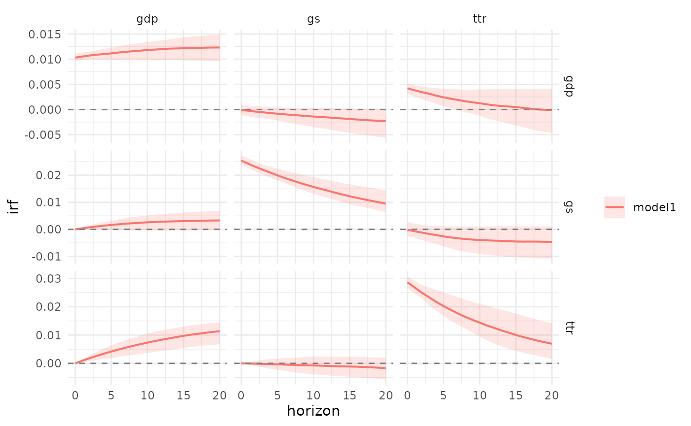
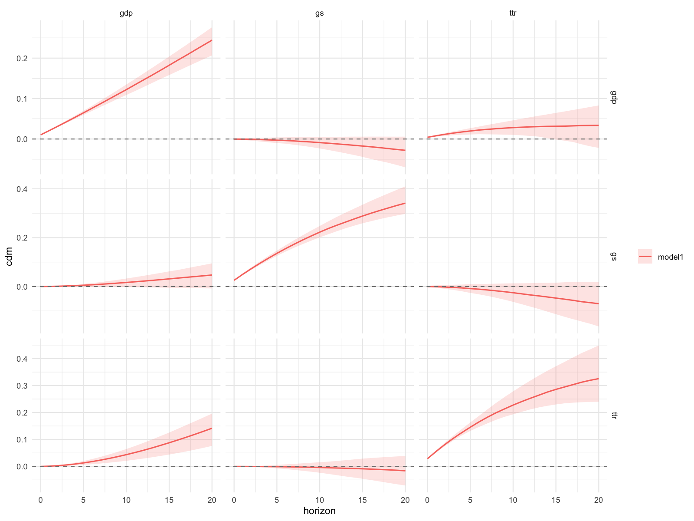
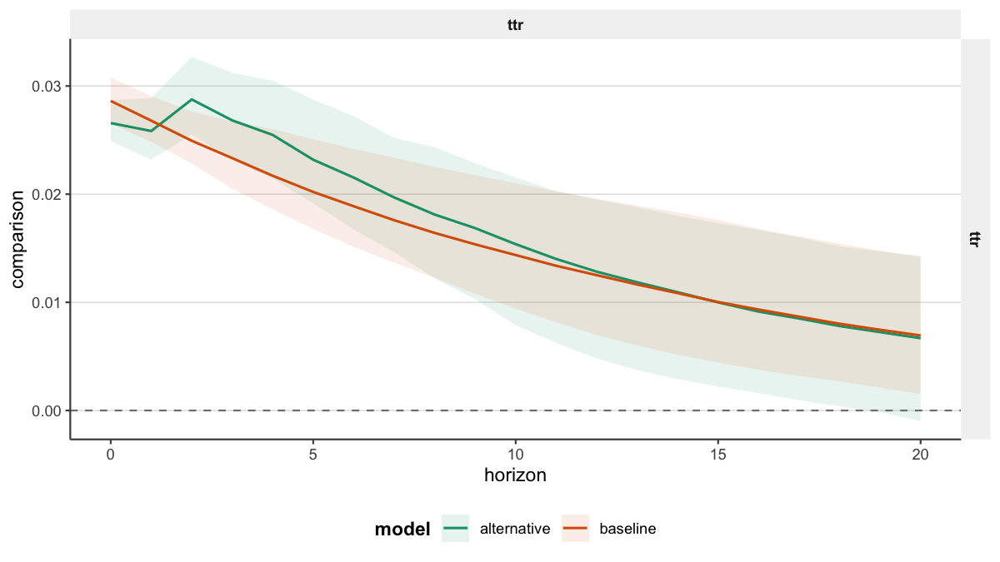
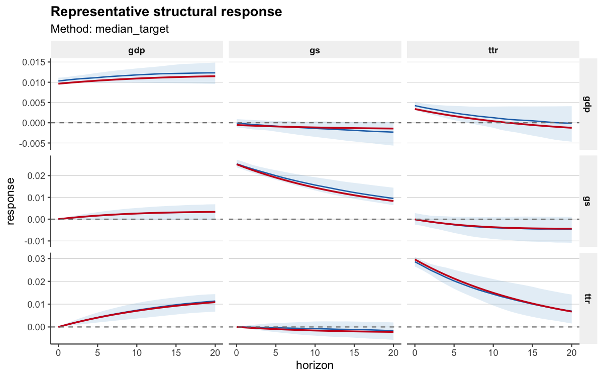

# Getting Started with bsvarPost

`bsvarPost` is a companion post-estimation package for `bsvars` and
`bsvarSIGNs`. It does not estimate models. Instead it provides:

- tidy extraction of impulse responses, CDMs, FEVD, and forecasts
- model comparison utilities across lag specifications or identifying
  assumptions
- `ggplot2` plot methods and publication-oriented styling
- reporting helpers for `knitr`, `gt`, `flextable`, and CSV

The core question answered in this vignette is: **How do fiscal spending
shocks propagate through the US economy?** We use the `us_fiscal_lsuw`
dataset from `bsvars`, which contains quarterly US data on three
variables — `ttr` (tax-to-revenue), `gs` (government spending), and
`gdp` — to estimate a structural VAR and post-process the results with
`bsvarPost`.

## Estimation setup

The code below produces two posterior objects. We use pre-computed
results for build speed — the
[`readRDS()`](https://rdrr.io/r/base/readRDS.html) calls in the hidden
setup chunk have already loaded them.

``` r
library(bsvars)
library(bsvarPost)

data(us_fiscal_lsuw)
# Variables: ttr (tax-to-revenue), gs (government spending), gdp

# Baseline: p = 1 lag
set.seed(123)
spec     <- specify_bsvar$new(us_fiscal_lsuw, p = 1)
post     <- estimate(spec, S = 200, thin = 1, show_progress = FALSE)

# Alternative: p = 3 lags
set.seed(456)
spec_alt <- specify_bsvar$new(us_fiscal_lsuw, p = 3)
post_alt <- estimate(spec_alt, S = 200, thin = 1, show_progress = FALSE)
```

## Extracting impulse responses

[`tidy_irf()`](https://davidzenz.github.io/bsvarPost/reference/tidy_irf.md)
returns a tidy table with posterior summaries (median, credible interval
bounds) for every variable-shock pair at each horizon. The column
`variable` names the responding variable and `shock` names the
structural shock.

``` r
irf_tbl <- tidy_irf(post, horizon = 20)
head(irf_tbl)
#> # A tibble: 6 × 10
#>   model  object_type variable shock horizon   mean median      sd  lower  upper
#>   <chr>  <chr>       <chr>    <chr>   <dbl>  <dbl>  <dbl>   <dbl>  <dbl>  <dbl>
#> 1 model1 irf         ttr      ttr         0 0.0291 0.0286 0.00666 0.0265 0.0308
#> 2 model1 irf         ttr      ttr         1 0.0260 0.0268 0.0119  0.0248 0.0291
#> 3 model1 irf         ttr      ttr         2 0.0226 0.0249 0.0350  0.0228 0.0277
#> 4 model1 irf         ttr      ttr         3 0.0189 0.0233 0.0643  0.0205 0.0267
#> 5 model1 irf         ttr      ttr         4 0.0148 0.0217 0.101   0.0186 0.0260
#> 6 model1 irf         ttr      ttr         5 0.0100 0.0202 0.147   0.0168 0.0251
```

[`ggplot2::autoplot()`](https://ggplot2.tidyverse.org/reference/autoplot.html)
produces a faceted fan chart — one panel per variable-shock pair, with
shaded credible bands:

``` r
ggplot2::autoplot(irf_tbl)
```



The `gs` shock column shows how a one-standard-deviation increase in
government spending affects `ttr`, `gs`, and `gdp` over 20 quarters.

## Cumulative dynamic multipliers

Cumulative dynamic multipliers (CDMs) integrate the impulse responses
over the horizon, making them the natural quantity for fiscal multiplier
analysis.

``` r
cdm_obj <- cdm(post, horizon = 20)
summary(cdm_obj)
#> # A tibble: 189 × 10
#>    model  object_type variable shock horizon   mean median      sd  lower  upper
#>    <chr>  <chr>       <chr>    <chr>   <dbl>  <dbl>  <dbl>   <dbl>  <dbl>  <dbl>
#>  1 model1 cdm         ttr      ttr         0 0.0291 0.0286 0.00666 0.0265 0.0308
#>  2 model1 cdm         ttr      ttr         1 0.0551 0.0553 0.00581 0.0514 0.0595
#>  3 model1 cdm         ttr      ttr         2 0.0778 0.0804 0.0404  0.0746 0.0872
#>  4 model1 cdm         ttr      ttr         3 0.0967 0.104  0.105   0.0957 0.113 
#>  5 model1 cdm         ttr      ttr         4 0.111  0.125  0.206   0.115  0.138 
#>  6 model1 cdm         ttr      ttr         5 0.121  0.145  0.352   0.132  0.163 
#>  7 model1 cdm         ttr      ttr         6 0.126  0.165  0.555   0.146  0.187 
#>  8 model1 cdm         ttr      ttr         7 0.124  0.183  0.828   0.160  0.211 
#>  9 model1 cdm         ttr      ttr         8 0.115  0.199  1.19    0.173  0.235 
#> 10 model1 cdm         ttr      ttr         9 0.0960 0.213  1.65    0.184  0.257 
#> # ℹ 179 more rows
```

The pre-rendered figure below, generated from the same posterior at a
longer horizon, gives a cleaner view of the multiplier path:



The `gdp` row of the CDM table answers the fiscal-multiplier question
directly: by horizon 20, how much has cumulative GDP responded to the
`gs` spending shock?

## Comparing model specifications

Different lag orders can shift the estimated multiplier meaningfully.
The comparison helpers place two posteriors side by side in a single
tidy table.

``` r
cmp_irf <- compare_irf(baseline = post, alternative = post_alt, horizon = 20)
head(cmp_irf)
#> # A tibble: 6 × 10
#>   model   object_type variable shock horizon   mean median      sd  lower  upper
#>   <chr>   <chr>       <chr>    <chr>   <dbl>  <dbl>  <dbl>   <dbl>  <dbl>  <dbl>
#> 1 baseli… irf         ttr      ttr         0 0.0291 0.0286 0.00666 0.0265 0.0308
#> 2 baseli… irf         ttr      ttr         1 0.0260 0.0268 0.0119  0.0248 0.0291
#> 3 baseli… irf         ttr      ttr         2 0.0226 0.0249 0.0350  0.0228 0.0277
#> 4 baseli… irf         ttr      ttr         3 0.0189 0.0233 0.0643  0.0205 0.0267
#> 5 baseli… irf         ttr      ttr         4 0.0148 0.0217 0.101   0.0186 0.0260
#> 6 baseli… irf         ttr      ttr         5 0.0100 0.0202 0.147   0.0168 0.0251
```

The named arguments `baseline` and `alternative` become the `model`
column labels in the output.
[`ggplot2::autoplot()`](https://ggplot2.tidyverse.org/reference/autoplot.html)
overlays both posterior bands:



CDMs can be compared the same way:

``` r
cmp_cdm <- compare_cdm(baseline = post, alternative = post_alt, horizon = 20)
head(cmp_cdm)
#> # A tibble: 6 × 10
#>   model   object_type variable shock horizon   mean median      sd  lower  upper
#>   <chr>   <chr>       <chr>    <chr>   <dbl>  <dbl>  <dbl>   <dbl>  <dbl>  <dbl>
#> 1 baseli… cdm         ttr      ttr         0 0.0291 0.0286 0.00666 0.0265 0.0308
#> 2 baseli… cdm         ttr      ttr         1 0.0551 0.0553 0.00581 0.0514 0.0595
#> 3 baseli… cdm         ttr      ttr         2 0.0778 0.0804 0.0404  0.0746 0.0872
#> 4 baseli… cdm         ttr      ttr         3 0.0967 0.104  0.105   0.0957 0.113 
#> 5 baseli… cdm         ttr      ttr         4 0.111  0.125  0.206   0.115  0.138 
#> 6 baseli… cdm         ttr      ttr         5 0.121  0.145  0.352   0.132  0.163
```

The `p = 3` alternative typically shows a slower decay in the `gdp`
multiplier, reflecting richer lag dynamics.

## Forecast error variance decomposition

FEVD measures which structural shocks account for most of the forecast
error variance in each variable. For fiscal analysis, the key question
is: what share of `gdp` volatility is explained by the `gs` shock?

``` r
fevd_tbl <- tidy_fevd(post, horizon = 20)
head(fevd_tbl)
#> # A tibble: 6 × 10
#>   model  object_type variable shock horizon  mean median    sd lower upper
#>   <chr>  <chr>       <chr>    <chr>   <dbl> <dbl>  <dbl> <dbl> <dbl> <dbl>
#> 1 model1 fevd        ttr      ttr         0 100    100    0    100   100  
#> 2 model1 fevd        ttr      ttr         1  99.3   99.5  2.05  98.8  99.9
#> 3 model1 fevd        ttr      ttr         2  98.1   98.4  2.01  96.1  99.7
#> 4 model1 fevd        ttr      ttr         3  96.2   96.7  2.83  92.1  99.4
#> 5 model1 fevd        ttr      ttr         4  93.6   94.4  4.81  86.9  98.9
#> 6 model1 fevd        ttr      ttr         5  90.5   91.6  7.02  80.9  98.3
```

The `share` column sums to 100 within each variable-horizon cell (FEVD
values are on a 0-100 percentage scale).

## Plot styling

`bsvarPost` ships three layered styling helpers. They all accept any
tidy output object and apply theme and color presets.

``` r
# Apply a publication theme to an existing autoplot
style_bsvar_plot(
  ggplot2::autoplot(irf_tbl),
  preset  = "paper",
  palette = c("#1b9e77", "#d95f02")
)

# Apply a family-aware template (adds axis labels, titles, etc.)
template_bsvar_plot(
  ggplot2::autoplot(irf_tbl),
  family = "irf",
  preset = "paper"
)

# One-shot publication-ready export
publish_bsvar_plot(irf_tbl, preset = "paper")
```

A pre-rendered representative-response showcase:



## Reporting helpers

Most `bsvarPost` outputs are tidy data frames and render directly to any
table format. The `preset = "compact"` argument selects a narrower
publication column set.

``` r
as_kable(summary(cdm_obj), preset = "compact", digits = 3)
```

| Model  | Variable | Shock | Horizon |   Mean | Median |  Lower | Upper |
|:-------|:---------|:------|--------:|-------:|-------:|-------:|------:|
| model1 | ttr      | ttr   |       0 |  0.029 |  0.029 |  0.027 | 0.031 |
| model1 | ttr      | ttr   |       1 |  0.055 |  0.055 |  0.051 | 0.060 |
| model1 | ttr      | ttr   |       2 |  0.078 |  0.080 |  0.075 | 0.087 |
| model1 | ttr      | ttr   |       3 |  0.097 |  0.104 |  0.096 | 0.113 |
| model1 | ttr      | ttr   |       4 |  0.111 |  0.125 |  0.115 | 0.138 |
| model1 | ttr      | ttr   |       5 |  0.121 |  0.145 |  0.132 | 0.163 |
| model1 | ttr      | ttr   |       6 |  0.126 |  0.165 |  0.146 | 0.187 |
| model1 | ttr      | ttr   |       7 |  0.124 |  0.183 |  0.160 | 0.211 |
| model1 | ttr      | ttr   |       8 |  0.115 |  0.199 |  0.173 | 0.235 |
| model1 | ttr      | ttr   |       9 |  0.096 |  0.213 |  0.184 | 0.257 |
| model1 | ttr      | ttr   |      10 |  0.066 |  0.228 |  0.193 | 0.278 |
| model1 | ttr      | ttr   |      11 |  0.022 |  0.240 |  0.203 | 0.299 |
| model1 | ttr      | ttr   |      12 | -0.039 |  0.253 |  0.211 | 0.318 |
| model1 | ttr      | ttr   |      13 | -0.122 |  0.264 |  0.219 | 0.337 |
| model1 | ttr      | ttr   |      14 | -0.235 |  0.276 |  0.225 | 0.355 |
| model1 | ttr      | ttr   |      15 | -0.387 |  0.286 |  0.230 | 0.372 |
| model1 | ttr      | ttr   |      16 | -0.594 |  0.295 |  0.234 | 0.388 |
| model1 | ttr      | ttr   |      17 | -0.876 |  0.304 |  0.236 | 0.404 |
| model1 | ttr      | ttr   |      18 | -1.271 |  0.312 |  0.238 | 0.421 |
| model1 | ttr      | ttr   |      19 | -1.833 |  0.320 |  0.239 | 0.434 |
| model1 | ttr      | ttr   |      20 | -2.649 |  0.326 |  0.240 | 0.449 |
| model1 | ttr      | gs    |       0 |  0.000 |  0.000 |  0.000 | 0.000 |
| model1 | ttr      | gs    |       1 |  0.000 |  0.000 | -0.001 | 0.000 |
| model1 | ttr      | gs    |       2 |  0.001 |  0.000 | -0.002 | 0.001 |
| model1 | ttr      | gs    |       3 |  0.002 |  0.000 | -0.003 | 0.003 |
| model1 | ttr      | gs    |       4 |  0.004 | -0.001 | -0.005 | 0.004 |
| model1 | ttr      | gs    |       5 |  0.007 | -0.001 | -0.007 | 0.006 |
| model1 | ttr      | gs    |       6 |  0.011 | -0.001 | -0.010 | 0.008 |
| model1 | ttr      | gs    |       7 |  0.016 | -0.002 | -0.013 | 0.010 |
| model1 | ttr      | gs    |       8 |  0.023 | -0.003 | -0.016 | 0.012 |
| model1 | ttr      | gs    |       9 |  0.031 | -0.003 | -0.020 | 0.014 |
| model1 | ttr      | gs    |      10 |  0.041 | -0.004 | -0.023 | 0.016 |
| model1 | ttr      | gs    |      11 |  0.054 | -0.005 | -0.028 | 0.018 |
| model1 | ttr      | gs    |      12 |  0.069 | -0.006 | -0.032 | 0.020 |
| model1 | ttr      | gs    |      13 |  0.087 | -0.007 | -0.037 | 0.023 |
| model1 | ttr      | gs    |      14 |  0.106 | -0.008 | -0.041 | 0.026 |
| model1 | ttr      | gs    |      15 |  0.124 | -0.009 | -0.046 | 0.029 |
| model1 | ttr      | gs    |      16 |  0.139 | -0.010 | -0.051 | 0.031 |
| model1 | ttr      | gs    |      17 |  0.145 | -0.011 | -0.056 | 0.033 |
| model1 | ttr      | gs    |      18 |  0.130 | -0.013 | -0.061 | 0.035 |
| model1 | ttr      | gs    |      19 |  0.073 | -0.014 | -0.066 | 0.037 |
| model1 | ttr      | gs    |      20 | -0.058 | -0.016 | -0.071 | 0.039 |
| model1 | ttr      | gdp   |       0 |  0.000 |  0.000 |  0.000 | 0.000 |
| model1 | ttr      | gdp   |       1 |  0.000 |  0.001 |  0.000 | 0.001 |
| model1 | ttr      | gdp   |       2 | -0.002 |  0.003 |  0.001 | 0.004 |
| model1 | ttr      | gdp   |       3 | -0.004 |  0.005 |  0.002 | 0.008 |
| model1 | ttr      | gdp   |       4 | -0.008 |  0.009 |  0.004 | 0.014 |
| model1 | ttr      | gdp   |       5 | -0.015 |  0.013 |  0.006 | 0.020 |
| model1 | ttr      | gdp   |       6 | -0.024 |  0.018 |  0.008 | 0.027 |
| model1 | ttr      | gdp   |       7 | -0.037 |  0.024 |  0.011 | 0.036 |
| model1 | ttr      | gdp   |       8 | -0.054 |  0.030 |  0.014 | 0.045 |
| model1 | ttr      | gdp   |       9 | -0.075 |  0.036 |  0.017 | 0.054 |
| model1 | ttr      | gdp   |      10 | -0.101 |  0.044 |  0.021 | 0.065 |
| model1 | ttr      | gdp   |      11 | -0.131 |  0.052 |  0.025 | 0.076 |
| model1 | ttr      | gdp   |      12 | -0.162 |  0.060 |  0.029 | 0.087 |
| model1 | ttr      | gdp   |      13 | -0.190 |  0.069 |  0.034 | 0.100 |
| model1 | ttr      | gdp   |      14 | -0.206 |  0.078 |  0.039 | 0.113 |
| model1 | ttr      | gdp   |      15 | -0.191 |  0.088 |  0.044 | 0.126 |
| model1 | ttr      | gdp   |      16 | -0.116 |  0.098 |  0.050 | 0.140 |
| model1 | ttr      | gdp   |      17 |  0.074 |  0.108 |  0.056 | 0.153 |
| model1 | ttr      | gdp   |      18 |  0.472 |  0.119 |  0.062 | 0.167 |
| model1 | ttr      | gdp   |      19 |  1.237 |  0.130 |  0.069 | 0.182 |
| model1 | ttr      | gdp   |      20 |  2.640 |  0.142 |  0.076 | 0.196 |
| model1 | gs       | ttr   |       0 |  0.000 |  0.000 | -0.002 | 0.003 |
| model1 | gs       | ttr   |       1 | -0.002 | -0.001 | -0.005 | 0.005 |
| model1 | gs       | ttr   |       2 | -0.007 | -0.002 | -0.009 | 0.006 |
| model1 | gs       | ttr   |       3 | -0.015 | -0.004 | -0.014 | 0.007 |
| model1 | gs       | ttr   |       4 | -0.026 | -0.006 | -0.019 | 0.008 |
| model1 | gs       | ttr   |       5 | -0.041 | -0.008 | -0.026 | 0.010 |
| model1 | gs       | ttr   |       6 | -0.061 | -0.011 | -0.032 | 0.010 |
| model1 | gs       | ttr   |       7 | -0.087 | -0.014 | -0.038 | 0.011 |
| model1 | gs       | ttr   |       8 | -0.119 | -0.018 | -0.046 | 0.012 |
| model1 | gs       | ttr   |       9 | -0.160 | -0.021 | -0.054 | 0.012 |
| model1 | gs       | ttr   |      10 | -0.211 | -0.025 | -0.063 | 0.013 |
| model1 | gs       | ttr   |      11 | -0.274 | -0.030 | -0.072 | 0.013 |
| model1 | gs       | ttr   |      12 | -0.352 | -0.034 | -0.082 | 0.014 |
| model1 | gs       | ttr   |      13 | -0.446 | -0.038 | -0.092 | 0.015 |
| model1 | gs       | ttr   |      14 | -0.560 | -0.043 | -0.103 | 0.015 |
| model1 | gs       | ttr   |      15 | -0.696 | -0.047 | -0.113 | 0.016 |
| model1 | gs       | ttr   |      16 | -0.859 | -0.052 | -0.124 | 0.017 |
| model1 | gs       | ttr   |      17 | -1.051 | -0.057 | -0.134 | 0.019 |
| model1 | gs       | ttr   |      18 | -1.272 | -0.062 | -0.143 | 0.019 |
| model1 | gs       | ttr   |      19 | -1.523 | -0.066 | -0.152 | 0.019 |
| model1 | gs       | ttr   |      20 | -1.796 | -0.070 | -0.163 | 0.019 |
| model1 | gs       | gs    |       0 |  0.026 |  0.025 |  0.024 | 0.027 |
| model1 | gs       | gs    |       1 |  0.051 |  0.050 |  0.046 | 0.054 |
| model1 | gs       | gs    |       2 |  0.075 |  0.073 |  0.068 | 0.079 |
| model1 | gs       | gs    |       3 |  0.099 |  0.095 |  0.088 | 0.102 |
| model1 | gs       | gs    |       4 |  0.123 |  0.116 |  0.107 | 0.125 |
| model1 | gs       | gs    |       5 |  0.147 |  0.136 |  0.126 | 0.147 |
| model1 | gs       | gs    |       6 |  0.171 |  0.155 |  0.143 | 0.168 |
| model1 | gs       | gs    |       7 |  0.196 |  0.173 |  0.159 | 0.190 |
| model1 | gs       | gs    |       8 |  0.223 |  0.190 |  0.173 | 0.209 |
| model1 | gs       | gs    |       9 |  0.251 |  0.207 |  0.188 | 0.229 |
| model1 | gs       | gs    |      10 |  0.281 |  0.223 |  0.201 | 0.248 |
| model1 | gs       | gs    |      11 |  0.315 |  0.237 |  0.214 | 0.267 |
| model1 | gs       | gs    |      12 |  0.352 |  0.251 |  0.226 | 0.285 |
| model1 | gs       | gs    |      13 |  0.395 |  0.264 |  0.238 | 0.302 |
| model1 | gs       | gs    |      14 |  0.445 |  0.276 |  0.249 | 0.318 |
| model1 | gs       | gs    |      15 |  0.503 |  0.288 |  0.259 | 0.335 |
| model1 | gs       | gs    |      16 |  0.573 |  0.300 |  0.267 | 0.351 |
| model1 | gs       | gs    |      17 |  0.658 |  0.311 |  0.276 | 0.366 |
| model1 | gs       | gs    |      18 |  0.763 |  0.321 |  0.284 | 0.381 |
| model1 | gs       | gs    |      19 |  0.897 |  0.332 |  0.291 | 0.396 |
| model1 | gs       | gs    |      20 |  1.071 |  0.341 |  0.297 | 0.410 |
| model1 | gs       | gdp   |       0 |  0.000 |  0.000 |  0.000 | 0.000 |
| model1 | gs       | gdp   |       1 | -0.002 |  0.000 |  0.000 | 0.001 |
| model1 | gs       | gdp   |       2 | -0.005 |  0.001 |  0.000 | 0.002 |
| model1 | gs       | gdp   |       3 | -0.011 |  0.002 |  0.000 | 0.004 |
| model1 | gs       | gdp   |       4 | -0.020 |  0.004 | -0.001 | 0.007 |
| model1 | gs       | gdp   |       5 | -0.032 |  0.005 | -0.001 | 0.010 |
| model1 | gs       | gdp   |       6 | -0.049 |  0.007 | -0.001 | 0.014 |
| model1 | gs       | gdp   |       7 | -0.071 |  0.009 | -0.001 | 0.018 |
| model1 | gs       | gdp   |       8 | -0.100 |  0.011 | -0.002 | 0.023 |
| model1 | gs       | gdp   |       9 | -0.138 |  0.014 | -0.002 | 0.028 |
| model1 | gs       | gdp   |      10 | -0.187 |  0.017 | -0.003 | 0.033 |
| model1 | gs       | gdp   |      11 | -0.250 |  0.019 | -0.003 | 0.038 |
| model1 | gs       | gdp   |      12 | -0.330 |  0.022 | -0.003 | 0.044 |
| model1 | gs       | gdp   |      13 | -0.432 |  0.025 | -0.004 | 0.050 |
| model1 | gs       | gdp   |      14 | -0.562 |  0.028 | -0.005 | 0.056 |
| model1 | gs       | gdp   |      15 | -0.731 |  0.031 | -0.005 | 0.062 |
| model1 | gs       | gdp   |      16 | -0.951 |  0.034 | -0.006 | 0.068 |
| model1 | gs       | gdp   |      17 | -1.242 |  0.038 | -0.006 | 0.074 |
| model1 | gs       | gdp   |      18 | -1.635 |  0.041 | -0.007 | 0.081 |
| model1 | gs       | gdp   |      19 | -2.175 |  0.044 | -0.007 | 0.088 |
| model1 | gs       | gdp   |      20 | -2.936 |  0.047 | -0.008 | 0.095 |
| model1 | gdp      | ttr   |       0 |  0.006 |  0.004 |  0.003 | 0.005 |
| model1 | gdp      | ttr   |       1 |  0.012 |  0.008 |  0.006 | 0.010 |
| model1 | gdp      | ttr   |       2 |  0.016 |  0.011 |  0.008 | 0.014 |
| model1 | gdp      | ttr   |       3 |  0.019 |  0.015 |  0.009 | 0.019 |
| model1 | gdp      | ttr   |       4 |  0.021 |  0.017 |  0.010 | 0.023 |
| model1 | gdp      | ttr   |       5 |  0.020 |  0.020 |  0.011 | 0.027 |
| model1 | gdp      | ttr   |       6 |  0.017 |  0.022 |  0.012 | 0.031 |
| model1 | gdp      | ttr   |       7 |  0.011 |  0.024 |  0.012 | 0.035 |
| model1 | gdp      | ttr   |       8 |  0.000 |  0.025 |  0.011 | 0.039 |
| model1 | gdp      | ttr   |       9 | -0.018 |  0.027 |  0.011 | 0.042 |
| model1 | gdp      | ttr   |      10 | -0.046 |  0.028 |  0.010 | 0.046 |
| model1 | gdp      | ttr   |      11 | -0.089 |  0.029 |  0.009 | 0.050 |
| model1 | gdp      | ttr   |      12 | -0.156 |  0.030 |  0.008 | 0.054 |
| model1 | gdp      | ttr   |      13 | -0.259 |  0.031 |  0.006 | 0.057 |
| model1 | gdp      | ttr   |      14 | -0.422 |  0.031 |  0.002 | 0.061 |
| model1 | gdp      | ttr   |      15 | -0.679 |  0.032 | -0.001 | 0.065 |
| model1 | gdp      | ttr   |      16 | -1.091 |  0.032 | -0.004 | 0.068 |
| model1 | gdp      | ttr   |      17 | -1.756 |  0.033 | -0.007 | 0.072 |
| model1 | gdp      | ttr   |      18 | -2.839 |  0.033 | -0.013 | 0.075 |
| model1 | gdp      | ttr   |      19 | -4.612 |  0.034 | -0.018 | 0.079 |
| model1 | gdp      | ttr   |      20 | -7.531 |  0.034 | -0.022 | 0.083 |
| model1 | gdp      | gs    |       0 |  0.000 |  0.000 | -0.001 | 0.001 |
| model1 | gdp      | gs    |       1 | -0.001 |  0.000 | -0.002 | 0.002 |
| model1 | gdp      | gs    |       2 | -0.002 | -0.001 | -0.004 | 0.002 |
| model1 | gdp      | gs    |       3 | -0.003 | -0.001 | -0.006 | 0.003 |
| model1 | gdp      | gs    |       4 | -0.003 | -0.002 | -0.008 | 0.003 |
| model1 | gdp      | gs    |       5 | -0.004 | -0.003 | -0.010 | 0.004 |
| model1 | gdp      | gs    |       6 | -0.005 | -0.004 | -0.012 | 0.004 |
| model1 | gdp      | gs    |       7 | -0.007 | -0.005 | -0.014 | 0.005 |
| model1 | gdp      | gs    |       8 | -0.008 | -0.006 | -0.017 | 0.005 |
| model1 | gdp      | gs    |       9 | -0.011 | -0.007 | -0.020 | 0.005 |
| model1 | gdp      | gs    |      10 | -0.017 | -0.009 | -0.023 | 0.005 |
| model1 | gdp      | gs    |      11 | -0.026 | -0.010 | -0.027 | 0.005 |
| model1 | gdp      | gs    |      12 | -0.043 | -0.012 | -0.031 | 0.005 |
| model1 | gdp      | gs    |      13 | -0.073 | -0.014 | -0.035 | 0.006 |
| model1 | gdp      | gs    |      14 | -0.125 | -0.016 | -0.040 | 0.006 |
| model1 | gdp      | gs    |      15 | -0.215 | -0.017 | -0.044 | 0.006 |
| model1 | gdp      | gs    |      16 | -0.370 | -0.019 | -0.050 | 0.006 |
| model1 | gdp      | gs    |      17 | -0.636 | -0.021 | -0.054 | 0.006 |
| model1 | gdp      | gs    |      18 | -1.089 | -0.024 | -0.059 | 0.006 |
| model1 | gdp      | gs    |      19 | -1.855 | -0.026 | -0.064 | 0.006 |
| model1 | gdp      | gs    |      20 | -3.150 | -0.028 | -0.070 | 0.006 |
| model1 | gdp      | gdp   |       0 |  0.013 |  0.010 |  0.010 | 0.011 |
| model1 | gdp      | gdp   |       1 |  0.025 |  0.021 |  0.019 | 0.022 |
| model1 | gdp      | gdp   |       2 |  0.037 |  0.032 |  0.029 | 0.034 |
| model1 | gdp      | gdp   |       3 |  0.049 |  0.042 |  0.040 | 0.046 |
| model1 | gdp      | gdp   |       4 |  0.062 |  0.054 |  0.050 | 0.058 |
| model1 | gdp      | gdp   |       5 |  0.075 |  0.065 |  0.060 | 0.070 |
| model1 | gdp      | gdp   |       6 |  0.090 |  0.076 |  0.069 | 0.082 |
| model1 | gdp      | gdp   |       7 |  0.109 |  0.087 |  0.080 | 0.095 |
| model1 | gdp      | gdp   |       8 |  0.133 |  0.099 |  0.089 | 0.108 |
| model1 | gdp      | gdp   |       9 |  0.169 |  0.111 |  0.099 | 0.121 |
| model1 | gdp      | gdp   |      10 |  0.225 |  0.122 |  0.109 | 0.135 |
| model1 | gdp      | gdp   |      11 |  0.317 |  0.134 |  0.118 | 0.148 |
| model1 | gdp      | gdp   |      12 |  0.468 |  0.146 |  0.128 | 0.162 |
| model1 | gdp      | gdp   |      13 |  0.724 |  0.158 |  0.138 | 0.176 |
| model1 | gdp      | gdp   |      14 |  1.155 |  0.170 |  0.149 | 0.190 |
| model1 | gdp      | gdp   |      15 |  1.884 |  0.182 |  0.158 | 0.204 |
| model1 | gdp      | gdp   |      16 |  3.115 |  0.195 |  0.168 | 0.218 |
| model1 | gdp      | gdp   |      17 |  5.191 |  0.207 |  0.178 | 0.233 |
| model1 | gdp      | gdp   |      18 |  8.686 |  0.220 |  0.188 | 0.247 |
| model1 | gdp      | gdp   |      19 | 14.563 |  0.232 |  0.197 | 0.262 |
| model1 | gdp      | gdp   |      20 | 24.433 |  0.244 |  0.207 | 0.276 |

``` r
write_bsvar_csv(cmp_irf, tempfile(fileext = ".csv"), preset = "compact")
```

``` r
as_gt(cmp_irf, caption = "Impulse-response comparison", digits = 3,
      preset = "compact")
```

| Impulse-response comparison |          |       |         |             |        |        |       |
|-----------------------------|----------|-------|---------|-------------|--------|--------|-------|
| Model                       | Variable | Shock | Horizon | Mean        | Median | Lower  | Upper |
| baseline                    | ttr      | ttr   | 0       | 0.029       | 0.029  | 0.027  | 0.031 |
| baseline                    | ttr      | ttr   | 1       | 0.026       | 0.027  | 0.025  | 0.029 |
| baseline                    | ttr      | ttr   | 2       | 0.023       | 0.025  | 0.023  | 0.028 |
| baseline                    | ttr      | ttr   | 3       | 0.019       | 0.023  | 0.020  | 0.027 |
| baseline                    | ttr      | ttr   | 4       | 0.015       | 0.022  | 0.019  | 0.026 |
| baseline                    | ttr      | ttr   | 5       | 0.010       | 0.020  | 0.017  | 0.025 |
| baseline                    | ttr      | ttr   | 6       | 0.005       | 0.019  | 0.015  | 0.024 |
| baseline                    | ttr      | ttr   | 7       | -0.002      | 0.018  | 0.014  | 0.023 |
| baseline                    | ttr      | ttr   | 8       | -0.009      | 0.016  | 0.012  | 0.023 |
| baseline                    | ttr      | ttr   | 9       | -0.019      | 0.015  | 0.011  | 0.022 |
| baseline                    | ttr      | ttr   | 10      | -0.030      | 0.014  | 0.009  | 0.021 |
| baseline                    | ttr      | ttr   | 11      | -0.044      | 0.013  | 0.008  | 0.020 |
| baseline                    | ttr      | ttr   | 12      | -0.061      | 0.013  | 0.007  | 0.020 |
| baseline                    | ttr      | ttr   | 13      | -0.084      | 0.012  | 0.006  | 0.019 |
| baseline                    | ttr      | ttr   | 14      | -0.113      | 0.011  | 0.005  | 0.018 |
| baseline                    | ttr      | ttr   | 15      | -0.152      | 0.010  | 0.004  | 0.018 |
| baseline                    | ttr      | ttr   | 16      | -0.206      | 0.009  | 0.004  | 0.017 |
| baseline                    | ttr      | ttr   | 17      | -0.283      | 0.009  | 0.003  | 0.016 |
| baseline                    | ttr      | ttr   | 18      | -0.395      | 0.008  | 0.003  | 0.015 |
| baseline                    | ttr      | ttr   | 19      | -0.561      | 0.007  | 0.002  | 0.015 |
| baseline                    | ttr      | ttr   | 20      | -0.817      | 0.007  | 0.002  | 0.014 |
| baseline                    | ttr      | gs    | 0       | 0.000       | 0.000  | 0.000  | 0.000 |
| baseline                    | ttr      | gs    | 1       | 0.000       | 0.000  | -0.001 | 0.000 |
| baseline                    | ttr      | gs    | 2       | 0.001       | 0.000  | -0.001 | 0.001 |
| baseline                    | ttr      | gs    | 3       | 0.001       | 0.000  | -0.001 | 0.001 |
| baseline                    | ttr      | gs    | 4       | 0.002       | 0.000  | -0.002 | 0.001 |
| baseline                    | ttr      | gs    | 5       | 0.003       | 0.000  | -0.002 | 0.002 |
| baseline                    | ttr      | gs    | 6       | 0.004       | 0.000  | -0.003 | 0.002 |
| baseline                    | ttr      | gs    | 7       | 0.005       | -0.001 | -0.003 | 0.002 |
| baseline                    | ttr      | gs    | 8       | 0.007       | -0.001 | -0.003 | 0.002 |
| baseline                    | ttr      | gs    | 9       | 0.008       | -0.001 | -0.004 | 0.002 |
| baseline                    | ttr      | gs    | 10      | 0.010       | -0.001 | -0.004 | 0.002 |
| baseline                    | ttr      | gs    | 11      | 0.013       | -0.001 | -0.004 | 0.002 |
| baseline                    | ttr      | gs    | 12      | 0.015       | -0.001 | -0.004 | 0.002 |
| baseline                    | ttr      | gs    | 13      | 0.017       | -0.001 | -0.004 | 0.002 |
| baseline                    | ttr      | gs    | 14      | 0.019       | -0.001 | -0.005 | 0.002 |
| baseline                    | ttr      | gs    | 15      | 0.019       | -0.001 | -0.005 | 0.002 |
| baseline                    | ttr      | gs    | 16      | 0.015       | -0.001 | -0.005 | 0.002 |
| baseline                    | ttr      | gs    | 17      | 0.006       | -0.001 | -0.005 | 0.002 |
| baseline                    | ttr      | gs    | 18      | -0.015      | -0.001 | -0.005 | 0.002 |
| baseline                    | ttr      | gs    | 19      | -0.056      | -0.002 | -0.005 | 0.002 |
| baseline                    | ttr      | gs    | 20      | -0.131      | -0.002 | -0.006 | 0.002 |
| baseline                    | ttr      | gdp   | 0       | 0.000       | 0.000  | 0.000  | 0.000 |
| baseline                    | ttr      | gdp   | 1       | 0.000       | 0.001  | 0.000  | 0.001 |
| baseline                    | ttr      | gdp   | 2       | -0.001      | 0.002  | 0.001  | 0.003 |
| baseline                    | ttr      | gdp   | 3       | -0.002      | 0.003  | 0.001  | 0.004 |
| baseline                    | ttr      | gdp   | 4       | -0.004      | 0.003  | 0.002  | 0.005 |
| baseline                    | ttr      | gdp   | 5       | -0.006      | 0.004  | 0.002  | 0.006 |
| baseline                    | ttr      | gdp   | 6       | -0.009      | 0.005  | 0.002  | 0.007 |
| baseline                    | ttr      | gdp   | 7       | -0.013      | 0.006  | 0.003  | 0.008 |
| baseline                    | ttr      | gdp   | 8       | -0.017      | 0.006  | 0.003  | 0.009 |
| baseline                    | ttr      | gdp   | 9       | -0.021      | 0.007  | 0.003  | 0.010 |
| baseline                    | ttr      | gdp   | 10      | -0.026      | 0.007  | 0.004  | 0.010 |
| baseline                    | ttr      | gdp   | 11      | -0.030      | 0.008  | 0.004  | 0.011 |
| baseline                    | ttr      | gdp   | 12      | -0.031      | 0.008  | 0.004  | 0.012 |
| baseline                    | ttr      | gdp   | 13      | -0.028      | 0.009  | 0.005  | 0.012 |
| baseline                    | ttr      | gdp   | 14      | -0.015      | 0.009  | 0.005  | 0.013 |
| baseline                    | ttr      | gdp   | 15      | 0.014       | 0.010  | 0.005  | 0.013 |
| baseline                    | ttr      | gdp   | 16      | 0.075       | 0.010  | 0.006  | 0.013 |
| baseline                    | ttr      | gdp   | 17      | 0.190       | 0.010  | 0.006  | 0.014 |
| baseline                    | ttr      | gdp   | 18      | 0.398       | 0.011  | 0.006  | 0.014 |
| baseline                    | ttr      | gdp   | 19      | 0.765       | 0.011  | 0.007  | 0.014 |
| baseline                    | ttr      | gdp   | 20      | 1.403       | 0.011  | 0.007  | 0.014 |
| baseline                    | gs       | ttr   | 0       | 0.000       | 0.000  | -0.002 | 0.003 |
| baseline                    | gs       | ttr   | 1       | -0.002      | -0.001 | -0.003 | 0.002 |
| baseline                    | gs       | ttr   | 2       | -0.005      | -0.001 | -0.004 | 0.002 |
| baseline                    | gs       | ttr   | 3       | -0.008      | -0.002 | -0.005 | 0.001 |
| baseline                    | gs       | ttr   | 4       | -0.011      | -0.002 | -0.005 | 0.001 |
| baseline                    | gs       | ttr   | 5       | -0.015      | -0.003 | -0.006 | 0.001 |
| baseline                    | gs       | ttr   | 6       | -0.020      | -0.003 | -0.007 | 0.001 |
| baseline                    | gs       | ttr   | 7       | -0.026      | -0.003 | -0.008 | 0.001 |
| baseline                    | gs       | ttr   | 8       | -0.033      | -0.004 | -0.008 | 0.001 |
| baseline                    | gs       | ttr   | 9       | -0.041      | -0.004 | -0.009 | 0.001 |
| baseline                    | gs       | ttr   | 10      | -0.051      | -0.004 | -0.009 | 0.001 |
| baseline                    | gs       | ttr   | 11      | -0.063      | -0.004 | -0.009 | 0.001 |
| baseline                    | gs       | ttr   | 12      | -0.077      | -0.004 | -0.010 | 0.001 |
| baseline                    | gs       | ttr   | 13      | -0.094      | -0.004 | -0.010 | 0.001 |
| baseline                    | gs       | ttr   | 14      | -0.114      | -0.004 | -0.010 | 0.001 |
| baseline                    | gs       | ttr   | 15      | -0.137      | -0.004 | -0.010 | 0.001 |
| baseline                    | gs       | ttr   | 16      | -0.163      | -0.005 | -0.010 | 0.001 |
| baseline                    | gs       | ttr   | 17      | -0.192      | -0.005 | -0.011 | 0.001 |
| baseline                    | gs       | ttr   | 18      | -0.222      | -0.005 | -0.011 | 0.001 |
| baseline                    | gs       | ttr   | 19      | -0.251      | -0.005 | -0.011 | 0.001 |
| baseline                    | gs       | ttr   | 20      | -0.273      | -0.005 | -0.011 | 0.001 |
| baseline                    | gs       | gs    | 0       | 0.026       | 0.025  | 0.024  | 0.027 |
| baseline                    | gs       | gs    | 1       | 0.025       | 0.024  | 0.023  | 0.026 |
| baseline                    | gs       | gs    | 2       | 0.024       | 0.023  | 0.021  | 0.025 |
| baseline                    | gs       | gs    | 3       | 0.024       | 0.022  | 0.020  | 0.024 |
| baseline                    | gs       | gs    | 4       | 0.024       | 0.021  | 0.019  | 0.023 |
| baseline                    | gs       | gs    | 5       | 0.024       | 0.020  | 0.018  | 0.022 |
| baseline                    | gs       | gs    | 6       | 0.024       | 0.019  | 0.017  | 0.022 |
| baseline                    | gs       | gs    | 7       | 0.025       | 0.018  | 0.016  | 0.021 |
| baseline                    | gs       | gs    | 8       | 0.026       | 0.017  | 0.015  | 0.020 |
| baseline                    | gs       | gs    | 9       | 0.028       | 0.016  | 0.014  | 0.020 |
| baseline                    | gs       | gs    | 10      | 0.030       | 0.016  | 0.013  | 0.019 |
| baseline                    | gs       | gs    | 11      | 0.034       | 0.015  | 0.012  | 0.019 |
| baseline                    | gs       | gs    | 12      | 0.038       | 0.014  | 0.011  | 0.018 |
| baseline                    | gs       | gs    | 13      | 0.043       | 0.014  | 0.011  | 0.018 |
| baseline                    | gs       | gs    | 14      | 0.050       | 0.013  | 0.010  | 0.017 |
| baseline                    | gs       | gs    | 15      | 0.058       | 0.012  | 0.009  | 0.017 |
| baseline                    | gs       | gs    | 16      | 0.070       | 0.012  | 0.009  | 0.016 |
| baseline                    | gs       | gs    | 17      | 0.085       | 0.011  | 0.008  | 0.016 |
| baseline                    | gs       | gs    | 18      | 0.105       | 0.011  | 0.008  | 0.015 |
| baseline                    | gs       | gs    | 19      | 0.134       | 0.010  | 0.007  | 0.015 |
| baseline                    | gs       | gs    | 20      | 0.174       | 0.009  | 0.006  | 0.014 |
| baseline                    | gs       | gdp   | 0       | 0.000       | 0.000  | 0.000  | 0.000 |
| baseline                    | gs       | gdp   | 1       | -0.002      | 0.000  | 0.000  | 0.001 |
| baseline                    | gs       | gdp   | 2       | -0.004      | 0.001  | 0.000  | 0.002 |
| baseline                    | gs       | gdp   | 3       | -0.006      | 0.001  | 0.000  | 0.002 |
| baseline                    | gs       | gdp   | 4       | -0.009      | 0.001  | 0.000  | 0.003 |
| baseline                    | gs       | gdp   | 5       | -0.012      | 0.002  | 0.000  | 0.003 |
| baseline                    | gs       | gdp   | 6       | -0.017      | 0.002  | 0.000  | 0.004 |
| baseline                    | gs       | gdp   | 7       | -0.022      | 0.002  | 0.000  | 0.004 |
| baseline                    | gs       | gdp   | 8       | -0.029      | 0.002  | 0.000  | 0.005 |
| baseline                    | gs       | gdp   | 9       | -0.038      | 0.002  | 0.000  | 0.005 |
| baseline                    | gs       | gdp   | 10      | -0.049      | 0.003  | 0.000  | 0.005 |
| baseline                    | gs       | gdp   | 11      | -0.063      | 0.003  | 0.000  | 0.005 |
| baseline                    | gs       | gdp   | 12      | -0.080      | 0.003  | 0.000  | 0.006 |
| baseline                    | gs       | gdp   | 13      | -0.102      | 0.003  | 0.000  | 0.006 |
| baseline                    | gs       | gdp   | 14      | -0.131      | 0.003  | 0.000  | 0.006 |
| baseline                    | gs       | gdp   | 15      | -0.169      | 0.003  | 0.000  | 0.006 |
| baseline                    | gs       | gdp   | 16      | -0.220      | 0.003  | 0.000  | 0.006 |
| baseline                    | gs       | gdp   | 17      | -0.291      | 0.003  | 0.000  | 0.007 |
| baseline                    | gs       | gdp   | 18      | -0.392      | 0.003  | 0.000  | 0.007 |
| baseline                    | gs       | gdp   | 19      | -0.540      | 0.003  | 0.000  | 0.007 |
| baseline                    | gs       | gdp   | 20      | -0.762      | 0.003  | 0.000  | 0.007 |
| baseline                    | gdp      | ttr   | 0       | 0.006       | 0.004  | 0.003  | 0.005 |
| baseline                    | gdp      | ttr   | 1       | 0.005       | 0.004  | 0.003  | 0.005 |
| baseline                    | gdp      | ttr   | 2       | 0.004       | 0.003  | 0.002  | 0.005 |
| baseline                    | gdp      | ttr   | 3       | 0.003       | 0.003  | 0.002  | 0.004 |
| baseline                    | gdp      | ttr   | 4       | 0.002       | 0.003  | 0.001  | 0.004 |
| baseline                    | gdp      | ttr   | 5       | 0.000       | 0.002  | 0.001  | 0.004 |
| baseline                    | gdp      | ttr   | 6       | -0.003      | 0.002  | 0.000  | 0.004 |
| baseline                    | gdp      | ttr   | 7       | -0.006      | 0.002  | 0.000  | 0.004 |
| baseline                    | gdp      | ttr   | 8       | -0.011      | 0.002  | -0.001 | 0.004 |
| baseline                    | gdp      | ttr   | 9       | -0.018      | 0.001  | -0.001 | 0.004 |
| baseline                    | gdp      | ttr   | 10      | -0.028      | 0.001  | -0.001 | 0.004 |
| baseline                    | gdp      | ttr   | 11      | -0.043      | 0.001  | -0.002 | 0.004 |
| baseline                    | gdp      | ttr   | 12      | -0.067      | 0.001  | -0.002 | 0.004 |
| baseline                    | gdp      | ttr   | 13      | -0.104      | 0.001  | -0.002 | 0.004 |
| baseline                    | gdp      | ttr   | 14      | -0.163      | 0.001  | -0.003 | 0.004 |
| baseline                    | gdp      | ttr   | 15      | -0.257      | 0.000  | -0.003 | 0.004 |
| baseline                    | gdp      | ttr   | 16      | -0.412      | 0.000  | -0.004 | 0.004 |
| baseline                    | gdp      | ttr   | 17      | -0.665      | 0.000  | -0.004 | 0.004 |
| baseline                    | gdp      | ttr   | 18      | -1.083      | 0.000  | -0.004 | 0.004 |
| baseline                    | gdp      | ttr   | 19      | -1.773      | 0.000  | -0.004 | 0.004 |
| baseline                    | gdp      | ttr   | 20      | -2.919      | 0.000  | -0.005 | 0.004 |
| baseline                    | gdp      | gs    | 0       | 0.000       | 0.000  | -0.001 | 0.001 |
| baseline                    | gdp      | gs    | 1       | -0.001      | 0.000  | -0.001 | 0.001 |
| baseline                    | gdp      | gs    | 2       | -0.001      | 0.000  | -0.002 | 0.001 |
| baseline                    | gdp      | gs    | 3       | -0.001      | -0.001 | -0.002 | 0.001 |
| baseline                    | gdp      | gs    | 4       | -0.001      | -0.001 | -0.002 | 0.001 |
| baseline                    | gdp      | gs    | 5       | -0.001      | -0.001 | -0.002 | 0.000 |
| baseline                    | gdp      | gs    | 6       | -0.001      | -0.001 | -0.002 | 0.000 |
| baseline                    | gdp      | gs    | 7       | -0.001      | -0.001 | -0.003 | 0.000 |
| baseline                    | gdp      | gs    | 8       | -0.002      | -0.001 | -0.003 | 0.000 |
| baseline                    | gdp      | gs    | 9       | -0.003      | -0.001 | -0.003 | 0.000 |
| baseline                    | gdp      | gs    | 10      | -0.005      | -0.001 | -0.003 | 0.000 |
| baseline                    | gdp      | gs    | 11      | -0.009      | -0.001 | -0.004 | 0.000 |
| baseline                    | gdp      | gs    | 12      | -0.017      | -0.002 | -0.004 | 0.000 |
| baseline                    | gdp      | gs    | 13      | -0.030      | -0.002 | -0.004 | 0.000 |
| baseline                    | gdp      | gs    | 14      | -0.052      | -0.002 | -0.004 | 0.000 |
| baseline                    | gdp      | gs    | 15      | -0.090      | -0.002 | -0.005 | 0.000 |
| baseline                    | gdp      | gs    | 16      | -0.155      | -0.002 | -0.005 | 0.000 |
| baseline                    | gdp      | gs    | 17      | -0.266      | -0.002 | -0.005 | 0.000 |
| baseline                    | gdp      | gs    | 18      | -0.453      | -0.002 | -0.005 | 0.000 |
| baseline                    | gdp      | gs    | 19      | -0.767      | -0.002 | -0.005 | 0.000 |
| baseline                    | gdp      | gs    | 20      | -1.295      | -0.002 | -0.006 | 0.000 |
| baseline                    | gdp      | gdp   | 0       | 0.013       | 0.010  | 0.010  | 0.011 |
| baseline                    | gdp      | gdp   | 1       | 0.012       | 0.011  | 0.010  | 0.011 |
| baseline                    | gdp      | gdp   | 2       | 0.012       | 0.011  | 0.010  | 0.012 |
| baseline                    | gdp      | gdp   | 3       | 0.012       | 0.011  | 0.010  | 0.012 |
| baseline                    | gdp      | gdp   | 4       | 0.013       | 0.011  | 0.010  | 0.012 |
| baseline                    | gdp      | gdp   | 5       | 0.013       | 0.011  | 0.010  | 0.012 |
| baseline                    | gdp      | gdp   | 6       | 0.015       | 0.011  | 0.010  | 0.013 |
| baseline                    | gdp      | gdp   | 7       | 0.018       | 0.011  | 0.010  | 0.013 |
| baseline                    | gdp      | gdp   | 8       | 0.025       | 0.012  | 0.010  | 0.013 |
| baseline                    | gdp      | gdp   | 9       | 0.036       | 0.012  | 0.010  | 0.013 |
| baseline                    | gdp      | gdp   | 10      | 0.056       | 0.012  | 0.010  | 0.013 |
| baseline                    | gdp      | gdp   | 11      | 0.091       | 0.012  | 0.010  | 0.014 |
| baseline                    | gdp      | gdp   | 12      | 0.152       | 0.012  | 0.010  | 0.014 |
| baseline                    | gdp      | gdp   | 13      | 0.255       | 0.012  | 0.010  | 0.014 |
| baseline                    | gdp      | gdp   | 14      | 0.431       | 0.012  | 0.010  | 0.014 |
| baseline                    | gdp      | gdp   | 15      | 0.729       | 0.012  | 0.010  | 0.014 |
| baseline                    | gdp      | gdp   | 16      | 1.231       | 0.012  | 0.010  | 0.015 |
| baseline                    | gdp      | gdp   | 17      | 2.076       | 0.012  | 0.010  | 0.015 |
| baseline                    | gdp      | gdp   | 18      | 3.495       | 0.012  | 0.010  | 0.015 |
| baseline                    | gdp      | gdp   | 19      | 5.877       | 0.012  | 0.010  | 0.015 |
| baseline                    | gdp      | gdp   | 20      | 9.870       | 0.012  | 0.010  | 0.015 |
| alternative                 | ttr      | ttr   | 0       | 0.027       | 0.027  | 0.025  | 0.029 |
| alternative                 | ttr      | ttr   | 1       | 0.027       | 0.026  | 0.023  | 0.029 |
| alternative                 | ttr      | ttr   | 2       | 0.030       | 0.029  | 0.026  | 0.033 |
| alternative                 | ttr      | ttr   | 3       | 0.029       | 0.027  | 0.023  | 0.031 |
| alternative                 | ttr      | ttr   | 4       | 0.030       | 0.025  | 0.021  | 0.030 |
| alternative                 | ttr      | ttr   | 5       | 0.037       | 0.023  | 0.019  | 0.029 |
| alternative                 | ttr      | ttr   | 6       | 0.057       | 0.022  | 0.017  | 0.027 |
| alternative                 | ttr      | ttr   | 7       | 0.117       | 0.020  | 0.015  | 0.025 |
| alternative                 | ttr      | ttr   | 8       | 0.278       | 0.018  | 0.012  | 0.024 |
| alternative                 | ttr      | ttr   | 9       | 0.716       | 0.017  | 0.010  | 0.023 |
| alternative                 | ttr      | ttr   | 10      | 1.895       | 0.015  | 0.008  | 0.022 |
| alternative                 | ttr      | ttr   | 11      | 5.067       | 0.014  | 0.006  | 0.020 |
| alternative                 | ttr      | ttr   | 12      | 13.596      | 0.013  | 0.005  | 0.020 |
| alternative                 | ttr      | ttr   | 13      | 36.520      | 0.012  | 0.004  | 0.019 |
| alternative                 | ttr      | ttr   | 14      | 98.139      | 0.011  | 0.003  | 0.018 |
| alternative                 | ttr      | ttr   | 15      | 263.757     | 0.010  | 0.002  | 0.017 |
| alternative                 | ttr      | ttr   | 16      | 708.908     | 0.009  | 0.002  | 0.017 |
| alternative                 | ttr      | ttr   | 17      | 1905.385    | 0.009  | 0.001  | 0.016 |
| alternative                 | ttr      | ttr   | 18      | 5121.269    | 0.008  | 0.000  | 0.015 |
| alternative                 | ttr      | ttr   | 19      | 13764.908   | 0.007  | 0.000  | 0.015 |
| alternative                 | ttr      | ttr   | 20      | 36997.240   | 0.007  | -0.001 | 0.014 |
| alternative                 | ttr      | gs    | 0       | 0.000       | 0.000  | 0.000  | 0.000 |
| alternative                 | ttr      | gs    | 1       | -0.001      | 0.000  | -0.002 | 0.002 |
| alternative                 | ttr      | gs    | 2       | -0.002      | -0.001 | -0.005 | 0.002 |
| alternative                 | ttr      | gs    | 3       | -0.005      | -0.002 | -0.006 | 0.002 |
| alternative                 | ttr      | gs    | 4       | -0.010      | -0.003 | -0.008 | 0.002 |
| alternative                 | ttr      | gs    | 5       | -0.022      | -0.003 | -0.009 | 0.002 |
| alternative                 | ttr      | gs    | 6       | -0.055      | -0.004 | -0.010 | 0.002 |
| alternative                 | ttr      | gs    | 7       | -0.142      | -0.004 | -0.010 | 0.001 |
| alternative                 | ttr      | gs    | 8       | -0.375      | -0.004 | -0.011 | 0.001 |
| alternative                 | ttr      | gs    | 9       | -1.002      | -0.004 | -0.011 | 0.001 |
| alternative                 | ttr      | gs    | 10      | -2.686      | -0.004 | -0.011 | 0.001 |
| alternative                 | ttr      | gs    | 11      | -7.213      | -0.005 | -0.011 | 0.001 |
| alternative                 | ttr      | gs    | 12      | -19.380     | -0.004 | -0.011 | 0.001 |
| alternative                 | ttr      | gs    | 13      | -52.082     | -0.005 | -0.011 | 0.001 |
| alternative                 | ttr      | gs    | 14      | -139.978    | -0.004 | -0.011 | 0.001 |
| alternative                 | ttr      | gs    | 15      | -376.224    | -0.004 | -0.012 | 0.001 |
| alternative                 | ttr      | gs    | 16      | -1011.206   | -0.005 | -0.011 | 0.001 |
| alternative                 | ttr      | gs    | 17      | -2717.908   | -0.005 | -0.011 | 0.001 |
| alternative                 | ttr      | gs    | 18      | -7305.171   | -0.004 | -0.011 | 0.002 |
| alternative                 | ttr      | gs    | 19      | -19634.796  | -0.004 | -0.011 | 0.002 |
| alternative                 | ttr      | gs    | 20      | -52774.300  | -0.004 | -0.011 | 0.002 |
| alternative                 | ttr      | gdp   | 0       | 0.000       | 0.000  | 0.000  | 0.000 |
| alternative                 | ttr      | gdp   | 1       | 0.006       | 0.006  | 0.004  | 0.009 |
| alternative                 | ttr      | gdp   | 2       | 0.007       | 0.009  | 0.006  | 0.013 |
| alternative                 | ttr      | gdp   | 3       | 0.004       | 0.011  | 0.008  | 0.015 |
| alternative                 | ttr      | gdp   | 4       | -0.006      | 0.012  | 0.008  | 0.016 |
| alternative                 | ttr      | gdp   | 5       | -0.036      | 0.012  | 0.008  | 0.017 |
| alternative                 | ttr      | gdp   | 6       | -0.117      | 0.012  | 0.009  | 0.017 |
| alternative                 | ttr      | gdp   | 7       | -0.336      | 0.013  | 0.009  | 0.017 |
| alternative                 | ttr      | gdp   | 8       | -0.926      | 0.013  | 0.009  | 0.017 |
| alternative                 | ttr      | gdp   | 9       | -2.510      | 0.013  | 0.009  | 0.017 |
| alternative                 | ttr      | gdp   | 10      | -6.768      | 0.013  | 0.009  | 0.017 |
| alternative                 | ttr      | gdp   | 11      | -18.213     | 0.013  | 0.009  | 0.017 |
| alternative                 | ttr      | gdp   | 12      | -48.974     | 0.013  | 0.009  | 0.017 |
| alternative                 | ttr      | gdp   | 13      | -131.655    | 0.013  | 0.009  | 0.017 |
| alternative                 | ttr      | gdp   | 14      | -353.884    | 0.013  | 0.010  | 0.017 |
| alternative                 | ttr      | gdp   | 15      | -951.189    | 0.013  | 0.010  | 0.017 |
| alternative                 | ttr      | gdp   | 16      | -2556.624   | 0.013  | 0.009  | 0.017 |
| alternative                 | ttr      | gdp   | 17      | -6871.705   | 0.013  | 0.010  | 0.017 |
| alternative                 | ttr      | gdp   | 18      | -18469.758  | 0.013  | 0.010  | 0.017 |
| alternative                 | ttr      | gdp   | 19      | -49642.948  | 0.013  | 0.010  | 0.017 |
| alternative                 | ttr      | gdp   | 20      | -133430.096 | 0.013  | 0.010  | 0.017 |
| alternative                 | gs       | ttr   | 0       | 0.000       | 0.000  | -0.003 | 0.002 |
| alternative                 | gs       | ttr   | 1       | 0.002       | 0.002  | -0.002 | 0.005 |
| alternative                 | gs       | ttr   | 2       | 0.004       | 0.003  | -0.002 | 0.008 |
| alternative                 | gs       | ttr   | 3       | 0.004       | 0.004  | -0.002 | 0.009 |
| alternative                 | gs       | ttr   | 4       | 0.005       | 0.004  | -0.003 | 0.009 |
| alternative                 | gs       | ttr   | 5       | 0.005       | 0.003  | -0.004 | 0.009 |
| alternative                 | gs       | ttr   | 6       | 0.008       | 0.002  | -0.005 | 0.008 |
| alternative                 | gs       | ttr   | 7       | 0.017       | 0.001  | -0.006 | 0.007 |
| alternative                 | gs       | ttr   | 8       | 0.044       | 0.000  | -0.008 | 0.007 |
| alternative                 | gs       | ttr   | 9       | 0.118       | -0.001 | -0.009 | 0.006 |
| alternative                 | gs       | ttr   | 10      | 0.318       | -0.002 | -0.010 | 0.005 |
| alternative                 | gs       | ttr   | 11      | 0.858       | -0.003 | -0.011 | 0.004 |
| alternative                 | gs       | ttr   | 12      | 2.311       | -0.004 | -0.012 | 0.003 |
| alternative                 | gs       | ttr   | 13      | 6.219       | -0.005 | -0.013 | 0.003 |
| alternative                 | gs       | ttr   | 14      | 16.723      | -0.005 | -0.013 | 0.002 |
| alternative                 | gs       | ttr   | 15      | 44.955      | -0.006 | -0.013 | 0.002 |
| alternative                 | gs       | ttr   | 16      | 120.840     | -0.006 | -0.014 | 0.002 |
| alternative                 | gs       | ttr   | 17      | 324.802     | -0.006 | -0.014 | 0.001 |
| alternative                 | gs       | ttr   | 18      | 873.012     | -0.006 | -0.014 | 0.001 |
| alternative                 | gs       | ttr   | 19      | 2346.489    | -0.006 | -0.014 | 0.001 |
| alternative                 | gs       | ttr   | 20      | 6306.893    | -0.006 | -0.014 | 0.001 |
| alternative                 | gs       | gs    | 0       | 0.023       | 0.022  | 0.021  | 0.024 |
| alternative                 | gs       | gs    | 1       | 0.029       | 0.028  | 0.026  | 0.032 |
| alternative                 | gs       | gs    | 2       | 0.033       | 0.033  | 0.029  | 0.037 |
| alternative                 | gs       | gs    | 3       | 0.034       | 0.033  | 0.029  | 0.039 |
| alternative                 | gs       | gs    | 4       | 0.032       | 0.033  | 0.028  | 0.040 |
| alternative                 | gs       | gs    | 5       | 0.029       | 0.031  | 0.026  | 0.040 |
| alternative                 | gs       | gs    | 6       | 0.022       | 0.029  | 0.023  | 0.038 |
| alternative                 | gs       | gs    | 7       | 0.005       | 0.027  | 0.021  | 0.036 |
| alternative                 | gs       | gs    | 8       | -0.037      | 0.024  | 0.018  | 0.034 |
| alternative                 | gs       | gs    | 9       | -0.147      | 0.022  | 0.016  | 0.032 |
| alternative                 | gs       | gs    | 10      | -0.436      | 0.020  | 0.014  | 0.029 |
| alternative                 | gs       | gs    | 11      | -1.209      | 0.018  | 0.012  | 0.027 |
| alternative                 | gs       | gs    | 12      | -3.285      | 0.016  | 0.011  | 0.025 |
| alternative                 | gs       | gs    | 13      | -8.861      | 0.015  | 0.009  | 0.024 |
| alternative                 | gs       | gs    | 14      | -23.847     | 0.013  | 0.008  | 0.023 |
| alternative                 | gs       | gs    | 15      | -64.121     | 0.012  | 0.007  | 0.022 |
| alternative                 | gs       | gs    | 16      | -172.367    | 0.011  | 0.006  | 0.020 |
| alternative                 | gs       | gs    | 17      | -463.309    | 0.010  | 0.005  | 0.019 |
| alternative                 | gs       | gs    | 18      | -1245.298   | 0.009  | 0.004  | 0.018 |
| alternative                 | gs       | gs    | 19      | -3347.123   | 0.008  | 0.003  | 0.017 |
| alternative                 | gs       | gs    | 20      | -8996.398   | 0.007  | 0.002  | 0.016 |
| alternative                 | gs       | gdp   | 0       | 0.000       | 0.000  | 0.000  | 0.000 |
| alternative                 | gs       | gdp   | 1       | 0.001       | 0.001  | 0.000  | 0.003 |
| alternative                 | gs       | gdp   | 2       | 0.004       | 0.004  | 0.001  | 0.007 |
| alternative                 | gs       | gdp   | 3       | 0.005       | 0.006  | 0.002  | 0.010 |
| alternative                 | gs       | gdp   | 4       | 0.004       | 0.007  | 0.003  | 0.012 |
| alternative                 | gs       | gdp   | 5       | -0.001      | 0.008  | 0.003  | 0.013 |
| alternative                 | gs       | gdp   | 6       | -0.014      | 0.008  | 0.004  | 0.013 |
| alternative                 | gs       | gdp   | 7       | -0.051      | 0.008  | 0.004  | 0.013 |
| alternative                 | gs       | gdp   | 8       | -0.152      | 0.008  | 0.004  | 0.013 |
| alternative                 | gs       | gdp   | 9       | -0.422      | 0.008  | 0.004  | 0.012 |
| alternative                 | gs       | gdp   | 10      | -1.148      | 0.007  | 0.003  | 0.012 |
| alternative                 | gs       | gdp   | 11      | -3.099      | 0.007  | 0.004  | 0.012 |
| alternative                 | gs       | gdp   | 12      | -8.344      | 0.007  | 0.004  | 0.011 |
| alternative                 | gs       | gdp   | 13      | -22.438     | 0.007  | 0.003  | 0.011 |
| alternative                 | gs       | gdp   | 14      | -60.322     | 0.006  | 0.003  | 0.010 |
| alternative                 | gs       | gdp   | 15      | -162.145    | 0.006  | 0.003  | 0.010 |
| alternative                 | gs       | gdp   | 16      | -435.822    | 0.006  | 0.003  | 0.010 |
| alternative                 | gs       | gdp   | 17      | -1171.412   | 0.006  | 0.003  | 0.010 |
| alternative                 | gs       | gdp   | 18      | -3148.526   | 0.005  | 0.003  | 0.010 |
| alternative                 | gs       | gdp   | 19      | -8462.604   | 0.005  | 0.003  | 0.009 |
| alternative                 | gs       | gdp   | 20      | -22745.755  | 0.005  | 0.003  | 0.009 |
| alternative                 | gdp      | ttr   | 0       | 0.004       | 0.004  | 0.003  | 0.005 |
| alternative                 | gdp      | ttr   | 1       | 0.004       | 0.004  | 0.003  | 0.005 |
| alternative                 | gdp      | ttr   | 2       | 0.004       | 0.004  | 0.003  | 0.006 |
| alternative                 | gdp      | ttr   | 3       | 0.002       | 0.004  | 0.002  | 0.006 |
| alternative                 | gdp      | ttr   | 4       | -0.002      | 0.004  | 0.002  | 0.006 |
| alternative                 | gdp      | ttr   | 5       | -0.013      | 0.003  | 0.001  | 0.006 |
| alternative                 | gdp      | ttr   | 6       | -0.042      | 0.003  | 0.001  | 0.006 |
| alternative                 | gdp      | ttr   | 7       | -0.119      | 0.003  | 0.000  | 0.005 |
| alternative                 | gdp      | ttr   | 8       | -0.324      | 0.002  | -0.001 | 0.005 |
| alternative                 | gdp      | ttr   | 9       | -0.875      | 0.002  | -0.001 | 0.005 |
| alternative                 | gdp      | ttr   | 10      | -2.355      | 0.002  | -0.002 | 0.005 |
| alternative                 | gdp      | ttr   | 11      | -6.331      | 0.001  | -0.002 | 0.005 |
| alternative                 | gdp      | ttr   | 12      | -17.020     | 0.001  | -0.003 | 0.005 |
| alternative                 | gdp      | ttr   | 13      | -45.748     | 0.001  | -0.003 | 0.005 |
| alternative                 | gdp      | ttr   | 14      | -122.963    | 0.001  | -0.004 | 0.005 |
| alternative                 | gdp      | ttr   | 15      | -330.502    | 0.001  | -0.004 | 0.005 |
| alternative                 | gdp      | ttr   | 16      | -888.322    | 0.001  | -0.005 | 0.005 |
| alternative                 | gdp      | ttr   | 17      | -2387.628   | 0.000  | -0.005 | 0.004 |
| alternative                 | gdp      | ttr   | 18      | -6417.455   | 0.000  | -0.005 | 0.004 |
| alternative                 | gdp      | ttr   | 19      | -17248.804  | 0.000  | -0.005 | 0.004 |
| alternative                 | gdp      | ttr   | 20      | -46361.250  | 0.000  | -0.006 | 0.004 |
| alternative                 | gdp      | gs    | 0       | 0.000       | 0.000  | -0.001 | 0.001 |
| alternative                 | gdp      | gs    | 1       | 0.000       | 0.000  | -0.002 | 0.001 |
| alternative                 | gdp      | gs    | 2       | 0.001       | -0.001 | -0.002 | 0.002 |
| alternative                 | gdp      | gs    | 3       | 0.003       | -0.001 | -0.003 | 0.002 |
| alternative                 | gdp      | gs    | 4       | 0.008       | -0.001 | -0.003 | 0.002 |
| alternative                 | gdp      | gs    | 5       | 0.023       | -0.001 | -0.003 | 0.002 |
| alternative                 | gdp      | gs    | 6       | 0.063       | -0.001 | -0.004 | 0.002 |
| alternative                 | gdp      | gs    | 7       | 0.172       | -0.001 | -0.004 | 0.002 |
| alternative                 | gdp      | gs    | 8       | 0.464       | -0.002 | -0.005 | 0.002 |
| alternative                 | gdp      | gs    | 9       | 1.249       | -0.002 | -0.005 | 0.002 |
| alternative                 | gdp      | gs    | 10      | 3.359       | -0.002 | -0.005 | 0.002 |
| alternative                 | gdp      | gs    | 11      | 9.032       | -0.002 | -0.005 | 0.002 |
| alternative                 | gdp      | gs    | 12      | 24.278      | -0.002 | -0.005 | 0.002 |
| alternative                 | gdp      | gs    | 13      | 65.256      | -0.002 | -0.006 | 0.002 |
| alternative                 | gdp      | gs    | 14      | 175.399     | -0.002 | -0.006 | 0.002 |
| alternative                 | gdp      | gs    | 15      | 471.439     | -0.002 | -0.006 | 0.002 |
| alternative                 | gdp      | gs    | 16      | 1267.135    | -0.002 | -0.006 | 0.002 |
| alternative                 | gdp      | gs    | 17      | 3405.804    | -0.003 | -0.006 | 0.003 |
| alternative                 | gdp      | gs    | 18      | 9154.105    | -0.003 | -0.006 | 0.003 |
| alternative                 | gdp      | gs    | 19      | 24604.363   | -0.003 | -0.006 | 0.003 |
| alternative                 | gdp      | gs    | 20      | 66131.490   | -0.003 | -0.006 | 0.003 |
| alternative                 | gdp      | gdp   | 0       | 0.011       | 0.010  | 0.010  | 0.011 |
| alternative                 | gdp      | gdp   | 1       | 0.013       | 0.011  | 0.010  | 0.013 |
| alternative                 | gdp      | gdp   | 2       | 0.015       | 0.012  | 0.010  | 0.014 |
| alternative                 | gdp      | gdp   | 3       | 0.021       | 0.012  | 0.011  | 0.014 |
| alternative                 | gdp      | gdp   | 4       | 0.035       | 0.012  | 0.011  | 0.015 |
| alternative                 | gdp      | gdp   | 5       | 0.073       | 0.012  | 0.011  | 0.015 |
| alternative                 | gdp      | gdp   | 6       | 0.176       | 0.012  | 0.011  | 0.015 |
| alternative                 | gdp      | gdp   | 7       | 0.450       | 0.012  | 0.011  | 0.015 |
| alternative                 | gdp      | gdp   | 8       | 1.189       | 0.012  | 0.011  | 0.015 |
| alternative                 | gdp      | gdp   | 9       | 3.174       | 0.012  | 0.011  | 0.015 |
| alternative                 | gdp      | gdp   | 10      | 8.510       | 0.012  | 0.010  | 0.015 |
| alternative                 | gdp      | gdp   | 11      | 22.851      | 0.012  | 0.010  | 0.015 |
| alternative                 | gdp      | gdp   | 12      | 61.399      | 0.012  | 0.010  | 0.015 |
| alternative                 | gdp      | gdp   | 13      | 165.006     | 0.012  | 0.010  | 0.015 |
| alternative                 | gdp      | gdp   | 14      | 443.481     | 0.012  | 0.010  | 0.015 |
| alternative                 | gdp      | gdp   | 15      | 1191.965    | 0.012  | 0.010  | 0.015 |
| alternative                 | gdp      | gdp   | 16      | 3203.737    | 0.012  | 0.010  | 0.015 |
| alternative                 | gdp      | gdp   | 17      | 8610.966    | 0.012  | 0.010  | 0.015 |
| alternative                 | gdp      | gdp   | 18      | 23144.491   | 0.012  | 0.010  | 0.015 |
| alternative                 | gdp      | gdp   | 19      | 62207.630   | 0.012  | 0.010  | 0.015 |
| alternative                 | gdp      | gdp   | 20      | 167201.341  | 0.012  | 0.010  | 0.015 |

``` r
as_flextable(cmp_irf, caption = "Impulse-response comparison", digits = 3,
             preset = "compact")
```

| Model       | Variable | Shock | Horizon | Mean         | Median | Lower  | Upper |
|-------------|----------|-------|---------|--------------|--------|--------|-------|
| baseline    | ttr      | ttr   | 0       | 0.029        | 0.029  | 0.027  | 0.031 |
| baseline    | ttr      | ttr   | 1       | 0.026        | 0.027  | 0.025  | 0.029 |
| baseline    | ttr      | ttr   | 2       | 0.023        | 0.025  | 0.023  | 0.028 |
| baseline    | ttr      | ttr   | 3       | 0.019        | 0.023  | 0.020  | 0.027 |
| baseline    | ttr      | ttr   | 4       | 0.015        | 0.022  | 0.019  | 0.026 |
| baseline    | ttr      | ttr   | 5       | 0.010        | 0.020  | 0.017  | 0.025 |
| baseline    | ttr      | ttr   | 6       | 0.005        | 0.019  | 0.015  | 0.024 |
| baseline    | ttr      | ttr   | 7       | -0.002       | 0.018  | 0.014  | 0.023 |
| baseline    | ttr      | ttr   | 8       | -0.009       | 0.016  | 0.012  | 0.023 |
| baseline    | ttr      | ttr   | 9       | -0.019       | 0.015  | 0.011  | 0.022 |
| baseline    | ttr      | ttr   | 10      | -0.030       | 0.014  | 0.009  | 0.021 |
| baseline    | ttr      | ttr   | 11      | -0.044       | 0.013  | 0.008  | 0.020 |
| baseline    | ttr      | ttr   | 12      | -0.061       | 0.013  | 0.007  | 0.020 |
| baseline    | ttr      | ttr   | 13      | -0.084       | 0.012  | 0.006  | 0.019 |
| baseline    | ttr      | ttr   | 14      | -0.113       | 0.011  | 0.005  | 0.018 |
| baseline    | ttr      | ttr   | 15      | -0.152       | 0.010  | 0.004  | 0.018 |
| baseline    | ttr      | ttr   | 16      | -0.206       | 0.009  | 0.004  | 0.017 |
| baseline    | ttr      | ttr   | 17      | -0.283       | 0.009  | 0.003  | 0.016 |
| baseline    | ttr      | ttr   | 18      | -0.395       | 0.008  | 0.003  | 0.015 |
| baseline    | ttr      | ttr   | 19      | -0.561       | 0.007  | 0.002  | 0.015 |
| baseline    | ttr      | ttr   | 20      | -0.817       | 0.007  | 0.002  | 0.014 |
| baseline    | ttr      | gs    | 0       | 0.000        | 0.000  | 0.000  | 0.000 |
| baseline    | ttr      | gs    | 1       | 0.000        | 0.000  | -0.001 | 0.000 |
| baseline    | ttr      | gs    | 2       | 0.001        | 0.000  | -0.001 | 0.001 |
| baseline    | ttr      | gs    | 3       | 0.001        | 0.000  | -0.001 | 0.001 |
| baseline    | ttr      | gs    | 4       | 0.002        | 0.000  | -0.002 | 0.001 |
| baseline    | ttr      | gs    | 5       | 0.003        | 0.000  | -0.002 | 0.002 |
| baseline    | ttr      | gs    | 6       | 0.004        | 0.000  | -0.003 | 0.002 |
| baseline    | ttr      | gs    | 7       | 0.005        | -0.001 | -0.003 | 0.002 |
| baseline    | ttr      | gs    | 8       | 0.007        | -0.001 | -0.003 | 0.002 |
| baseline    | ttr      | gs    | 9       | 0.008        | -0.001 | -0.004 | 0.002 |
| baseline    | ttr      | gs    | 10      | 0.010        | -0.001 | -0.004 | 0.002 |
| baseline    | ttr      | gs    | 11      | 0.013        | -0.001 | -0.004 | 0.002 |
| baseline    | ttr      | gs    | 12      | 0.015        | -0.001 | -0.004 | 0.002 |
| baseline    | ttr      | gs    | 13      | 0.017        | -0.001 | -0.004 | 0.002 |
| baseline    | ttr      | gs    | 14      | 0.019        | -0.001 | -0.005 | 0.002 |
| baseline    | ttr      | gs    | 15      | 0.019        | -0.001 | -0.005 | 0.002 |
| baseline    | ttr      | gs    | 16      | 0.015        | -0.001 | -0.005 | 0.002 |
| baseline    | ttr      | gs    | 17      | 0.006        | -0.001 | -0.005 | 0.002 |
| baseline    | ttr      | gs    | 18      | -0.015       | -0.001 | -0.005 | 0.002 |
| baseline    | ttr      | gs    | 19      | -0.056       | -0.002 | -0.005 | 0.002 |
| baseline    | ttr      | gs    | 20      | -0.131       | -0.002 | -0.006 | 0.002 |
| baseline    | ttr      | gdp   | 0       | 0.000        | 0.000  | 0.000  | 0.000 |
| baseline    | ttr      | gdp   | 1       | 0.000        | 0.001  | 0.000  | 0.001 |
| baseline    | ttr      | gdp   | 2       | -0.001       | 0.002  | 0.001  | 0.003 |
| baseline    | ttr      | gdp   | 3       | -0.002       | 0.003  | 0.001  | 0.004 |
| baseline    | ttr      | gdp   | 4       | -0.004       | 0.003  | 0.002  | 0.005 |
| baseline    | ttr      | gdp   | 5       | -0.006       | 0.004  | 0.002  | 0.006 |
| baseline    | ttr      | gdp   | 6       | -0.009       | 0.005  | 0.002  | 0.007 |
| baseline    | ttr      | gdp   | 7       | -0.013       | 0.006  | 0.003  | 0.008 |
| baseline    | ttr      | gdp   | 8       | -0.017       | 0.006  | 0.003  | 0.009 |
| baseline    | ttr      | gdp   | 9       | -0.021       | 0.007  | 0.003  | 0.010 |
| baseline    | ttr      | gdp   | 10      | -0.026       | 0.007  | 0.004  | 0.010 |
| baseline    | ttr      | gdp   | 11      | -0.030       | 0.008  | 0.004  | 0.011 |
| baseline    | ttr      | gdp   | 12      | -0.031       | 0.008  | 0.004  | 0.012 |
| baseline    | ttr      | gdp   | 13      | -0.028       | 0.009  | 0.005  | 0.012 |
| baseline    | ttr      | gdp   | 14      | -0.015       | 0.009  | 0.005  | 0.013 |
| baseline    | ttr      | gdp   | 15      | 0.014        | 0.010  | 0.005  | 0.013 |
| baseline    | ttr      | gdp   | 16      | 0.075        | 0.010  | 0.006  | 0.013 |
| baseline    | ttr      | gdp   | 17      | 0.190        | 0.010  | 0.006  | 0.014 |
| baseline    | ttr      | gdp   | 18      | 0.398        | 0.011  | 0.006  | 0.014 |
| baseline    | ttr      | gdp   | 19      | 0.765        | 0.011  | 0.007  | 0.014 |
| baseline    | ttr      | gdp   | 20      | 1.403        | 0.011  | 0.007  | 0.014 |
| baseline    | gs       | ttr   | 0       | 0.000        | 0.000  | -0.002 | 0.003 |
| baseline    | gs       | ttr   | 1       | -0.002       | -0.001 | -0.003 | 0.002 |
| baseline    | gs       | ttr   | 2       | -0.005       | -0.001 | -0.004 | 0.002 |
| baseline    | gs       | ttr   | 3       | -0.008       | -0.002 | -0.005 | 0.001 |
| baseline    | gs       | ttr   | 4       | -0.011       | -0.002 | -0.005 | 0.001 |
| baseline    | gs       | ttr   | 5       | -0.015       | -0.003 | -0.006 | 0.001 |
| baseline    | gs       | ttr   | 6       | -0.020       | -0.003 | -0.007 | 0.001 |
| baseline    | gs       | ttr   | 7       | -0.026       | -0.003 | -0.008 | 0.001 |
| baseline    | gs       | ttr   | 8       | -0.033       | -0.004 | -0.008 | 0.001 |
| baseline    | gs       | ttr   | 9       | -0.041       | -0.004 | -0.009 | 0.001 |
| baseline    | gs       | ttr   | 10      | -0.051       | -0.004 | -0.009 | 0.001 |
| baseline    | gs       | ttr   | 11      | -0.063       | -0.004 | -0.009 | 0.001 |
| baseline    | gs       | ttr   | 12      | -0.077       | -0.004 | -0.010 | 0.001 |
| baseline    | gs       | ttr   | 13      | -0.094       | -0.004 | -0.010 | 0.001 |
| baseline    | gs       | ttr   | 14      | -0.114       | -0.004 | -0.010 | 0.001 |
| baseline    | gs       | ttr   | 15      | -0.137       | -0.004 | -0.010 | 0.001 |
| baseline    | gs       | ttr   | 16      | -0.163       | -0.005 | -0.010 | 0.001 |
| baseline    | gs       | ttr   | 17      | -0.192       | -0.005 | -0.011 | 0.001 |
| baseline    | gs       | ttr   | 18      | -0.222       | -0.005 | -0.011 | 0.001 |
| baseline    | gs       | ttr   | 19      | -0.251       | -0.005 | -0.011 | 0.001 |
| baseline    | gs       | ttr   | 20      | -0.273       | -0.005 | -0.011 | 0.001 |
| baseline    | gs       | gs    | 0       | 0.026        | 0.025  | 0.024  | 0.027 |
| baseline    | gs       | gs    | 1       | 0.025        | 0.024  | 0.023  | 0.026 |
| baseline    | gs       | gs    | 2       | 0.024        | 0.023  | 0.021  | 0.025 |
| baseline    | gs       | gs    | 3       | 0.024        | 0.022  | 0.020  | 0.024 |
| baseline    | gs       | gs    | 4       | 0.024        | 0.021  | 0.019  | 0.023 |
| baseline    | gs       | gs    | 5       | 0.024        | 0.020  | 0.018  | 0.022 |
| baseline    | gs       | gs    | 6       | 0.024        | 0.019  | 0.017  | 0.022 |
| baseline    | gs       | gs    | 7       | 0.025        | 0.018  | 0.016  | 0.021 |
| baseline    | gs       | gs    | 8       | 0.026        | 0.017  | 0.015  | 0.020 |
| baseline    | gs       | gs    | 9       | 0.028        | 0.016  | 0.014  | 0.020 |
| baseline    | gs       | gs    | 10      | 0.030        | 0.016  | 0.013  | 0.019 |
| baseline    | gs       | gs    | 11      | 0.034        | 0.015  | 0.012  | 0.019 |
| baseline    | gs       | gs    | 12      | 0.038        | 0.014  | 0.011  | 0.018 |
| baseline    | gs       | gs    | 13      | 0.043        | 0.014  | 0.011  | 0.018 |
| baseline    | gs       | gs    | 14      | 0.050        | 0.013  | 0.010  | 0.017 |
| baseline    | gs       | gs    | 15      | 0.058        | 0.012  | 0.009  | 0.017 |
| baseline    | gs       | gs    | 16      | 0.070        | 0.012  | 0.009  | 0.016 |
| baseline    | gs       | gs    | 17      | 0.085        | 0.011  | 0.008  | 0.016 |
| baseline    | gs       | gs    | 18      | 0.105        | 0.011  | 0.008  | 0.015 |
| baseline    | gs       | gs    | 19      | 0.134        | 0.010  | 0.007  | 0.015 |
| baseline    | gs       | gs    | 20      | 0.174        | 0.009  | 0.006  | 0.014 |
| baseline    | gs       | gdp   | 0       | 0.000        | 0.000  | 0.000  | 0.000 |
| baseline    | gs       | gdp   | 1       | -0.002       | 0.000  | 0.000  | 0.001 |
| baseline    | gs       | gdp   | 2       | -0.004       | 0.001  | 0.000  | 0.002 |
| baseline    | gs       | gdp   | 3       | -0.006       | 0.001  | 0.000  | 0.002 |
| baseline    | gs       | gdp   | 4       | -0.009       | 0.001  | 0.000  | 0.003 |
| baseline    | gs       | gdp   | 5       | -0.012       | 0.002  | 0.000  | 0.003 |
| baseline    | gs       | gdp   | 6       | -0.017       | 0.002  | 0.000  | 0.004 |
| baseline    | gs       | gdp   | 7       | -0.022       | 0.002  | 0.000  | 0.004 |
| baseline    | gs       | gdp   | 8       | -0.029       | 0.002  | 0.000  | 0.005 |
| baseline    | gs       | gdp   | 9       | -0.038       | 0.002  | 0.000  | 0.005 |
| baseline    | gs       | gdp   | 10      | -0.049       | 0.003  | 0.000  | 0.005 |
| baseline    | gs       | gdp   | 11      | -0.063       | 0.003  | 0.000  | 0.005 |
| baseline    | gs       | gdp   | 12      | -0.080       | 0.003  | 0.000  | 0.006 |
| baseline    | gs       | gdp   | 13      | -0.102       | 0.003  | 0.000  | 0.006 |
| baseline    | gs       | gdp   | 14      | -0.131       | 0.003  | 0.000  | 0.006 |
| baseline    | gs       | gdp   | 15      | -0.169       | 0.003  | 0.000  | 0.006 |
| baseline    | gs       | gdp   | 16      | -0.220       | 0.003  | 0.000  | 0.006 |
| baseline    | gs       | gdp   | 17      | -0.291       | 0.003  | 0.000  | 0.007 |
| baseline    | gs       | gdp   | 18      | -0.392       | 0.003  | 0.000  | 0.007 |
| baseline    | gs       | gdp   | 19      | -0.540       | 0.003  | 0.000  | 0.007 |
| baseline    | gs       | gdp   | 20      | -0.762       | 0.003  | 0.000  | 0.007 |
| baseline    | gdp      | ttr   | 0       | 0.006        | 0.004  | 0.003  | 0.005 |
| baseline    | gdp      | ttr   | 1       | 0.005        | 0.004  | 0.003  | 0.005 |
| baseline    | gdp      | ttr   | 2       | 0.004        | 0.003  | 0.002  | 0.005 |
| baseline    | gdp      | ttr   | 3       | 0.003        | 0.003  | 0.002  | 0.004 |
| baseline    | gdp      | ttr   | 4       | 0.002        | 0.003  | 0.001  | 0.004 |
| baseline    | gdp      | ttr   | 5       | 0.000        | 0.002  | 0.001  | 0.004 |
| baseline    | gdp      | ttr   | 6       | -0.003       | 0.002  | 0.000  | 0.004 |
| baseline    | gdp      | ttr   | 7       | -0.006       | 0.002  | 0.000  | 0.004 |
| baseline    | gdp      | ttr   | 8       | -0.011       | 0.002  | -0.001 | 0.004 |
| baseline    | gdp      | ttr   | 9       | -0.018       | 0.001  | -0.001 | 0.004 |
| baseline    | gdp      | ttr   | 10      | -0.028       | 0.001  | -0.001 | 0.004 |
| baseline    | gdp      | ttr   | 11      | -0.043       | 0.001  | -0.002 | 0.004 |
| baseline    | gdp      | ttr   | 12      | -0.067       | 0.001  | -0.002 | 0.004 |
| baseline    | gdp      | ttr   | 13      | -0.104       | 0.001  | -0.002 | 0.004 |
| baseline    | gdp      | ttr   | 14      | -0.163       | 0.001  | -0.003 | 0.004 |
| baseline    | gdp      | ttr   | 15      | -0.257       | 0.000  | -0.003 | 0.004 |
| baseline    | gdp      | ttr   | 16      | -0.412       | 0.000  | -0.004 | 0.004 |
| baseline    | gdp      | ttr   | 17      | -0.665       | 0.000  | -0.004 | 0.004 |
| baseline    | gdp      | ttr   | 18      | -1.083       | 0.000  | -0.004 | 0.004 |
| baseline    | gdp      | ttr   | 19      | -1.773       | 0.000  | -0.004 | 0.004 |
| baseline    | gdp      | ttr   | 20      | -2.919       | 0.000  | -0.005 | 0.004 |
| baseline    | gdp      | gs    | 0       | 0.000        | 0.000  | -0.001 | 0.001 |
| baseline    | gdp      | gs    | 1       | -0.001       | 0.000  | -0.001 | 0.001 |
| baseline    | gdp      | gs    | 2       | -0.001       | 0.000  | -0.002 | 0.001 |
| baseline    | gdp      | gs    | 3       | -0.001       | -0.001 | -0.002 | 0.001 |
| baseline    | gdp      | gs    | 4       | -0.001       | -0.001 | -0.002 | 0.001 |
| baseline    | gdp      | gs    | 5       | -0.001       | -0.001 | -0.002 | 0.000 |
| baseline    | gdp      | gs    | 6       | -0.001       | -0.001 | -0.002 | 0.000 |
| baseline    | gdp      | gs    | 7       | -0.001       | -0.001 | -0.003 | 0.000 |
| baseline    | gdp      | gs    | 8       | -0.002       | -0.001 | -0.003 | 0.000 |
| baseline    | gdp      | gs    | 9       | -0.003       | -0.001 | -0.003 | 0.000 |
| baseline    | gdp      | gs    | 10      | -0.005       | -0.001 | -0.003 | 0.000 |
| baseline    | gdp      | gs    | 11      | -0.009       | -0.001 | -0.004 | 0.000 |
| baseline    | gdp      | gs    | 12      | -0.017       | -0.002 | -0.004 | 0.000 |
| baseline    | gdp      | gs    | 13      | -0.030       | -0.002 | -0.004 | 0.000 |
| baseline    | gdp      | gs    | 14      | -0.052       | -0.002 | -0.004 | 0.000 |
| baseline    | gdp      | gs    | 15      | -0.090       | -0.002 | -0.005 | 0.000 |
| baseline    | gdp      | gs    | 16      | -0.155       | -0.002 | -0.005 | 0.000 |
| baseline    | gdp      | gs    | 17      | -0.266       | -0.002 | -0.005 | 0.000 |
| baseline    | gdp      | gs    | 18      | -0.453       | -0.002 | -0.005 | 0.000 |
| baseline    | gdp      | gs    | 19      | -0.767       | -0.002 | -0.005 | 0.000 |
| baseline    | gdp      | gs    | 20      | -1.295       | -0.002 | -0.006 | 0.000 |
| baseline    | gdp      | gdp   | 0       | 0.013        | 0.010  | 0.010  | 0.011 |
| baseline    | gdp      | gdp   | 1       | 0.012        | 0.011  | 0.010  | 0.011 |
| baseline    | gdp      | gdp   | 2       | 0.012        | 0.011  | 0.010  | 0.012 |
| baseline    | gdp      | gdp   | 3       | 0.012        | 0.011  | 0.010  | 0.012 |
| baseline    | gdp      | gdp   | 4       | 0.013        | 0.011  | 0.010  | 0.012 |
| baseline    | gdp      | gdp   | 5       | 0.013        | 0.011  | 0.010  | 0.012 |
| baseline    | gdp      | gdp   | 6       | 0.015        | 0.011  | 0.010  | 0.013 |
| baseline    | gdp      | gdp   | 7       | 0.018        | 0.011  | 0.010  | 0.013 |
| baseline    | gdp      | gdp   | 8       | 0.025        | 0.012  | 0.010  | 0.013 |
| baseline    | gdp      | gdp   | 9       | 0.036        | 0.012  | 0.010  | 0.013 |
| baseline    | gdp      | gdp   | 10      | 0.056        | 0.012  | 0.010  | 0.013 |
| baseline    | gdp      | gdp   | 11      | 0.091        | 0.012  | 0.010  | 0.014 |
| baseline    | gdp      | gdp   | 12      | 0.152        | 0.012  | 0.010  | 0.014 |
| baseline    | gdp      | gdp   | 13      | 0.255        | 0.012  | 0.010  | 0.014 |
| baseline    | gdp      | gdp   | 14      | 0.431        | 0.012  | 0.010  | 0.014 |
| baseline    | gdp      | gdp   | 15      | 0.729        | 0.012  | 0.010  | 0.014 |
| baseline    | gdp      | gdp   | 16      | 1.231        | 0.012  | 0.010  | 0.015 |
| baseline    | gdp      | gdp   | 17      | 2.076        | 0.012  | 0.010  | 0.015 |
| baseline    | gdp      | gdp   | 18      | 3.495        | 0.012  | 0.010  | 0.015 |
| baseline    | gdp      | gdp   | 19      | 5.877        | 0.012  | 0.010  | 0.015 |
| baseline    | gdp      | gdp   | 20      | 9.870        | 0.012  | 0.010  | 0.015 |
| alternative | ttr      | ttr   | 0       | 0.027        | 0.027  | 0.025  | 0.029 |
| alternative | ttr      | ttr   | 1       | 0.027        | 0.026  | 0.023  | 0.029 |
| alternative | ttr      | ttr   | 2       | 0.030        | 0.029  | 0.026  | 0.033 |
| alternative | ttr      | ttr   | 3       | 0.029        | 0.027  | 0.023  | 0.031 |
| alternative | ttr      | ttr   | 4       | 0.030        | 0.025  | 0.021  | 0.030 |
| alternative | ttr      | ttr   | 5       | 0.037        | 0.023  | 0.019  | 0.029 |
| alternative | ttr      | ttr   | 6       | 0.057        | 0.022  | 0.017  | 0.027 |
| alternative | ttr      | ttr   | 7       | 0.117        | 0.020  | 0.015  | 0.025 |
| alternative | ttr      | ttr   | 8       | 0.278        | 0.018  | 0.012  | 0.024 |
| alternative | ttr      | ttr   | 9       | 0.716        | 0.017  | 0.010  | 0.023 |
| alternative | ttr      | ttr   | 10      | 1.895        | 0.015  | 0.008  | 0.022 |
| alternative | ttr      | ttr   | 11      | 5.067        | 0.014  | 0.006  | 0.020 |
| alternative | ttr      | ttr   | 12      | 13.596       | 0.013  | 0.005  | 0.020 |
| alternative | ttr      | ttr   | 13      | 36.520       | 0.012  | 0.004  | 0.019 |
| alternative | ttr      | ttr   | 14      | 98.139       | 0.011  | 0.003  | 0.018 |
| alternative | ttr      | ttr   | 15      | 263.757      | 0.010  | 0.002  | 0.017 |
| alternative | ttr      | ttr   | 16      | 708.908      | 0.009  | 0.002  | 0.017 |
| alternative | ttr      | ttr   | 17      | 1,905.385    | 0.009  | 0.001  | 0.016 |
| alternative | ttr      | ttr   | 18      | 5,121.269    | 0.008  | 0.000  | 0.015 |
| alternative | ttr      | ttr   | 19      | 13,764.908   | 0.007  | 0.000  | 0.015 |
| alternative | ttr      | ttr   | 20      | 36,997.240   | 0.007  | -0.001 | 0.014 |
| alternative | ttr      | gs    | 0       | 0.000        | 0.000  | 0.000  | 0.000 |
| alternative | ttr      | gs    | 1       | -0.001       | 0.000  | -0.002 | 0.002 |
| alternative | ttr      | gs    | 2       | -0.002       | -0.001 | -0.005 | 0.002 |
| alternative | ttr      | gs    | 3       | -0.005       | -0.002 | -0.006 | 0.002 |
| alternative | ttr      | gs    | 4       | -0.010       | -0.003 | -0.008 | 0.002 |
| alternative | ttr      | gs    | 5       | -0.022       | -0.003 | -0.009 | 0.002 |
| alternative | ttr      | gs    | 6       | -0.055       | -0.004 | -0.010 | 0.002 |
| alternative | ttr      | gs    | 7       | -0.142       | -0.004 | -0.010 | 0.001 |
| alternative | ttr      | gs    | 8       | -0.375       | -0.004 | -0.011 | 0.001 |
| alternative | ttr      | gs    | 9       | -1.002       | -0.004 | -0.011 | 0.001 |
| alternative | ttr      | gs    | 10      | -2.686       | -0.004 | -0.011 | 0.001 |
| alternative | ttr      | gs    | 11      | -7.213       | -0.005 | -0.011 | 0.001 |
| alternative | ttr      | gs    | 12      | -19.380      | -0.004 | -0.011 | 0.001 |
| alternative | ttr      | gs    | 13      | -52.082      | -0.005 | -0.011 | 0.001 |
| alternative | ttr      | gs    | 14      | -139.978     | -0.004 | -0.011 | 0.001 |
| alternative | ttr      | gs    | 15      | -376.224     | -0.004 | -0.012 | 0.001 |
| alternative | ttr      | gs    | 16      | -1,011.206   | -0.005 | -0.011 | 0.001 |
| alternative | ttr      | gs    | 17      | -2,717.908   | -0.005 | -0.011 | 0.001 |
| alternative | ttr      | gs    | 18      | -7,305.171   | -0.004 | -0.011 | 0.002 |
| alternative | ttr      | gs    | 19      | -19,634.796  | -0.004 | -0.011 | 0.002 |
| alternative | ttr      | gs    | 20      | -52,774.300  | -0.004 | -0.011 | 0.002 |
| alternative | ttr      | gdp   | 0       | 0.000        | 0.000  | 0.000  | 0.000 |
| alternative | ttr      | gdp   | 1       | 0.006        | 0.006  | 0.004  | 0.009 |
| alternative | ttr      | gdp   | 2       | 0.007        | 0.009  | 0.006  | 0.013 |
| alternative | ttr      | gdp   | 3       | 0.004        | 0.011  | 0.008  | 0.015 |
| alternative | ttr      | gdp   | 4       | -0.006       | 0.012  | 0.008  | 0.016 |
| alternative | ttr      | gdp   | 5       | -0.036       | 0.012  | 0.008  | 0.017 |
| alternative | ttr      | gdp   | 6       | -0.117       | 0.012  | 0.009  | 0.017 |
| alternative | ttr      | gdp   | 7       | -0.336       | 0.013  | 0.009  | 0.017 |
| alternative | ttr      | gdp   | 8       | -0.926       | 0.013  | 0.009  | 0.017 |
| alternative | ttr      | gdp   | 9       | -2.510       | 0.013  | 0.009  | 0.017 |
| alternative | ttr      | gdp   | 10      | -6.768       | 0.013  | 0.009  | 0.017 |
| alternative | ttr      | gdp   | 11      | -18.213      | 0.013  | 0.009  | 0.017 |
| alternative | ttr      | gdp   | 12      | -48.974      | 0.013  | 0.009  | 0.017 |
| alternative | ttr      | gdp   | 13      | -131.655     | 0.013  | 0.009  | 0.017 |
| alternative | ttr      | gdp   | 14      | -353.884     | 0.013  | 0.010  | 0.017 |
| alternative | ttr      | gdp   | 15      | -951.189     | 0.013  | 0.010  | 0.017 |
| alternative | ttr      | gdp   | 16      | -2,556.624   | 0.013  | 0.009  | 0.017 |
| alternative | ttr      | gdp   | 17      | -6,871.705   | 0.013  | 0.010  | 0.017 |
| alternative | ttr      | gdp   | 18      | -18,469.758  | 0.013  | 0.010  | 0.017 |
| alternative | ttr      | gdp   | 19      | -49,642.948  | 0.013  | 0.010  | 0.017 |
| alternative | ttr      | gdp   | 20      | -133,430.096 | 0.013  | 0.010  | 0.017 |
| alternative | gs       | ttr   | 0       | 0.000        | 0.000  | -0.003 | 0.002 |
| alternative | gs       | ttr   | 1       | 0.002        | 0.002  | -0.002 | 0.005 |
| alternative | gs       | ttr   | 2       | 0.004        | 0.003  | -0.002 | 0.008 |
| alternative | gs       | ttr   | 3       | 0.004        | 0.004  | -0.002 | 0.009 |
| alternative | gs       | ttr   | 4       | 0.005        | 0.004  | -0.003 | 0.009 |
| alternative | gs       | ttr   | 5       | 0.005        | 0.003  | -0.004 | 0.009 |
| alternative | gs       | ttr   | 6       | 0.008        | 0.002  | -0.005 | 0.008 |
| alternative | gs       | ttr   | 7       | 0.017        | 0.001  | -0.006 | 0.007 |
| alternative | gs       | ttr   | 8       | 0.044        | 0.000  | -0.008 | 0.007 |
| alternative | gs       | ttr   | 9       | 0.118        | -0.001 | -0.009 | 0.006 |
| alternative | gs       | ttr   | 10      | 0.318        | -0.002 | -0.010 | 0.005 |
| alternative | gs       | ttr   | 11      | 0.858        | -0.003 | -0.011 | 0.004 |
| alternative | gs       | ttr   | 12      | 2.311        | -0.004 | -0.012 | 0.003 |
| alternative | gs       | ttr   | 13      | 6.219        | -0.005 | -0.013 | 0.003 |
| alternative | gs       | ttr   | 14      | 16.723       | -0.005 | -0.013 | 0.002 |
| alternative | gs       | ttr   | 15      | 44.955       | -0.006 | -0.013 | 0.002 |
| alternative | gs       | ttr   | 16      | 120.840      | -0.006 | -0.014 | 0.002 |
| alternative | gs       | ttr   | 17      | 324.802      | -0.006 | -0.014 | 0.001 |
| alternative | gs       | ttr   | 18      | 873.012      | -0.006 | -0.014 | 0.001 |
| alternative | gs       | ttr   | 19      | 2,346.489    | -0.006 | -0.014 | 0.001 |
| alternative | gs       | ttr   | 20      | 6,306.893    | -0.006 | -0.014 | 0.001 |
| alternative | gs       | gs    | 0       | 0.023        | 0.022  | 0.021  | 0.024 |
| alternative | gs       | gs    | 1       | 0.029        | 0.028  | 0.026  | 0.032 |
| alternative | gs       | gs    | 2       | 0.033        | 0.033  | 0.029  | 0.037 |
| alternative | gs       | gs    | 3       | 0.034        | 0.033  | 0.029  | 0.039 |
| alternative | gs       | gs    | 4       | 0.032        | 0.033  | 0.028  | 0.040 |
| alternative | gs       | gs    | 5       | 0.029        | 0.031  | 0.026  | 0.040 |
| alternative | gs       | gs    | 6       | 0.022        | 0.029  | 0.023  | 0.038 |
| alternative | gs       | gs    | 7       | 0.005        | 0.027  | 0.021  | 0.036 |
| alternative | gs       | gs    | 8       | -0.037       | 0.024  | 0.018  | 0.034 |
| alternative | gs       | gs    | 9       | -0.147       | 0.022  | 0.016  | 0.032 |
| alternative | gs       | gs    | 10      | -0.436       | 0.020  | 0.014  | 0.029 |
| alternative | gs       | gs    | 11      | -1.209       | 0.018  | 0.012  | 0.027 |
| alternative | gs       | gs    | 12      | -3.285       | 0.016  | 0.011  | 0.025 |
| alternative | gs       | gs    | 13      | -8.861       | 0.015  | 0.009  | 0.024 |
| alternative | gs       | gs    | 14      | -23.847      | 0.013  | 0.008  | 0.023 |
| alternative | gs       | gs    | 15      | -64.121      | 0.012  | 0.007  | 0.022 |
| alternative | gs       | gs    | 16      | -172.367     | 0.011  | 0.006  | 0.020 |
| alternative | gs       | gs    | 17      | -463.309     | 0.010  | 0.005  | 0.019 |
| alternative | gs       | gs    | 18      | -1,245.298   | 0.009  | 0.004  | 0.018 |
| alternative | gs       | gs    | 19      | -3,347.123   | 0.008  | 0.003  | 0.017 |
| alternative | gs       | gs    | 20      | -8,996.398   | 0.007  | 0.002  | 0.016 |
| alternative | gs       | gdp   | 0       | 0.000        | 0.000  | 0.000  | 0.000 |
| alternative | gs       | gdp   | 1       | 0.001        | 0.001  | 0.000  | 0.003 |
| alternative | gs       | gdp   | 2       | 0.004        | 0.004  | 0.001  | 0.007 |
| alternative | gs       | gdp   | 3       | 0.005        | 0.006  | 0.002  | 0.010 |
| alternative | gs       | gdp   | 4       | 0.004        | 0.007  | 0.003  | 0.012 |
| alternative | gs       | gdp   | 5       | -0.001       | 0.008  | 0.003  | 0.013 |
| alternative | gs       | gdp   | 6       | -0.014       | 0.008  | 0.004  | 0.013 |
| alternative | gs       | gdp   | 7       | -0.051       | 0.008  | 0.004  | 0.013 |
| alternative | gs       | gdp   | 8       | -0.152       | 0.008  | 0.004  | 0.013 |
| alternative | gs       | gdp   | 9       | -0.422       | 0.008  | 0.004  | 0.012 |
| alternative | gs       | gdp   | 10      | -1.148       | 0.007  | 0.003  | 0.012 |
| alternative | gs       | gdp   | 11      | -3.099       | 0.007  | 0.004  | 0.012 |
| alternative | gs       | gdp   | 12      | -8.344       | 0.007  | 0.004  | 0.011 |
| alternative | gs       | gdp   | 13      | -22.438      | 0.007  | 0.003  | 0.011 |
| alternative | gs       | gdp   | 14      | -60.322      | 0.006  | 0.003  | 0.010 |
| alternative | gs       | gdp   | 15      | -162.145     | 0.006  | 0.003  | 0.010 |
| alternative | gs       | gdp   | 16      | -435.822     | 0.006  | 0.003  | 0.010 |
| alternative | gs       | gdp   | 17      | -1,171.412   | 0.006  | 0.003  | 0.010 |
| alternative | gs       | gdp   | 18      | -3,148.526   | 0.005  | 0.003  | 0.010 |
| alternative | gs       | gdp   | 19      | -8,462.604   | 0.005  | 0.003  | 0.009 |
| alternative | gs       | gdp   | 20      | -22,745.755  | 0.005  | 0.003  | 0.009 |
| alternative | gdp      | ttr   | 0       | 0.004        | 0.004  | 0.003  | 0.005 |
| alternative | gdp      | ttr   | 1       | 0.004        | 0.004  | 0.003  | 0.005 |
| alternative | gdp      | ttr   | 2       | 0.004        | 0.004  | 0.003  | 0.006 |
| alternative | gdp      | ttr   | 3       | 0.002        | 0.004  | 0.002  | 0.006 |
| alternative | gdp      | ttr   | 4       | -0.002       | 0.004  | 0.002  | 0.006 |
| alternative | gdp      | ttr   | 5       | -0.013       | 0.003  | 0.001  | 0.006 |
| alternative | gdp      | ttr   | 6       | -0.042       | 0.003  | 0.001  | 0.006 |
| alternative | gdp      | ttr   | 7       | -0.119       | 0.003  | 0.000  | 0.005 |
| alternative | gdp      | ttr   | 8       | -0.324       | 0.002  | -0.001 | 0.005 |
| alternative | gdp      | ttr   | 9       | -0.875       | 0.002  | -0.001 | 0.005 |
| alternative | gdp      | ttr   | 10      | -2.355       | 0.002  | -0.002 | 0.005 |
| alternative | gdp      | ttr   | 11      | -6.331       | 0.001  | -0.002 | 0.005 |
| alternative | gdp      | ttr   | 12      | -17.020      | 0.001  | -0.003 | 0.005 |
| alternative | gdp      | ttr   | 13      | -45.748      | 0.001  | -0.003 | 0.005 |
| alternative | gdp      | ttr   | 14      | -122.963     | 0.001  | -0.004 | 0.005 |
| alternative | gdp      | ttr   | 15      | -330.502     | 0.001  | -0.004 | 0.005 |
| alternative | gdp      | ttr   | 16      | -888.322     | 0.001  | -0.005 | 0.005 |
| alternative | gdp      | ttr   | 17      | -2,387.628   | 0.000  | -0.005 | 0.004 |
| alternative | gdp      | ttr   | 18      | -6,417.455   | 0.000  | -0.005 | 0.004 |
| alternative | gdp      | ttr   | 19      | -17,248.804  | 0.000  | -0.005 | 0.004 |
| alternative | gdp      | ttr   | 20      | -46,361.250  | 0.000  | -0.006 | 0.004 |
| alternative | gdp      | gs    | 0       | 0.000        | 0.000  | -0.001 | 0.001 |
| alternative | gdp      | gs    | 1       | 0.000        | 0.000  | -0.002 | 0.001 |
| alternative | gdp      | gs    | 2       | 0.001        | -0.001 | -0.002 | 0.002 |
| alternative | gdp      | gs    | 3       | 0.003        | -0.001 | -0.003 | 0.002 |
| alternative | gdp      | gs    | 4       | 0.008        | -0.001 | -0.003 | 0.002 |
| alternative | gdp      | gs    | 5       | 0.023        | -0.001 | -0.003 | 0.002 |
| alternative | gdp      | gs    | 6       | 0.063        | -0.001 | -0.004 | 0.002 |
| alternative | gdp      | gs    | 7       | 0.172        | -0.001 | -0.004 | 0.002 |
| alternative | gdp      | gs    | 8       | 0.464        | -0.002 | -0.005 | 0.002 |
| alternative | gdp      | gs    | 9       | 1.249        | -0.002 | -0.005 | 0.002 |
| alternative | gdp      | gs    | 10      | 3.359        | -0.002 | -0.005 | 0.002 |
| alternative | gdp      | gs    | 11      | 9.032        | -0.002 | -0.005 | 0.002 |
| alternative | gdp      | gs    | 12      | 24.278       | -0.002 | -0.005 | 0.002 |
| alternative | gdp      | gs    | 13      | 65.256       | -0.002 | -0.006 | 0.002 |
| alternative | gdp      | gs    | 14      | 175.399      | -0.002 | -0.006 | 0.002 |
| alternative | gdp      | gs    | 15      | 471.439      | -0.002 | -0.006 | 0.002 |
| alternative | gdp      | gs    | 16      | 1,267.135    | -0.002 | -0.006 | 0.002 |
| alternative | gdp      | gs    | 17      | 3,405.804    | -0.003 | -0.006 | 0.003 |
| alternative | gdp      | gs    | 18      | 9,154.105    | -0.003 | -0.006 | 0.003 |
| alternative | gdp      | gs    | 19      | 24,604.363   | -0.003 | -0.006 | 0.003 |
| alternative | gdp      | gs    | 20      | 66,131.490   | -0.003 | -0.006 | 0.003 |
| alternative | gdp      | gdp   | 0       | 0.011        | 0.010  | 0.010  | 0.011 |
| alternative | gdp      | gdp   | 1       | 0.013        | 0.011  | 0.010  | 0.013 |
| alternative | gdp      | gdp   | 2       | 0.015        | 0.012  | 0.010  | 0.014 |
| alternative | gdp      | gdp   | 3       | 0.021        | 0.012  | 0.011  | 0.014 |
| alternative | gdp      | gdp   | 4       | 0.035        | 0.012  | 0.011  | 0.015 |
| alternative | gdp      | gdp   | 5       | 0.073        | 0.012  | 0.011  | 0.015 |
| alternative | gdp      | gdp   | 6       | 0.176        | 0.012  | 0.011  | 0.015 |
| alternative | gdp      | gdp   | 7       | 0.450        | 0.012  | 0.011  | 0.015 |
| alternative | gdp      | gdp   | 8       | 1.189        | 0.012  | 0.011  | 0.015 |
| alternative | gdp      | gdp   | 9       | 3.174        | 0.012  | 0.011  | 0.015 |
| alternative | gdp      | gdp   | 10      | 8.510        | 0.012  | 0.010  | 0.015 |
| alternative | gdp      | gdp   | 11      | 22.851       | 0.012  | 0.010  | 0.015 |
| alternative | gdp      | gdp   | 12      | 61.399       | 0.012  | 0.010  | 0.015 |
| alternative | gdp      | gdp   | 13      | 165.006      | 0.012  | 0.010  | 0.015 |
| alternative | gdp      | gdp   | 14      | 443.481      | 0.012  | 0.010  | 0.015 |
| alternative | gdp      | gdp   | 15      | 1,191.965    | 0.012  | 0.010  | 0.015 |
| alternative | gdp      | gdp   | 16      | 3,203.737    | 0.012  | 0.010  | 0.015 |
| alternative | gdp      | gdp   | 17      | 8,610.966    | 0.012  | 0.010  | 0.015 |
| alternative | gdp      | gdp   | 18      | 23,144.491   | 0.012  | 0.010  | 0.015 |
| alternative | gdp      | gdp   | 19      | 62,207.630   | 0.012  | 0.010  | 0.015 |
| alternative | gdp      | gdp   | 20      | 167,201.341  | 0.012  | 0.010  | 0.015 |

Impulse-response comparison

## Next steps

- **Post-Estimation Workflows vignette** — covers historical
  decomposition, hypothesis testing, peak/duration response summaries,
  and representative-draw selection.
- **Hypothesis Testing vignette** — formal posterior probability
  statements via
  [`hypothesis_irf()`](https://davidzenz.github.io/bsvarPost/reference/hypothesis_irf.md),
  [`joint_hypothesis_irf()`](https://davidzenz.github.io/bsvarPost/reference/joint_hypothesis_irf.md),
  and
  [`simultaneous_irf()`](https://davidzenz.github.io/bsvarPost/reference/simultaneous_irf.md).
