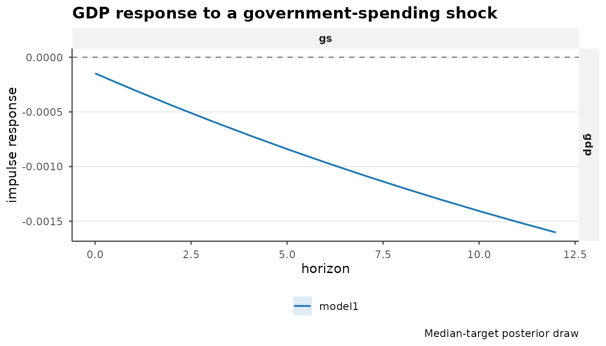

# Post-estimation Analysis with bsvarPost

`bsvarPost` analyses posterior distributions estimated with `bsvars` and
`bsvarSIGNs`. It summarises posterior quantities in tidy tables and
provides methods for cumulative responses, model comparison, posterior
hypothesis evaluation, representative draws, response timing, and
historical-event analysis.

This guide assumes that you already know how to specify and estimate a
model with one of the parent packages. The examples examine the response
of US GDP (`gdp`) to the government-spending shock (`gs`) using the
[`bsvars::us_fiscal_lsuw`](https://bsvars.org/bsvars/reference/us_fiscal_lsuw.html)
data. Precomputed posterior draws reduce computation time; the same
functions can be applied to posterior objects from an empirical
analysis.

## Posterior input

The analysis begins with a posterior distribution estimated by a parent
package. For example, the following code specifies and estimates a
Bayesian structural vector autoregression with `bsvars`:

``` r

data("us_fiscal_lsuw", package = "bsvars")
spec <- bsvars::specify_bsvar$new(us_fiscal_lsuw, p = 1)
post <- bsvars::estimate(spec, S = 2000, thin = 1,
                         show_progress = FALSE)
```

The remaining examples use the precomputed `post` object loaded above.
It is a `PosteriorBSVAR` object and can be passed directly to
`bsvarPost` functions.

## Summarise posterior quantities

The `tidy_*()` functions compute posterior summaries in long-format
tibbles. Here,
[`tidy_irf()`](https://davidzenz.github.io/bsvarPost/reference/tidy_irf.md)
reports posterior medians and 90% pointwise credible intervals for
impulse responses. The resulting table is restricted to four horizons of
the GDP response to a government-spending shock.

``` r

irf_tbl <- tidy_irf(post, horizon = 12, probability = 0.90)
irf_focus <- subset(irf_tbl, variable == "gdp" & shock == "gs" &
                    horizon %in% c(0, 4, 8, 12),
                    select = c(variable, shock, horizon, median, lower, upper))
irf_focus
#> # A tibble: 4 × 6
#>   variable shock horizon     median    lower    upper
#>   <chr>    <chr>   <dbl>      <dbl>    <dbl>    <dbl>
#> 1 gdp      gs          0 -0.0000935 -0.00115 0.000901
#> 2 gdp      gs          4 -0.000702  -0.00191 0.000522
#> 3 gdp      gs          8 -0.00119   -0.00301 0.000284
#> 4 gdp      gs         12 -0.00158   -0.00394 0.000289
```

The same tabular structure applies to other posterior quantities.
Summary tables contain posterior location and credible-interval columns.
Set `draws = TRUE` when an analysis requires the individual posterior
draws.

``` r

tidy_cdm(post, horizon = 12)       # cumulative responses
tidy_fevd(post, horizon = 12)      # variance shares
tidy_hd(post)                      # historical contributions
tidy_forecast(post, horizon = 8)   # predictive paths
tidy_shocks(post)                  # structural shocks
```

The resulting tables can be filtered, combined with additional
variables, or visualised with a graphics system of the researcher’s
choice without directly manipulating posterior arrays.

## Cumulative dynamic responses

[`cdm()`](https://davidzenz.github.io/bsvarPost/reference/cdm.md)
computes cumulative dynamic responses for every posterior draw by
accumulating the impulse response through each horizon.
[`tidy_cdm()`](https://davidzenz.github.io/bsvarPost/reference/tidy_cdm.md)
reports the corresponding posterior summaries and credible intervals.

``` r

cdm_draws <- cdm(post, horizon = 12)
cdm_tbl <- tidy_cdm(cdm_draws, probability = 0.90)
cdm_focus <- subset(cdm_tbl, variable == "gdp" & shock == "gs" &
                    horizon %in% c(0, 4, 8, 12),
                    select = c(variable, shock, horizon, median, lower, upper))
cdm_focus
#> # A tibble: 4 × 6
#>   variable shock horizon     median    lower    upper
#>   <chr>    <chr>   <dbl>      <dbl>    <dbl>    <dbl>
#> 1 gdp      gs          0 -0.0000935 -0.00115 0.000901
#> 2 gdp      gs          4 -0.00211   -0.00817 0.00344 
#> 3 gdp      gs          8 -0.00618   -0.0169  0.00487 
#> 4 gdp      gs         12 -0.0121    -0.0311  0.00547
```

These quantities are cumulative dynamic responses. Their interpretation
as economic multipliers depends on the transformations and scaling used
in the model; see
[`?cdm`](https://davidzenz.github.io/bsvarPost/reference/cdm.md) for the
`scale_by` and `scale_var` arguments.

## Compare model specifications

The second posterior distribution is estimated for the same
three-variable system with a longer lag order.
[`compare_cdm()`](https://davidzenz.github.io/bsvarPost/reference/compare_cdm.md)
computes comparable posterior summaries for both specifications. Names
assigned to the posterior arguments identify the specifications in the
`model` column.

``` r

cdm_comparison <- compare_cdm(
  baseline = post,
  longer_lag = post_alt,
  horizon = 12,
  probability = 0.90
)
subset(cdm_comparison, variable == "gdp" & shock == "gs" &
       horizon %in% c(4, 8, 12),
       select = c(model, horizon, median, lower, upper))
#> # A tibble: 6 × 5
#>   model      horizon   median    lower   upper
#>   <chr>        <dbl>    <dbl>    <dbl>   <dbl>
#> 1 baseline         4 -0.00211 -0.00817 0.00344
#> 2 baseline         8 -0.00618 -0.0169  0.00487
#> 3 baseline        12 -0.0121  -0.0311  0.00547
#> 4 longer_lag       4 -0.00277 -0.00934 0.00635
#> 5 longer_lag       8 -0.00866 -0.0262  0.0134 
#> 6 longer_lag      12 -0.0150  -0.0471  0.0209
```

The functions
[`compare_irf()`](https://davidzenz.github.io/bsvarPost/reference/compare_irf.md),
[`compare_fevd()`](https://davidzenz.github.io/bsvarPost/reference/compare_fevd.md),
and the remaining `compare_*()` methods provide analogous comparisons
for other posterior quantities. These comparisons are descriptive: they
report corresponding posterior summaries across specifications but do
not select a preferred model.

## Evaluate a posterior hypothesis

Consider the posterior probability that the GDP response to the spending
shock is positive at each selected horizon.
[`hypothesis_irf()`](https://davidzenz.github.io/bsvarPost/reference/hypothesis_irf.md)
evaluates this inequality using the posterior draws.

``` r

prob_positive <- hypothesis_irf(
  post,
  variables = "gdp",
  shocks = "gs",
  horizon = c(0, 4, 8, 12),
  relation = ">",
  value = 0
)
prob_positive[, c("variable", "shock", "horizon", "posterior_prob")]
#> # A tibble: 4 × 4
#>   variable shock horizon posterior_prob
#>   <chr>    <chr>   <dbl>          <dbl>
#> 1 gdp      gs          0          0.47 
#> 2 gdp      gs          4          0.185
#> 3 gdp      gs          8          0.11 
#> 4 gdp      gs         12          0.09
```

`posterior_prob` is a model-conditional posterior probability, not a
frequentist p-value.
[`joint_hypothesis_irf()`](https://davidzenz.github.io/bsvarPost/reference/joint_hypothesis_irf.md)
computes the probability that a condition holds jointly across several
horizons,
[`magnitude_audit()`](https://davidzenz.github.io/bsvarPost/reference/magnitude_audit.md)
evaluates economically meaningful thresholds, and
[`simultaneous_irf()`](https://davidzenz.github.io/bsvarPost/reference/simultaneous_irf.md)
constructs a credible band for an entire selected response path. The
[Inference and
Comparison](https://davidzenz.github.io/bsvarPost/articles/inference-and-comparison.md)
article develops these distinctions.

## Select a representative draw and summarise response timing

Pointwise medians need not correspond to any single posterior draw.
[`median_target_irf()`](https://davidzenz.github.io/bsvarPost/reference/median_target_irf.md)
selects the posterior draw whose response path is closest to the
pointwise posterior median over the requested variables, shocks, and
horizons. The selected path therefore preserves the joint dependence
within a single draw.

``` r

representative <- median_target_irf(
  post,
  horizon = 12,
  variables = "gdp",
  shocks = "gs"
)
representative_path <- subset(summary(representative),
                              variable == "gdp" & shock == "gs")
subset(representative_path, horizon %in% c(0, 4, 8, 12),
       select = c(variable, shock, horizon, median, draw_index, method))
#> # A tibble: 4 × 6
#>   variable shock horizon    median draw_index method       
#>   <chr>    <chr>   <dbl>     <dbl>      <int> <chr>        
#> 1 gdp      gs          0 -0.000148        144 median_target
#> 2 gdp      gs          4 -0.000712        144 median_target
#> 3 gdp      gs          8 -0.00119         144 median_target
#> 4 gdp      gs         12 -0.00160         144 median_target
```

[`peak_response()`](https://davidzenz.github.io/bsvarPost/reference/peak_response.md)
computes the magnitude and horizon of the peak response for every
posterior draw, then reports posterior summaries of both quantities.

``` r

peak <- peak_response(
  post,
  horizon = 12,
  variables = "gdp",
  shocks = "gs",
  absolute = TRUE
)
peak[, c("variable", "shock", "median_value", "median_horizon")]
#> # A tibble: 1 × 4
#>   variable shock median_value median_horizon
#>   <chr>    <chr>        <dbl>          <dbl>
#> 1 gdp      gs        -0.00158             12
```

For questions concerning response persistence,
[`duration_response()`](https://davidzenz.github.io/bsvarPost/reference/duration_response.md),
[`half_life_response()`](https://davidzenz.github.io/bsvarPost/reference/half_life_response.md),
and
[`time_to_threshold()`](https://davidzenz.github.io/bsvarPost/reference/time_to_threshold.md)
report related posterior summaries without reducing the posterior
distribution to a single curve.

## Summarise historical decompositions over selected periods

`tidy_hd(draws = TRUE)` returns draw-level contributions of structural
shocks to each observed variable.
[`tidy_hd_event()`](https://davidzenz.github.io/bsvarPost/reference/tidy_hd_event.md)
aggregates these contributions over a substantively selected period,
while
[`shock_ranking()`](https://davidzenz.github.io/bsvarPost/reference/shock_ranking.md)
orders shocks by their contributions. The following example uses an
illustrative four-quarter period.

``` r

hd_draws <- tidy_hd(post, draws = TRUE)
event_tbl <- tidy_hd_event(
  hd_draws,
  start = "1958",
  end = "1958.75"
)

subset(event_tbl, variable == "gdp",
       select = c(variable, shock, event_start, event_end, median))
#> # A tibble: 3 × 5
#>   variable shock event_start event_end median
#>   <chr>    <chr> <chr>       <chr>      <dbl>
#> 1 gdp      gdp   1958        1958.75   -14.9 
#> 2 gdp      gs    1958        1958.75    -3.15
#> 3 gdp      ttr   1958        1958.75    -1.23

ranking <- shock_ranking(hd_draws, start = "1958", end = "1958.75",
                         variables = "gdp")
ranking[, c("variable", "shock", "median", "rank")]
#> # A tibble: 3 × 4
#>   variable shock median  rank
#>   <chr>    <chr>  <dbl> <int>
#> 1 gdp      gdp   -14.9      1
#> 2 gdp      gs     -3.15     2
#> 3 gdp      ttr    -1.23     3
```

These functions extend the historical decompositions computed by the
parent package with posterior summaries for selected periods. The choice
of period and the interpretation of shock contributions are discussed in
[Historical-Decomposition
Analysis](https://davidzenz.github.io/bsvarPost/articles/historical-decomposition-events.md).

## Present figures and tables

[`publish_bsvar_plot()`](https://davidzenz.github.io/bsvarPost/reference/publish_bsvar_plot.md)
visualises the representative posterior draw using a consistent
`ggplot2` style. It returns a `ggplot` object that can be annotated or
otherwise modified before saving.

``` r

publish_bsvar_plot(representative_path, family = "irf", preset = "paper",
  title = "GDP response to a government-spending shock",
  caption = "Median-target posterior draw")
```



[`as_kable()`](https://davidzenz.github.io/bsvarPost/reference/as_kable.md)
reports the selected posterior summary as a formatted table:

``` r

as_kable(peak, caption = "Peak absolute GDP response",
         digits = 3, preset = "compact")
```

| Model | Variable | Shock | Mean value | Median value | Lower value | Upper value | Mean horizon | Median horizon | Lower horizon | Upper horizon |
|:---|:---|:---|---:|---:|---:|---:|---:|---:|---:|---:|
| model1 | gdp | gs | -0.017 | -0.002 | -0.004 | 0.001 | 10.44 | 12 | 0 | 12 |

Peak absolute GDP response {.table}

## Further analyses

- [Inference and
  Comparison](https://davidzenz.github.io/bsvarPost/articles/inference-and-comparison.md)
  covers joint and magnitude hypotheses, simultaneous credible bands,
  and model comparisons.
- [Historical-Decomposition
  Analysis](https://davidzenz.github.io/bsvarPost/articles/historical-decomposition-events.md)
  covers selected historical periods, structural-shock contributions,
  and shock rankings.
- [Analysis of Sign-Restricted
  Models](https://davidzenz.github.io/bsvarPost/articles/sign-restricted-workflows.md)
  covers `most_likely_admissible_*()`,
  [`restriction_audit()`](https://davidzenz.github.io/bsvarPost/reference/restriction_audit.md),
  [`acceptance_diagnostics()`](https://davidzenz.github.io/bsvarPost/reference/acceptance_diagnostics.md),
  and sign-model comparisons.

The [reference
index](https://davidzenz.github.io/bsvarPost/reference/index.html)
documents all functions and their arguments.
