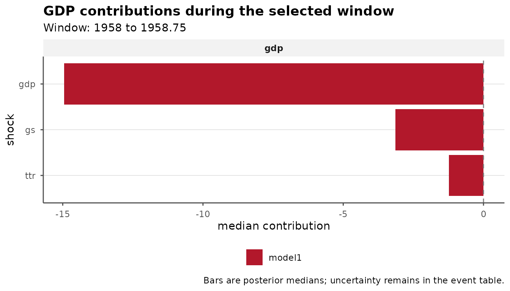

# Historical-Decomposition Event Workflows

Historical decompositions from `bsvars` and `bsvarSIGNs` describe how
structural shock contributions evolve through the sample. `bsvarPost`
adds a narrower workflow: aggregate those contributions over a
substantively chosen window, rank the shocks within it, and compare the
same event across specifications.

This article assumes that you already have a fitted posterior and
understand the identification behind its shock labels. See the
parent-package documentation for estimation and the standard
historical-decomposition workflow. The precomputed fiscal posteriors
used here avoid re-estimation and keep the vignette reproducible.

## Start from draw-level contributions

Event summaries need the posterior draws, not a table that has already
collapsed them to pointwise intervals. The canonical handoff is
therefore
[`tidy_hd(draws = TRUE)`](https://davidzenz.github.io/bsvarPost/reference/tidy_hd.md):

``` r

hd_draws <- tidy_hd(post, draws = TRUE)

data.frame(
  first = head(unique(as.character(hd_draws$time)), 1),
  last = tail(unique(as.character(hd_draws$time)), 1),
  draws = length(unique(hd_draws$draw))
)
#>     first    last draws
#> 1 1948.25 2024.25   200
```

Each row now identifies a model, variable, shock, observation, and
posterior draw. Keep this draw-level table when defining events so
uncertainty is aggregated *after* contributions are summed within the
window.

## Choose the window before ranking shocks

An event window is an analytical decision, not something the ranking
algorithm discovers. A defensible workflow usually does three things:

1.  Define the dates from the research question or an external
    chronology, before inspecting which shock ranks first.
2.  Match `start` and `end` to the model’s time labels and use a window
    consistent with the data frequency.
3.  Repeat the analysis over reasonable neighboring windows as a
    sensitivity check, without silently replacing the prespecified
    result.

For this compact example, we use the complete four-quarter span from
`1958` to `1958.75`. It is a convenient, bounded window inside both
fixtures—not a claim that these documentation fixtures establish a
particular historical narrative. They contain only 200 stored draws, and
the shock names inherit whatever interpretation the fitted model’s
identification supports.

``` r

event_start <- "1958"
event_end <- "1958.75"

event <- tidy_hd_event(
  hd_draws,
  start = event_start,
  end = event_end,
  probability = 0.90
)

subset(
  event,
  variable == "gdp",
  select = c(variable, shock, event_start, event_end,
             median, lower, upper)
)
#> # A tibble: 3 × 7
#>   variable shock event_start event_end median  lower  upper
#>   <chr>    <chr> <chr>       <chr>      <dbl>  <dbl>  <dbl>
#> 1 gdp      gdp   1958        1958.75   -14.9  -53.5  24.4  
#> 2 gdp      gs    1958        1958.75    -3.15 -11.9   0.435
#> 3 gdp      ttr   1958        1958.75    -1.23  -5.86  4.48
```

[`tidy_hd_event()`](https://davidzenz.github.io/bsvarPost/reference/tidy_hd_event.md)
sums each shock’s contribution across the inclusive window separately
for every draw, then reports posterior summaries. Set `draws = TRUE`
when a downstream calculation needs the aggregated draws themselves.

Do not read the largest median as certainty about a shock’s historical
role. The interval columns retain posterior uncertainty, while the
structural meaning of each label still comes from the original model.

## Rank the contributions relevant to the question

[`shock_ranking()`](https://davidzenz.github.io/bsvarPost/reference/shock_ranking.md)
orders shocks separately within each model-variable panel. Restricting
to `gdp` keeps the result aligned with one research question.

``` r

ranking <- shock_ranking(
  hd_draws,
  start = event_start,
  end = event_end,
  variables = "gdp",
  ranking = "absolute",
  probability = 0.90
)

ranking[, c("variable", "shock", "median", "lower", "upper", "rank")]
#> # A tibble: 3 × 6
#>   variable shock median  lower  upper  rank
#>   <chr>    <chr>  <dbl>  <dbl>  <dbl> <int>
#> 1 gdp      gdp   -14.9  -53.5  24.4       1
#> 2 gdp      gs     -3.15 -11.9   0.435     2
#> 3 gdp      ttr    -1.23  -5.86  4.48      3
```

`ranking = "absolute"` answers which shock has the largest median
contribution in magnitude. Use `ranking = "signed"` only when the
ordering by direction is the intended estimand. In either case, `rank`
summarizes the point estimate; it does not turn overlapping posterior
intervals into a decisive ordering.

One useful event figure is the ranked contribution plot. It keeps the
sign and scale of the contribution visible while ordering the bars by
importance.

``` r

ranking_plot <- publish_bsvar_plot(
  ranking,
  family = "shock_ranking",
  preset = "paper",
  title = "GDP contributions during the selected window",
  caption = "Bars are posterior medians; uncertainty remains in the event table."
)
ranking_plot
```



For a direct contribution plot rather than a ranking, use
[`plot_hd_event()`](https://davidzenz.github.io/bsvarPost/reference/plot_hd_event.md).
The more specialized
[`plot_hd_event_share()`](https://davidzenz.github.io/bsvarPost/reference/plot_hd_event_share.md),
[`plot_hd_event_cumulative()`](https://davidzenz.github.io/bsvarPost/reference/plot_hd_event_cumulative.md),
and
[`plot_hd_event_distribution()`](https://davidzenz.github.io/bsvarPost/reference/plot_hd_event_distribution.md)
are documented in the reference index; use them when the question
genuinely concerns composition, within-window accumulation, or the full
draw distribution.

## Hold the event fixed across specifications

Changing a lag order or prior should not also change the event
definition.
[`compare_hd_event()`](https://davidzenz.github.io/bsvarPost/reference/compare_hd_event.md)
applies the identical window to named posterior objects and returns a
tidy model column.

``` r

event_comparison <- compare_hd_event(
  baseline = post,
  alternative = post_alt,
  start = event_start,
  end = event_end,
  probability = 0.90
)

comparison_gdp <- subset(
  event_comparison,
  variable == "gdp",
  select = c(model, shock, event_start, event_end,
             median, lower, upper)
)
comparison_gdp
#> # A tibble: 6 × 7
#>   model       shock event_start event_end    median  lower  upper
#>   <chr>       <chr> <chr>       <chr>         <dbl>  <dbl>  <dbl>
#> 1 baseline    gdp   1958        1958.75   -14.9     -53.5  24.4  
#> 2 baseline    gs    1958        1958.75    -3.15    -11.9   0.435
#> 3 baseline    ttr   1958        1958.75    -1.23     -5.86  4.48 
#> 4 alternative gdp   1958        1958.75   -19.1     -51.5  17.0  
#> 5 alternative gs    1958        1958.75    -0.00276  -6.11  3.89 
#> 6 alternative ttr   1958        1958.75    -1.62     -6.60  4.49
```

This comparison is descriptive. Stability across columns can support a
robustness discussion, but
[`compare_hd_event()`](https://davidzenz.github.io/bsvarPost/reference/compare_hd_event.md)
neither selects a preferred model nor computes a posterior probability
that the specifications differ. When comparing additional windows,
preserve names such as `baseline` and `alternative` so tables and
figures remain traceable.

## Hand results to a report

Finish with one focused table and save the already styled plot. Both
objects remain ordinary R outputs, so captions, annotations, and
journal-specific formatting can be added downstream.

``` r

as_kable(
  comparison_gdp,
  caption = "GDP shock contributions in the selected event window",
  digits = 2,
  preset = "compact"
)
```

| Model       | Shock | Event start | Event end | Median |  Lower | Upper |
|:------------|:------|:------------|:----------|-------:|-------:|------:|
| baseline    | gdp   | 1958        | 1958.75   | -14.95 | -53.50 | 24.36 |
| baseline    | gs    | 1958        | 1958.75   |  -3.15 | -11.87 |  0.43 |
| baseline    | ttr   | 1958        | 1958.75   |  -1.23 |  -5.86 |  4.48 |
| alternative | gdp   | 1958        | 1958.75   | -19.05 | -51.50 | 16.99 |
| alternative | gs    | 1958        | 1958.75   |   0.00 |  -6.11 |  3.89 |
| alternative | ttr   | 1958        | 1958.75   |  -1.62 |  -6.60 |  4.49 |

GDP shock contributions in the selected event window {.table}

``` r

ggplot2::ggsave(
  "shock-ranking-1958.pdf",
  ranking_plot,
  width = 7,
  height = 4
)
```

For the broader path from posterior objects to response comparisons and
probability statements, return to [Getting
Started](https://davidzenz.github.io/bsvarPost/articles/bsvarPost.md).
For sign-restricted identification diagnostics, continue to the
dedicated bsvarSIGNs workflow article.
