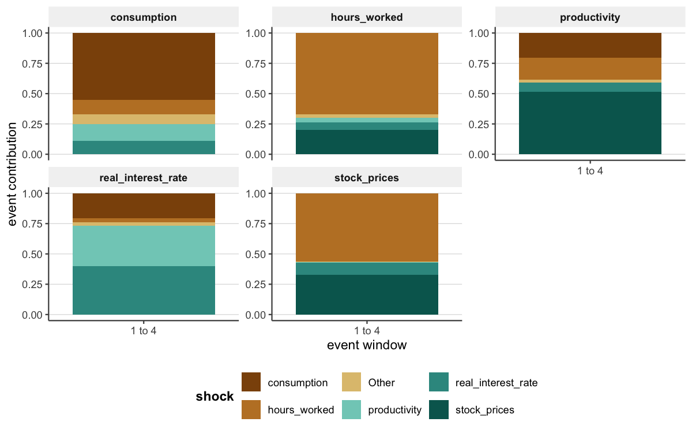
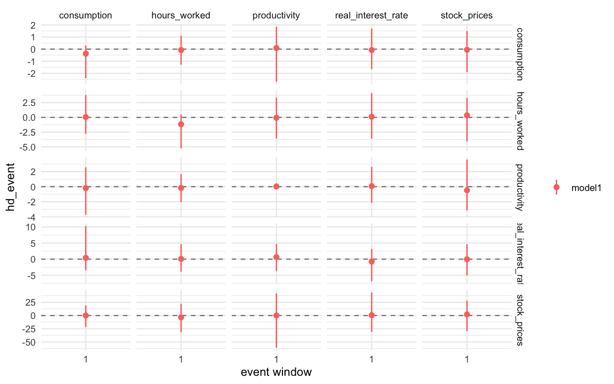
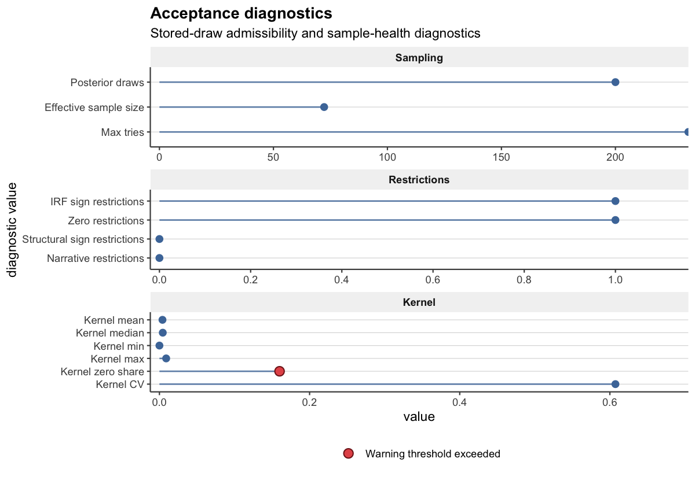

# Post-Estimation Workflows in bsvarPost

This vignette picks up where “Getting Started” left off. After
extracting impulse responses and CDMs, deeper analytical questions
remain: Which draw best represents the posterior as a whole? When
exactly does a spending shock peak, and how long does it last? Which
structural shocks drove observed fiscal dynamics? This vignette works
through those questions using the same `us_fiscal_lsuw` dataset —
quarterly US data on tax revenue (`ttr`), government spending (`gs`),
and output (`gdp`) — comparing a one-lag baseline against a three-lag
alternative specification.

## Representative-model summaries

Pointwise posterior medians may not correspond to any one coherent
structural draw.
[`median_target_irf()`](https://davidzenz.github.io/bsvarPost/reference/representative_irf.md)
finds the stored draw whose IRF matrix is closest (in L2 distance) to
the posterior median. The result is a single self-consistent model that
typifies the posterior center.

``` r
rep_irf <- median_target_irf(post, horizon = 20)
summary(rep_irf)
#> # A tibble: 189 × 13
#>    model  object_type variable shock horizon   mean median    sd  lower  upper
#>    <chr>  <chr>       <chr>    <chr>   <dbl>  <dbl>  <dbl> <dbl>  <dbl>  <dbl>
#>  1 model1 irf         ttr      ttr         0 0.0296 0.0296    NA 0.0296 0.0296
#>  2 model1 irf         ttr      ttr         1 0.0277 0.0277    NA 0.0277 0.0277
#>  3 model1 irf         ttr      ttr         2 0.0260 0.0260    NA 0.0260 0.0260
#>  4 model1 irf         ttr      ttr         3 0.0243 0.0243    NA 0.0243 0.0243
#>  5 model1 irf         ttr      ttr         4 0.0227 0.0227    NA 0.0227 0.0227
#>  6 model1 irf         ttr      ttr         5 0.0212 0.0212    NA 0.0212 0.0212
#>  7 model1 irf         ttr      ttr         6 0.0198 0.0198    NA 0.0198 0.0198
#>  8 model1 irf         ttr      ttr         7 0.0185 0.0185    NA 0.0185 0.0185
#>  9 model1 irf         ttr      ttr         8 0.0173 0.0173    NA 0.0173 0.0173
#> 10 model1 irf         ttr      ttr         9 0.0161 0.0161    NA 0.0161 0.0161
#> # ℹ 179 more rows
#> # ℹ 3 more variables: draw_index <int>, method <chr>, score <dbl>
```

The `draw_index` slot records which posterior draw was selected. This
can be used to extract other quantities (CDMs, FEVD) from the same draw
for a fully coherent representative model.

A pre-rendered figure from the same posterior at the full S = 200
resolution:


The representative IRF for the `gs` spending shock shows the typical
fiscal transmission shape: an immediate positive effect on government
spending itself, with the `gdp` response peaking a few quarters later.

## Response timing summaries

Researchers often need to report precisely *when* effects arrive and
*how long* they persist. `bsvarPost` provides four timing summaries,
each with full posterior uncertainty.

**Peak response** — at what horizon does the fiscal spending shock
produce the largest `gdp` effect?

``` r
peak_response(post, type = "irf", horizon = 20, variables = 3, shocks = 2)
#> # A tibble: 1 × 14
#>   model  object_type variable shock mean_value median_value sd_value lower_value
#>   <chr>  <chr>       <chr>    <chr>      <dbl>        <dbl>    <dbl>       <dbl>
#> 1 model1 peak_irf    gdp      gs        0.0379   -0.0000250    0.537    -0.00114
#> # ℹ 6 more variables: upper_value <dbl>, mean_horizon <dbl>,
#> #   median_horizon <dbl>, sd_horizon <dbl>, lower_horizon <dbl>,
#> #   upper_horizon <dbl>
```

**Duration response** — how many quarters does the cumulative multiplier
remain positive?

``` r
duration_response(
  post,
  type     = "cdm",
  horizon  = 20,
  variables = 3,
  shocks   = 2,
  relation = ">",
  value    = 0,
  mode     = "total"
)
#> # A tibble: 1 × 12
#>   model  object_type  variable shock relation threshold mode  mean_duration
#>   <chr>  <chr>        <chr>    <chr> <chr>        <dbl> <chr>         <dbl>
#> 1 model1 duration_cdm gdp      gs    >                0 total          4.10
#> # ℹ 4 more variables: median_duration <dbl>, sd_duration <dbl>,
#> #   lower_duration <dbl>, upper_duration <dbl>
```

**Half-life** — how quickly does the impulse response decay from its
peak?

``` r
half_life_response(
  post,
  type     = "irf",
  horizon  = 20,
  variables = 3,
  shocks   = 2,
  baseline = "peak"
)
#> # A tibble: 1 × 12
#>   model  object_type   variable shock fraction baseline mean_half_life
#>   <chr>  <chr>         <chr>    <chr>    <dbl> <chr>             <dbl>
#> 1 model1 half_life_irf gdp      gs         0.5 peak               5.67
#> # ℹ 5 more variables: median_half_life <dbl>, sd_half_life <dbl>,
#> #   lower_half_life <dbl>, upper_half_life <dbl>, reached_prob <dbl>
```

**Time to threshold** — when does the cumulative multiplier first exceed
zero?

``` r
time_to_threshold(
  post,
  type     = "cdm",
  horizon  = 20,
  variables = 3,
  shocks   = 2,
  relation = ">",
  value    = 0
)
#> # A tibble: 1 × 12
#>   model  object_type           variable shock relation threshold mean_horizon
#>   <chr>  <chr>                 <chr>    <chr> <chr>        <dbl>        <dbl>
#> 1 model1 time_to_threshold_cdm gdp      gs    >                0        0.351
#> # ℹ 5 more variables: median_horizon <dbl>, sd_horizon <dbl>,
#> #   lower_horizon <dbl>, upper_horizon <dbl>, reached_prob <dbl>
```

These four summaries characterise when the fiscal spending effect
arrives, how large it becomes, and how quickly it dissipates — the
standard set of timing statistics for fiscal multiplier papers.

## Comparing response summaries

Does the estimated timing change under a three-lag specification? The
`compare_*` helpers place both posteriors side by side.

``` r
cmp_peak <- compare_peak_response(
  baseline    = post,
  alternative = post_alt,
  type        = "irf",
  horizon     = 20,
  variables   = 3,
  shocks      = 2
)
cmp_peak
#> # A tibble: 2 × 14
#>   model  object_type variable shock mean_value median_value sd_value lower_value
#>   <chr>  <chr>       <chr>    <chr>      <dbl>        <dbl>    <dbl>       <dbl>
#> 1 basel… peak_irf    gdp      gs        0.0379   -0.0000250  5.37e-1   -0.00114 
#> 2 alter… peak_irf    gdp      gs    66131.        0.000115   9.35e+5   -0.000904
#> # ℹ 6 more variables: upper_value <dbl>, mean_horizon <dbl>,
#> #   median_horizon <dbl>, sd_horizon <dbl>, lower_horizon <dbl>,
#> #   upper_horizon <dbl>
```

``` r
compare_duration_response(
  baseline    = post,
  alternative = post_alt,
  type        = "cdm",
  horizon     = 20,
  variables   = 3,
  shocks      = 2,
  relation    = ">",
  value       = 0
)
#> # A tibble: 2 × 12
#>   model       object_type  variable shock relation threshold mode  mean_duration
#>   <chr>       <chr>        <chr>    <chr> <chr>        <dbl> <chr>         <dbl>
#> 1 baseline    duration_cdm gdp      gs    >                0 cons…          3.95
#> 2 alternative duration_cdm gdp      gs    >                0 cons…          4.16
#> # ℹ 4 more variables: median_duration <dbl>, sd_duration <dbl>,
#> #   lower_duration <dbl>, upper_duration <dbl>
```

[`as_kable()`](https://davidzenz.github.io/bsvarPost/reference/reporting.md)
formats any `bsvar_post_tbl` as a compact
[`knitr::kable`](https://rdrr.io/pkg/knitr/man/kable.html) table ready
for Rmd reports.

``` r
as_kable(cmp_peak, preset = "compact")
```

| Model       | Variable | Shock |   Mean value | Median value | Lower value | Upper value | Mean horizon | Median horizon | Lower horizon | Upper horizon |
|:------------|:---------|:------|-------------:|-------------:|------------:|------------:|-------------:|---------------:|--------------:|--------------:|
| baseline    | gdp      | gs    | 3.791410e-02 |   -0.0000250 |  -0.0011445 |   0.0009886 |        1.105 |              0 |             0 |          10.5 |
| alternative | gdp      | gs    | 6.613149e+04 |    0.0001149 |  -0.0009040 |   0.0033801 |        4.740 |              1 |             0 |          20.0 |

The three-lag alternative typically shows a later peak with wider
credible bands, reflecting the richer lag dynamics.

## Historical decomposition events

Historical decompositions (HD) measure each structural shock’s
contribution to observed variation in each variable at each point in
time.

For full-sample interpretation, start with
[`tidy_hd()`](https://davidzenz.github.io/bsvarPost/reference/tidy_hd.md)
and one of the dedicated plot helpers.
[`plot_hd_overlay()`](https://davidzenz.github.io/bsvarPost/reference/plot_hd_overlay.md)
is the best first-look diagnostic because it compares shock paths within
each variable without mixing in the raw level path.
[`plot_hd_stacked()`](https://davidzenz.github.io/bsvarPost/reference/plot_hd_stacked.md)
then gives the coherent composition view by adding an explicit
`Baseline` component, and
[`plot_hd_total()`](https://davidzenz.github.io/bsvarPost/reference/plot_hd_total.md)
compares the observed path against that same reconstructed decomposition
total.

``` r
hd_full <- tidy_hd(post)
plot_hd_overlay(post, variables = "gdp", top_n = 3)
plot_hd_stacked(post, variables = "gdp", top_n = 3)
plot_hd_total(post, variables = "gdp", shocks = c("gs", "ttr"))
```

A pre-rendered full-sample HD overlay plot from the same S = 200
posterior:


The stacked view now shows a full baseline-plus-shock decomposition on
the displayed summary scale:


And the totals view checks that decomposition against the realised
series:

[`tidy_hd_event()`](https://davidzenz.github.io/bsvarPost/reference/tidy_hd_event.md)
then aggregates those contributions over a chosen event window.

The `us_fiscal_lsuw` sample begins in 1948. To examine which shocks
drove fiscal dynamics in the first year (four quarters: 1948.25 through
1948.75):

``` r
hd_event <- tidy_hd_event(post, start = "1948.25", end = "1948.75")
head(hd_event)
#> # A tibble: 6 × 11
#>   model  object_type variable shock event_start event_end     mean    median
#>   <chr>  <chr>       <chr>    <chr> <chr>       <chr>        <dbl>     <dbl>
#> 1 model1 hd_event    gdp      gdp   1948.25     1948.75    3.28     3.32    
#> 2 model1 hd_event    gs       gdp   1948.25     1948.75    0.0116   0.000610
#> 3 model1 hd_event    ttr      gdp   1948.25     1948.75   -0.282   -0.289   
#> 4 model1 hd_event    gdp      gs    1948.25     1948.75   -0.0295  -0.0188  
#> 5 model1 hd_event    gs       gs    1948.25     1948.75   -0.906   -0.880   
#> 6 model1 hd_event    ttr      gs    1948.25     1948.75    0.00140  0.00680 
#> # ℹ 3 more variables: sd <dbl>, lower <dbl>, upper <dbl>
```

[`shock_ranking()`](https://davidzenz.github.io/bsvarPost/reference/shock_ranking.md)
ranks the structural shocks by their absolute contribution to a target
variable over the same window. Which shock moved `gdp` the most?

``` r
shock_ranking(post, start = "1948.25", end = "1948.75", ranking = "absolute")
#> # A tibble: 9 × 14
#>   model  object_type variable shock event_start event_end     mean    median
#>   <chr>  <chr>       <chr>    <chr> <chr>       <chr>        <dbl>     <dbl>
#> 1 model1 hd_event    gdp      gdp   1948.25     1948.75    3.28     3.32    
#> 2 model1 hd_event    gdp      ttr   1948.25     1948.75    0.520    0.458   
#> 3 model1 hd_event    gdp      gs    1948.25     1948.75   -0.0295  -0.0188  
#> 4 model1 hd_event    gs       gs    1948.25     1948.75   -0.906   -0.880   
#> 5 model1 hd_event    gs       ttr   1948.25     1948.75    0.0646   0.00766 
#> 6 model1 hd_event    gs       gdp   1948.25     1948.75    0.0116   0.000610
#> 7 model1 hd_event    ttr      ttr   1948.25     1948.75   -7.94    -8.01    
#> 8 model1 hd_event    ttr      gdp   1948.25     1948.75   -0.282   -0.289   
#> 9 model1 hd_event    ttr      gs    1948.25     1948.75    0.00140  0.00680 
#> # ℹ 6 more variables: sd <dbl>, lower <dbl>, upper <dbl>, ranking <chr>,
#> #   rank_score <dbl>, rank <int>
```

For a composition-oriented event view,
[`plot_hd_event_share()`](https://davidzenz.github.io/bsvarPost/reference/plot_hd_event_share.md)
rescales the same event-window contributions into shares:

``` r
plot_hd_event_share(post, start = "1948.25", end = "1948.75", top_n = 3)
```

And a pre-rendered event-share composition plot:



A pre-rendered HD event figure from a richer S = 200 run:



## Publication-ready reporting

All `bsvarPost` outputs are `bsvar_post_tbl` data frames and accept the
same family of reporting helpers.

**knitr table** (always available):

``` r
as_kable(summary(rep_irf), preset = "compact", digits = 3)
```

| Model  | Variable | Shock | Horizon |   Mean | Median |  Lower |  Upper |
|:-------|:---------|:------|--------:|-------:|-------:|-------:|-------:|
| model1 | ttr      | ttr   |       0 |  0.030 |  0.030 |  0.030 |  0.030 |
| model1 | ttr      | ttr   |       1 |  0.028 |  0.028 |  0.028 |  0.028 |
| model1 | ttr      | ttr   |       2 |  0.026 |  0.026 |  0.026 |  0.026 |
| model1 | ttr      | ttr   |       3 |  0.024 |  0.024 |  0.024 |  0.024 |
| model1 | ttr      | ttr   |       4 |  0.023 |  0.023 |  0.023 |  0.023 |
| model1 | ttr      | ttr   |       5 |  0.021 |  0.021 |  0.021 |  0.021 |
| model1 | ttr      | ttr   |       6 |  0.020 |  0.020 |  0.020 |  0.020 |
| model1 | ttr      | ttr   |       7 |  0.019 |  0.019 |  0.019 |  0.019 |
| model1 | ttr      | ttr   |       8 |  0.017 |  0.017 |  0.017 |  0.017 |
| model1 | ttr      | ttr   |       9 |  0.016 |  0.016 |  0.016 |  0.016 |
| model1 | ttr      | ttr   |      10 |  0.015 |  0.015 |  0.015 |  0.015 |
| model1 | ttr      | ttr   |      11 |  0.014 |  0.014 |  0.014 |  0.014 |
| model1 | ttr      | ttr   |      12 |  0.013 |  0.013 |  0.013 |  0.013 |
| model1 | ttr      | ttr   |      13 |  0.012 |  0.012 |  0.012 |  0.012 |
| model1 | ttr      | ttr   |      14 |  0.011 |  0.011 |  0.011 |  0.011 |
| model1 | ttr      | ttr   |      15 |  0.010 |  0.010 |  0.010 |  0.010 |
| model1 | ttr      | ttr   |      16 |  0.009 |  0.009 |  0.009 |  0.009 |
| model1 | ttr      | ttr   |      17 |  0.009 |  0.009 |  0.009 |  0.009 |
| model1 | ttr      | ttr   |      18 |  0.008 |  0.008 |  0.008 |  0.008 |
| model1 | ttr      | ttr   |      19 |  0.007 |  0.007 |  0.007 |  0.007 |
| model1 | ttr      | ttr   |      20 |  0.007 |  0.007 |  0.007 |  0.007 |
| model1 | ttr      | gs    |       0 |  0.000 |  0.000 |  0.000 |  0.000 |
| model1 | ttr      | gs    |       1 |  0.000 |  0.000 |  0.000 |  0.000 |
| model1 | ttr      | gs    |       2 |  0.000 |  0.000 |  0.000 |  0.000 |
| model1 | ttr      | gs    |       3 | -0.001 | -0.001 | -0.001 | -0.001 |
| model1 | ttr      | gs    |       4 | -0.001 | -0.001 | -0.001 | -0.001 |
| model1 | ttr      | gs    |       5 | -0.001 | -0.001 | -0.001 | -0.001 |
| model1 | ttr      | gs    |       6 | -0.001 | -0.001 | -0.001 | -0.001 |
| model1 | ttr      | gs    |       7 | -0.001 | -0.001 | -0.001 | -0.001 |
| model1 | ttr      | gs    |       8 | -0.001 | -0.001 | -0.001 | -0.001 |
| model1 | ttr      | gs    |       9 | -0.001 | -0.001 | -0.001 | -0.001 |
| model1 | ttr      | gs    |      10 | -0.002 | -0.002 | -0.002 | -0.002 |
| model1 | ttr      | gs    |      11 | -0.002 | -0.002 | -0.002 | -0.002 |
| model1 | ttr      | gs    |      12 | -0.002 | -0.002 | -0.002 | -0.002 |
| model1 | ttr      | gs    |      13 | -0.002 | -0.002 | -0.002 | -0.002 |
| model1 | ttr      | gs    |      14 | -0.002 | -0.002 | -0.002 | -0.002 |
| model1 | ttr      | gs    |      15 | -0.002 | -0.002 | -0.002 | -0.002 |
| model1 | ttr      | gs    |      16 | -0.002 | -0.002 | -0.002 | -0.002 |
| model1 | ttr      | gs    |      17 | -0.002 | -0.002 | -0.002 | -0.002 |
| model1 | ttr      | gs    |      18 | -0.002 | -0.002 | -0.002 | -0.002 |
| model1 | ttr      | gs    |      19 | -0.002 | -0.002 | -0.002 | -0.002 |
| model1 | ttr      | gs    |      20 | -0.002 | -0.002 | -0.002 | -0.002 |
| model1 | ttr      | gdp   |       0 |  0.000 |  0.000 |  0.000 |  0.000 |
| model1 | ttr      | gdp   |       1 |  0.001 |  0.001 |  0.001 |  0.001 |
| model1 | ttr      | gdp   |       2 |  0.002 |  0.002 |  0.002 |  0.002 |
| model1 | ttr      | gdp   |       3 |  0.003 |  0.003 |  0.003 |  0.003 |
| model1 | ttr      | gdp   |       4 |  0.003 |  0.003 |  0.003 |  0.003 |
| model1 | ttr      | gdp   |       5 |  0.004 |  0.004 |  0.004 |  0.004 |
| model1 | ttr      | gdp   |       6 |  0.005 |  0.005 |  0.005 |  0.005 |
| model1 | ttr      | gdp   |       7 |  0.005 |  0.005 |  0.005 |  0.005 |
| model1 | ttr      | gdp   |       8 |  0.006 |  0.006 |  0.006 |  0.006 |
| model1 | ttr      | gdp   |       9 |  0.007 |  0.007 |  0.007 |  0.007 |
| model1 | ttr      | gdp   |      10 |  0.007 |  0.007 |  0.007 |  0.007 |
| model1 | ttr      | gdp   |      11 |  0.008 |  0.008 |  0.008 |  0.008 |
| model1 | ttr      | gdp   |      12 |  0.008 |  0.008 |  0.008 |  0.008 |
| model1 | ttr      | gdp   |      13 |  0.008 |  0.008 |  0.008 |  0.008 |
| model1 | ttr      | gdp   |      14 |  0.009 |  0.009 |  0.009 |  0.009 |
| model1 | ttr      | gdp   |      15 |  0.009 |  0.009 |  0.009 |  0.009 |
| model1 | ttr      | gdp   |      16 |  0.010 |  0.010 |  0.010 |  0.010 |
| model1 | ttr      | gdp   |      17 |  0.010 |  0.010 |  0.010 |  0.010 |
| model1 | ttr      | gdp   |      18 |  0.010 |  0.010 |  0.010 |  0.010 |
| model1 | ttr      | gdp   |      19 |  0.011 |  0.011 |  0.011 |  0.011 |
| model1 | ttr      | gdp   |      20 |  0.011 |  0.011 |  0.011 |  0.011 |
| model1 | gs       | ttr   |       0 |  0.000 |  0.000 |  0.000 |  0.000 |
| model1 | gs       | ttr   |       1 | -0.001 | -0.001 | -0.001 | -0.001 |
| model1 | gs       | ttr   |       2 | -0.001 | -0.001 | -0.001 | -0.001 |
| model1 | gs       | ttr   |       3 | -0.002 | -0.002 | -0.002 | -0.002 |
| model1 | gs       | ttr   |       4 | -0.002 | -0.002 | -0.002 | -0.002 |
| model1 | gs       | ttr   |       5 | -0.002 | -0.002 | -0.002 | -0.002 |
| model1 | gs       | ttr   |       6 | -0.003 | -0.003 | -0.003 | -0.003 |
| model1 | gs       | ttr   |       7 | -0.003 | -0.003 | -0.003 | -0.003 |
| model1 | gs       | ttr   |       8 | -0.003 | -0.003 | -0.003 | -0.003 |
| model1 | gs       | ttr   |       9 | -0.004 | -0.004 | -0.004 | -0.004 |
| model1 | gs       | ttr   |      10 | -0.004 | -0.004 | -0.004 | -0.004 |
| model1 | gs       | ttr   |      11 | -0.004 | -0.004 | -0.004 | -0.004 |
| model1 | gs       | ttr   |      12 | -0.004 | -0.004 | -0.004 | -0.004 |
| model1 | gs       | ttr   |      13 | -0.004 | -0.004 | -0.004 | -0.004 |
| model1 | gs       | ttr   |      14 | -0.004 | -0.004 | -0.004 | -0.004 |
| model1 | gs       | ttr   |      15 | -0.004 | -0.004 | -0.004 | -0.004 |
| model1 | gs       | ttr   |      16 | -0.004 | -0.004 | -0.004 | -0.004 |
| model1 | gs       | ttr   |      17 | -0.004 | -0.004 | -0.004 | -0.004 |
| model1 | gs       | ttr   |      18 | -0.004 | -0.004 | -0.004 | -0.004 |
| model1 | gs       | ttr   |      19 | -0.004 | -0.004 | -0.004 | -0.004 |
| model1 | gs       | ttr   |      20 | -0.004 | -0.004 | -0.004 | -0.004 |
| model1 | gs       | gs    |       0 |  0.025 |  0.025 |  0.025 |  0.025 |
| model1 | gs       | gs    |       1 |  0.024 |  0.024 |  0.024 |  0.024 |
| model1 | gs       | gs    |       2 |  0.023 |  0.023 |  0.023 |  0.023 |
| model1 | gs       | gs    |       3 |  0.021 |  0.021 |  0.021 |  0.021 |
| model1 | gs       | gs    |       4 |  0.020 |  0.020 |  0.020 |  0.020 |
| model1 | gs       | gs    |       5 |  0.019 |  0.019 |  0.019 |  0.019 |
| model1 | gs       | gs    |       6 |  0.018 |  0.018 |  0.018 |  0.018 |
| model1 | gs       | gs    |       7 |  0.017 |  0.017 |  0.017 |  0.017 |
| model1 | gs       | gs    |       8 |  0.016 |  0.016 |  0.016 |  0.016 |
| model1 | gs       | gs    |       9 |  0.015 |  0.015 |  0.015 |  0.015 |
| model1 | gs       | gs    |      10 |  0.014 |  0.014 |  0.014 |  0.014 |
| model1 | gs       | gs    |      11 |  0.014 |  0.014 |  0.014 |  0.014 |
| model1 | gs       | gs    |      12 |  0.013 |  0.013 |  0.013 |  0.013 |
| model1 | gs       | gs    |      13 |  0.012 |  0.012 |  0.012 |  0.012 |
| model1 | gs       | gs    |      14 |  0.012 |  0.012 |  0.012 |  0.012 |
| model1 | gs       | gs    |      15 |  0.011 |  0.011 |  0.011 |  0.011 |
| model1 | gs       | gs    |      16 |  0.010 |  0.010 |  0.010 |  0.010 |
| model1 | gs       | gs    |      17 |  0.010 |  0.010 |  0.010 |  0.010 |
| model1 | gs       | gs    |      18 |  0.009 |  0.009 |  0.009 |  0.009 |
| model1 | gs       | gs    |      19 |  0.009 |  0.009 |  0.009 |  0.009 |
| model1 | gs       | gs    |      20 |  0.008 |  0.008 |  0.008 |  0.008 |
| model1 | gs       | gdp   |       0 |  0.000 |  0.000 |  0.000 |  0.000 |
| model1 | gs       | gdp   |       1 |  0.000 |  0.000 |  0.000 |  0.000 |
| model1 | gs       | gdp   |       2 |  0.001 |  0.001 |  0.001 |  0.001 |
| model1 | gs       | gdp   |       3 |  0.001 |  0.001 |  0.001 |  0.001 |
| model1 | gs       | gdp   |       4 |  0.001 |  0.001 |  0.001 |  0.001 |
| model1 | gs       | gdp   |       5 |  0.002 |  0.002 |  0.002 |  0.002 |
| model1 | gs       | gdp   |       6 |  0.002 |  0.002 |  0.002 |  0.002 |
| model1 | gs       | gdp   |       7 |  0.002 |  0.002 |  0.002 |  0.002 |
| model1 | gs       | gdp   |       8 |  0.002 |  0.002 |  0.002 |  0.002 |
| model1 | gs       | gdp   |       9 |  0.002 |  0.002 |  0.002 |  0.002 |
| model1 | gs       | gdp   |      10 |  0.003 |  0.003 |  0.003 |  0.003 |
| model1 | gs       | gdp   |      11 |  0.003 |  0.003 |  0.003 |  0.003 |
| model1 | gs       | gdp   |      12 |  0.003 |  0.003 |  0.003 |  0.003 |
| model1 | gs       | gdp   |      13 |  0.003 |  0.003 |  0.003 |  0.003 |
| model1 | gs       | gdp   |      14 |  0.003 |  0.003 |  0.003 |  0.003 |
| model1 | gs       | gdp   |      15 |  0.003 |  0.003 |  0.003 |  0.003 |
| model1 | gs       | gdp   |      16 |  0.003 |  0.003 |  0.003 |  0.003 |
| model1 | gs       | gdp   |      17 |  0.003 |  0.003 |  0.003 |  0.003 |
| model1 | gs       | gdp   |      18 |  0.003 |  0.003 |  0.003 |  0.003 |
| model1 | gs       | gdp   |      19 |  0.003 |  0.003 |  0.003 |  0.003 |
| model1 | gs       | gdp   |      20 |  0.003 |  0.003 |  0.003 |  0.003 |
| model1 | gdp      | ttr   |       0 |  0.003 |  0.003 |  0.003 |  0.003 |
| model1 | gdp      | ttr   |       1 |  0.003 |  0.003 |  0.003 |  0.003 |
| model1 | gdp      | ttr   |       2 |  0.003 |  0.003 |  0.003 |  0.003 |
| model1 | gdp      | ttr   |       3 |  0.002 |  0.002 |  0.002 |  0.002 |
| model1 | gdp      | ttr   |       4 |  0.002 |  0.002 |  0.002 |  0.002 |
| model1 | gdp      | ttr   |       5 |  0.002 |  0.002 |  0.002 |  0.002 |
| model1 | gdp      | ttr   |       6 |  0.001 |  0.001 |  0.001 |  0.001 |
| model1 | gdp      | ttr   |       7 |  0.001 |  0.001 |  0.001 |  0.001 |
| model1 | gdp      | ttr   |       8 |  0.001 |  0.001 |  0.001 |  0.001 |
| model1 | gdp      | ttr   |       9 |  0.001 |  0.001 |  0.001 |  0.001 |
| model1 | gdp      | ttr   |      10 |  0.000 |  0.000 |  0.000 |  0.000 |
| model1 | gdp      | ttr   |      11 |  0.000 |  0.000 |  0.000 |  0.000 |
| model1 | gdp      | ttr   |      12 |  0.000 |  0.000 |  0.000 |  0.000 |
| model1 | gdp      | ttr   |      13 |  0.000 |  0.000 |  0.000 |  0.000 |
| model1 | gdp      | ttr   |      14 |  0.000 |  0.000 |  0.000 |  0.000 |
| model1 | gdp      | ttr   |      15 | -0.001 | -0.001 | -0.001 | -0.001 |
| model1 | gdp      | ttr   |      16 | -0.001 | -0.001 | -0.001 | -0.001 |
| model1 | gdp      | ttr   |      17 | -0.001 | -0.001 | -0.001 | -0.001 |
| model1 | gdp      | ttr   |      18 | -0.001 | -0.001 | -0.001 | -0.001 |
| model1 | gdp      | ttr   |      19 | -0.001 | -0.001 | -0.001 | -0.001 |
| model1 | gdp      | ttr   |      20 | -0.001 | -0.001 | -0.001 | -0.001 |
| model1 | gdp      | gs    |       0 | -0.001 | -0.001 | -0.001 | -0.001 |
| model1 | gdp      | gs    |       1 | -0.001 | -0.001 | -0.001 | -0.001 |
| model1 | gdp      | gs    |       2 | -0.001 | -0.001 | -0.001 | -0.001 |
| model1 | gdp      | gs    |       3 | -0.001 | -0.001 | -0.001 | -0.001 |
| model1 | gdp      | gs    |       4 | -0.001 | -0.001 | -0.001 | -0.001 |
| model1 | gdp      | gs    |       5 | -0.001 | -0.001 | -0.001 | -0.001 |
| model1 | gdp      | gs    |       6 | -0.001 | -0.001 | -0.001 | -0.001 |
| model1 | gdp      | gs    |       7 | -0.001 | -0.001 | -0.001 | -0.001 |
| model1 | gdp      | gs    |       8 | -0.001 | -0.001 | -0.001 | -0.001 |
| model1 | gdp      | gs    |       9 | -0.001 | -0.001 | -0.001 | -0.001 |
| model1 | gdp      | gs    |      10 | -0.001 | -0.001 | -0.001 | -0.001 |
| model1 | gdp      | gs    |      11 | -0.001 | -0.001 | -0.001 | -0.001 |
| model1 | gdp      | gs    |      12 | -0.001 | -0.001 | -0.001 | -0.001 |
| model1 | gdp      | gs    |      13 | -0.001 | -0.001 | -0.001 | -0.001 |
| model1 | gdp      | gs    |      14 | -0.001 | -0.001 | -0.001 | -0.001 |
| model1 | gdp      | gs    |      15 | -0.001 | -0.001 | -0.001 | -0.001 |
| model1 | gdp      | gs    |      16 | -0.001 | -0.001 | -0.001 | -0.001 |
| model1 | gdp      | gs    |      17 | -0.001 | -0.001 | -0.001 | -0.001 |
| model1 | gdp      | gs    |      18 | -0.001 | -0.001 | -0.001 | -0.001 |
| model1 | gdp      | gs    |      19 | -0.001 | -0.001 | -0.001 | -0.001 |
| model1 | gdp      | gs    |      20 | -0.001 | -0.001 | -0.001 | -0.001 |
| model1 | gdp      | gdp   |       0 |  0.010 |  0.010 |  0.010 |  0.010 |
| model1 | gdp      | gdp   |       1 |  0.010 |  0.010 |  0.010 |  0.010 |
| model1 | gdp      | gdp   |       2 |  0.010 |  0.010 |  0.010 |  0.010 |
| model1 | gdp      | gdp   |       3 |  0.010 |  0.010 |  0.010 |  0.010 |
| model1 | gdp      | gdp   |       4 |  0.010 |  0.010 |  0.010 |  0.010 |
| model1 | gdp      | gdp   |       5 |  0.010 |  0.010 |  0.010 |  0.010 |
| model1 | gdp      | gdp   |       6 |  0.011 |  0.011 |  0.011 |  0.011 |
| model1 | gdp      | gdp   |       7 |  0.011 |  0.011 |  0.011 |  0.011 |
| model1 | gdp      | gdp   |       8 |  0.011 |  0.011 |  0.011 |  0.011 |
| model1 | gdp      | gdp   |       9 |  0.011 |  0.011 |  0.011 |  0.011 |
| model1 | gdp      | gdp   |      10 |  0.011 |  0.011 |  0.011 |  0.011 |
| model1 | gdp      | gdp   |      11 |  0.011 |  0.011 |  0.011 |  0.011 |
| model1 | gdp      | gdp   |      12 |  0.011 |  0.011 |  0.011 |  0.011 |
| model1 | gdp      | gdp   |      13 |  0.011 |  0.011 |  0.011 |  0.011 |
| model1 | gdp      | gdp   |      14 |  0.011 |  0.011 |  0.011 |  0.011 |
| model1 | gdp      | gdp   |      15 |  0.011 |  0.011 |  0.011 |  0.011 |
| model1 | gdp      | gdp   |      16 |  0.011 |  0.011 |  0.011 |  0.011 |
| model1 | gdp      | gdp   |      17 |  0.011 |  0.011 |  0.011 |  0.011 |
| model1 | gdp      | gdp   |      18 |  0.011 |  0.011 |  0.011 |  0.011 |
| model1 | gdp      | gdp   |      19 |  0.011 |  0.011 |  0.011 |  0.011 |
| model1 | gdp      | gdp   |      20 |  0.011 |  0.011 |  0.011 |  0.011 |

**gt table** (when the `gt` package is installed):

``` r
as_gt(cmp_peak, caption = "Peak response: 1-lag vs 3-lag", digits = 3,
      preset = "compact")
```

| Peak response: 1-lag vs 3-lag |          |       |            |              |             |             |              |                |               |               |
|-------------------------------|----------|-------|------------|--------------|-------------|-------------|--------------|----------------|---------------|---------------|
| Model                         | Variable | Shock | Mean value | Median value | Lower value | Upper value | Mean horizon | Median horizon | Lower horizon | Upper horizon |
| baseline                      | gdp      | gs    | 0.038      | 0            | -0.001      | 0.001       | 1.105        | 0              | 0             | 10.5          |
| alternative                   | gdp      | gs    | 66131.493  | 0            | -0.001      | 0.003       | 4.740        | 1              | 0             | 20.0          |

**flextable** (when the `flextable` package is installed):

``` r
as_flextable(cmp_peak, caption = "Peak response: 1-lag vs 3-lag", digits = 3,
             preset = "compact")
```

| Model       | Variable | Shock | Mean value | Median value | Lower value | Upper value | Mean horizon | Median horizon | Lower horizon | Upper horizon |
|-------------|----------|-------|------------|--------------|-------------|-------------|--------------|----------------|---------------|---------------|
| baseline    | gdp      | gs    | 0.038      | 0            | -0.001      | 0.001       | 1.105        | 0              | 0             | 10.5          |
| alternative | gdp      | gs    | 66,131.493 | 0            | -0.001      | 0.003       | 4.740        | 1              | 0             | 20.0          |

Peak response: 1-lag vs 3-lag

**Publication plot** —
[`publish_bsvar_plot()`](https://davidzenz.github.io/bsvarPost/reference/publish_bsvar_plot.md)
applies a paper-ready theme and returns the plot object for further
adjustment or direct saving.

``` r
publish_bsvar_plot(rep_irf, preset = "paper")
```

A pre-rendered diagnostics figure demonstrating the publication styling
layer:



## Next steps

The **Hypothesis Testing vignette** covers formal posterior probability
statements —
[`hypothesis_irf()`](https://davidzenz.github.io/bsvarPost/reference/hypothesis_irf.md),
[`joint_hypothesis_irf()`](https://davidzenz.github.io/bsvarPost/reference/joint_hypothesis_irf.md),
and
[`simultaneous_irf()`](https://davidzenz.github.io/bsvarPost/reference/simultaneous_irf.md)
— for testing sign and magnitude restrictions on the fiscal transmission
mechanism.
