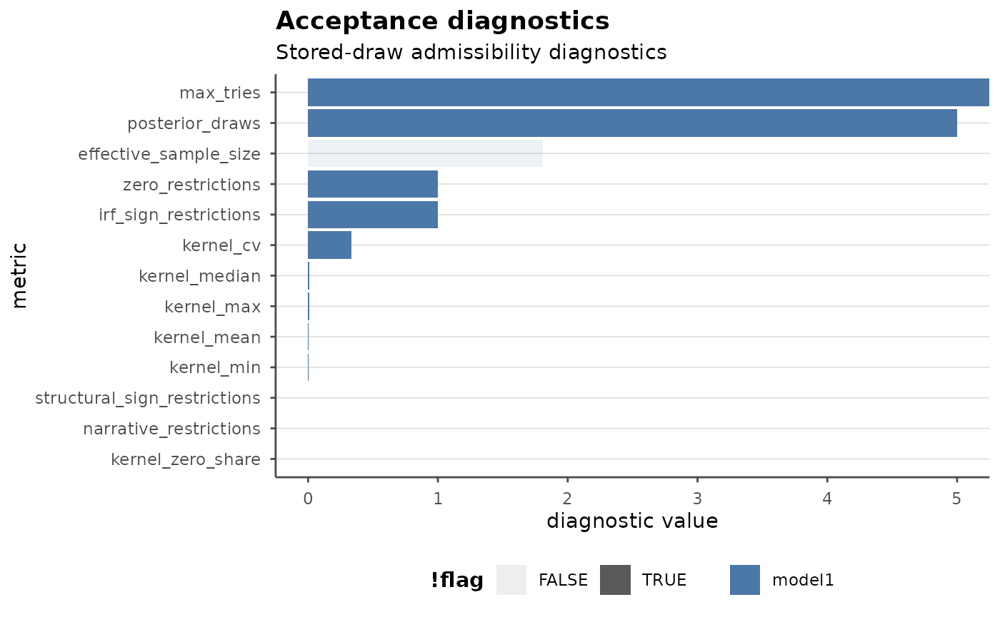
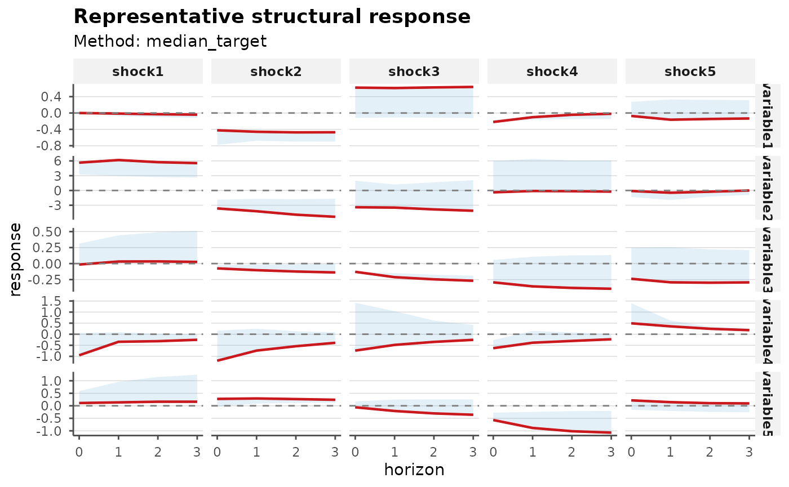
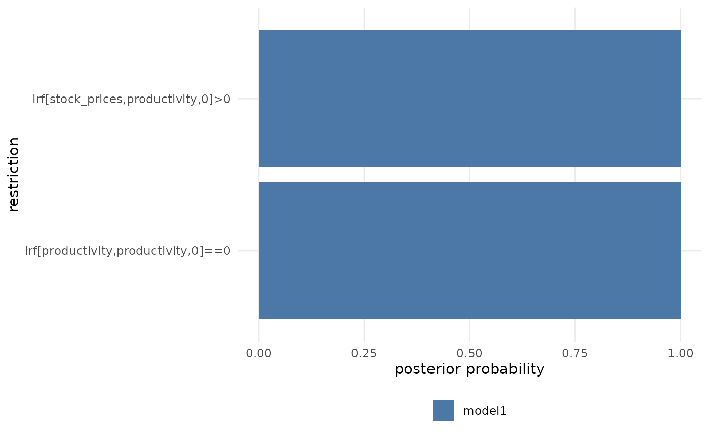
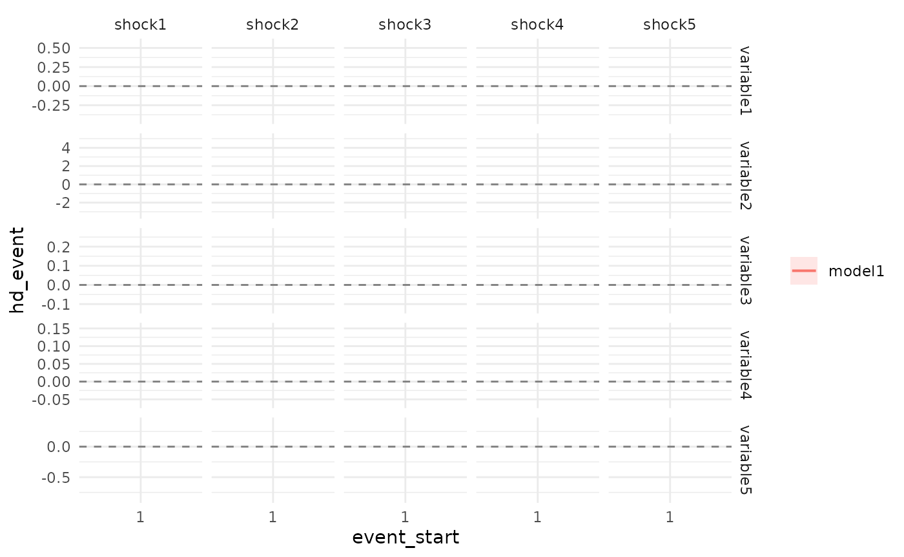
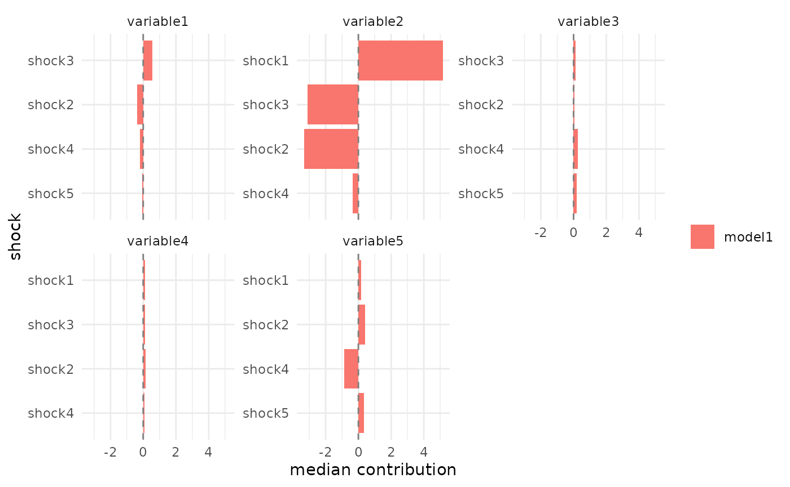

# Post-Estimation Workflows in bsvarPost

This vignette focuses on the broader analytical surface of `bsvarPost`
after a model has already been estimated with `bsvars` or `bsvarSIGNs`.

The emphasis is not on estimation itself, but on:

- representative-model summaries
- posterior hypothesis and restriction auditing
- event-window historical decomposition workflows
- response timing summaries
- diagnostics for sign-restricted models
- plot styling and publication-oriented outputs

Most chunks are shown as workflow templates rather than evaluated during
the build. A small evaluated showcase is included at the end so the
rendered document still contains a real table and plot.

This example uses one sign-restricted baseline specification and one
lighter alternative lag specification:

- `post`: `p = 4`
- `post_alt`: `p = 2`

That gives a meaningful surface for representative summaries, audits,
and event-window comparisons.

## Representative-model summaries

For sign-restricted analysis, pointwise posterior medians need not
correspond to one coherent draw. `bsvarPost` therefore offers
representative-model summaries.

``` r
library(bsvarSIGNs)
library(bsvarPost)

data(optimism)

sign_irf <- matrix(c(0, 1, rep(NA, 23)), 5, 5)

spec <- specify_bsvarSIGN$new(
  optimism * 100,
  p = 4,
  sign_irf = sign_irf
)

post <- estimate(spec, S = 100, thin = 1, show_progress = FALSE)

spec_alt <- specify_bsvarSIGN$new(
  optimism * 100,
  p = 2,
  sign_irf = sign_irf
)

post_alt <- estimate(spec_alt, S = 100, thin = 1, show_progress = FALSE)

rep_median <- median_target_irf(post, horizon = 12)
rep_mla <- most_likely_admissible_irf(post, horizon = 12)

summary(rep_median)
summary(rep_mla)
plot(rep_median)
```

Use `median_target_*()` when you want the stored draw closest to the
posterior center. Use `most_likely_admissible_*()` when you want the
stored admissible draw with the highest reconstructed admissibility
score.

The comparison to `post_alt` is useful because it changes the dynamic
specification while leaving the identifying sign restrictions unchanged.

## Posterior hypotheses and audits

Posterior probability statements can be evaluated directly on IRFs or
CDMs.

``` r
hypothesis_irf(
  post,
  variable = 1,
  shock = 1,
  horizon = 0:2,
  relation = ">",
  value = 0
)

joint_hypothesis_irf(
  post,
  variable = 1,
  shock = 1,
  horizon = 0:2,
  relation = ">",
  value = 0
)

simultaneous_irf(
  post,
  horizon = 12,
  variable = 1,
  shock = 1
)
```

Restriction and magnitude audits are explicit post-estimation summaries.
They do not modify the estimation problem.

``` r
restriction_audit(post)

magnitude_audit(
  post,
  type = "irf",
  variable = 2,
  shock = 1,
  horizon = 0,
  relation = ">",
  value = 0
)
```

## Historical decomposition workflows

For event studies, aggregate historical decomposition contributions over
a window and then rank shocks by contribution size.

``` r
hd_event <- tidy_hd_event(post, start = 1, end = 4)
hd_event

ranked <- shock_ranking(post, start = 1, end = 4, ranking = "absolute")
ranked
```

Compare event windows across models:

``` r
compare_hd_event(p1 = post, p2 = post_alt, start = 1, end = 4)
```

Plot the resulting summaries:

``` r
plot_hd_event(post, start = 1, end = 4)
plot_shock_ranking(post, start = 1, end = 4, ranking = "absolute", top_n = 5)
```

## Response timing summaries

`bsvarPost` includes timing summaries that applied users often compute
manually for papers and presentations.

``` r
peak_response(post, type = "irf", horizon = 12, variable = 1, shock = 1)

duration_response(
  post,
  type = "cdm",
  horizon = 12,
  variable = 1,
  shock = 1,
  relation = ">",
  value = 0,
  mode = "total"
)

half_life_response(
  post,
  type = "irf",
  horizon = 12,
  variable = 1,
  shock = 1,
  baseline = "peak"
)

time_to_threshold(
  post,
  type = "cdm",
  horizon = 12,
  variable = 1,
  shock = 1,
  relation = ">",
  value = 0
)
```

The same summaries can be compared across alternative specifications.

``` r
compare_peak_response(p1 = post, p2 = post_alt, type = "irf", horizon = 12, variable = 1, shock = 1)
compare_duration_response(p1 = post, p2 = post_alt, type = "cdm", horizon = 12, variable = 1, shock = 1, relation = ">", value = 0)
compare_half_life_response(p1 = post, p2 = post_alt, type = "irf", horizon = 12, variable = 1, shock = 1)
compare_time_to_threshold(p1 = post, p2 = post_alt, type = "cdm", horizon = 12, variable = 1, shock = 1, relation = ">", value = 0)

as_kable(compare_peak_response(
  p1 = post,
  p2 = post_alt,
  type = "irf",
  horizon = 12,
  variable = 1,
  shock = 1
), preset = "compact")
```

## Diagnostics for sign-restricted models

[`acceptance_diagnostics()`](https://davidzenz.github.io/bsvarPost/reference/acceptance_diagnostics.md)
provides a stored-draw diagnostics layer for `PosteriorBSVARSIGN`
objects.

``` r
diag_tbl <- acceptance_diagnostics(post)
diag_tbl

summary(diag_tbl)
```

Compare diagnostics across models:

``` r
compare_acceptance_diagnostics(p1 = post, p2 = post_alt)
plot_acceptance_diagnostics(diag_tbl, metrics = c("effective_sample_size", "kernel_zero_share"))

as_kable(report_bundle(diag_tbl, preset = "compact"))
```

These are not full proposal acceptance histories. They are summaries of
what is recoverable from the stored posterior draws and identification
state.

## Plot styling and templates

All `ggplot2` outputs returned by `bsvarPost` can be restyled
downstream.

``` r
irf_tbl <- tidy_irf(post, horizon = 12)

p <- ggplot2::autoplot(irf_tbl)

style_bsvar_plot(
  p,
  preset = "paper",
  palette = c("#1b9e77", "#d95f02")
)

template_bsvar_plot(
  p,
  family = "irf",
  preset = "paper"
)

annotate_bsvar_plot(
  p,
  title = "Impulse responses",
  xintercept = 2
)

publish_bsvar_plot(diag_tbl, preset = "slides")
```

This plotting layer is intended to reduce the amount of manual figure
code needed to bring posterior outputs into publication-ready form.

## Rendered showcase

``` r
library(bsvarSIGNs)
#> Loading required package: RcppArmadillo
#> Loading required package: bsvars
library(bsvarPost)
data(optimism)
sign_irf_demo <- matrix(c(0, 1, rep(NA, 23)), 5, 5)
set.seed(12)
demo_spec <- specify_bsvarSIGN$new(
  optimism * 100,
  p = 2,
  sign_irf = sign_irf_demo
)
demo_post <- estimate(demo_spec, S = 5, thin = 1, show_progress = FALSE)
demo_diag <- acceptance_diagnostics(demo_post)
#> Argument standardise is forcibly set to FALSE due to zero restrictions imposed on the diagonal element(s) of the on-impact impulse response matrix.
demo_rep <- median_target_irf(demo_post, horizon = 3)
#> Argument standardise is forcibly set to FALSE due to zero restrictions imposed on the diagonal element(s) of the on-impact impulse response matrix.
demo_audit <- restriction_audit(demo_post)
#> Argument standardise is forcibly set to FALSE due to zero restrictions imposed on the diagonal element(s) of the on-impact impulse response matrix.
demo_hd <- tidy_hd_event(demo_post, start = 1, end = 2)

as_kable(report_bundle(demo_diag, preset = "compact"))
```

| Model  |     Value |
|:-------|----------:|
| model1 | 5.0000000 |
| model1 | 1.8101543 |
| model1 |       Inf |
| model1 | 1.0000000 |
| model1 | 1.0000000 |
| model1 | 0.0000000 |
| model1 | 0.0000000 |
| model1 | 0.0053186 |
| model1 | 0.0066128 |
| model1 | 0.0033773 |
| model1 | 0.0066128 |
| model1 | 0.0000000 |
| model1 | 0.3332004 |

Acceptance diagnostics

``` r
publish_bsvar_plot(demo_diag, preset = "paper")
#> Warning: Using alpha for a discrete variable is not advised.
```



``` r
as_kable(summary(demo_rep), preset = "compact", digits = 3)
```

| Model  | Variable  | Shock  | Horizon |   Mean | Median |  Lower |  Upper |
|:-------|:----------|:-------|--------:|-------:|-------:|-------:|-------:|
| model1 | variable1 | shock1 |       0 |  0.000 |  0.000 |  0.000 |  0.000 |
| model1 | variable1 | shock1 |       1 | -0.013 | -0.013 | -0.013 | -0.013 |
| model1 | variable1 | shock1 |       2 | -0.030 | -0.030 | -0.030 | -0.030 |
| model1 | variable1 | shock1 |       3 | -0.040 | -0.040 | -0.040 | -0.040 |
| model1 | variable1 | shock2 |       0 | -0.423 | -0.423 | -0.423 | -0.423 |
| model1 | variable1 | shock2 |       1 | -0.459 | -0.459 | -0.459 | -0.459 |
| model1 | variable1 | shock2 |       2 | -0.473 | -0.473 | -0.473 | -0.473 |
| model1 | variable1 | shock2 |       3 | -0.471 | -0.471 | -0.471 | -0.471 |
| model1 | variable1 | shock3 |       0 |  0.621 |  0.621 |  0.621 |  0.621 |
| model1 | variable1 | shock3 |       1 |  0.610 |  0.610 |  0.610 |  0.610 |
| model1 | variable1 | shock3 |       2 |  0.626 |  0.626 |  0.626 |  0.626 |
| model1 | variable1 | shock3 |       3 |  0.638 |  0.638 |  0.638 |  0.638 |
| model1 | variable1 | shock4 |       0 | -0.220 | -0.220 | -0.220 | -0.220 |
| model1 | variable1 | shock4 |       1 | -0.102 | -0.102 | -0.102 | -0.102 |
| model1 | variable1 | shock4 |       2 | -0.043 | -0.043 | -0.043 | -0.043 |
| model1 | variable1 | shock4 |       3 | -0.018 | -0.018 | -0.018 | -0.018 |
| model1 | variable1 | shock5 |       0 | -0.072 | -0.072 | -0.072 | -0.072 |
| model1 | variable1 | shock5 |       1 | -0.164 | -0.164 | -0.164 | -0.164 |
| model1 | variable1 | shock5 |       2 | -0.146 | -0.146 | -0.146 | -0.146 |
| model1 | variable1 | shock5 |       3 | -0.134 | -0.134 | -0.134 | -0.134 |
| model1 | variable2 | shock1 |       0 |  5.644 |  5.644 |  5.644 |  5.644 |
| model1 | variable2 | shock1 |       1 |  6.175 |  6.175 |  6.175 |  6.175 |
| model1 | variable2 | shock1 |       2 |  5.742 |  5.742 |  5.742 |  5.742 |
| model1 | variable2 | shock1 |       3 |  5.552 |  5.552 |  5.552 |  5.552 |
| model1 | variable2 | shock2 |       0 | -3.645 | -3.645 | -3.645 | -3.645 |
| model1 | variable2 | shock2 |       1 | -4.215 | -4.215 | -4.215 | -4.215 |
| model1 | variable2 | shock2 |       2 | -4.915 | -4.915 | -4.915 | -4.915 |
| model1 | variable2 | shock2 |       3 | -5.345 | -5.345 | -5.345 | -5.345 |
| model1 | variable2 | shock3 |       0 | -3.405 | -3.405 | -3.405 | -3.405 |
| model1 | variable2 | shock3 |       1 | -3.474 | -3.474 | -3.474 | -3.474 |
| model1 | variable2 | shock3 |       2 | -3.843 | -3.843 | -3.843 | -3.843 |
| model1 | variable2 | shock3 |       3 | -4.116 | -4.116 | -4.116 | -4.116 |
| model1 | variable2 | shock4 |       0 | -0.378 | -0.378 | -0.378 | -0.378 |
| model1 | variable2 | shock4 |       1 | -0.105 | -0.105 | -0.105 | -0.105 |
| model1 | variable2 | shock4 |       2 | -0.147 | -0.147 | -0.147 | -0.147 |
| model1 | variable2 | shock4 |       3 | -0.231 | -0.231 | -0.231 | -0.231 |
| model1 | variable2 | shock5 |       0 | -0.104 | -0.104 | -0.104 | -0.104 |
| model1 | variable2 | shock5 |       1 | -0.460 | -0.460 | -0.460 | -0.460 |
| model1 | variable2 | shock5 |       2 | -0.243 | -0.243 | -0.243 | -0.243 |
| model1 | variable2 | shock5 |       3 | -0.010 | -0.010 | -0.010 | -0.010 |
| model1 | variable3 | shock1 |       0 | -0.015 | -0.015 | -0.015 | -0.015 |
| model1 | variable3 | shock1 |       1 |  0.032 |  0.032 |  0.032 |  0.032 |
| model1 | variable3 | shock1 |       2 |  0.034 |  0.034 |  0.034 |  0.034 |
| model1 | variable3 | shock1 |       3 |  0.026 |  0.026 |  0.026 |  0.026 |
| model1 | variable3 | shock2 |       0 | -0.075 | -0.075 | -0.075 | -0.075 |
| model1 | variable3 | shock2 |       1 | -0.103 | -0.103 | -0.103 | -0.103 |
| model1 | variable3 | shock2 |       2 | -0.124 | -0.124 | -0.124 | -0.124 |
| model1 | variable3 | shock2 |       3 | -0.139 | -0.139 | -0.139 | -0.139 |
| model1 | variable3 | shock3 |       0 | -0.129 | -0.129 | -0.129 | -0.129 |
| model1 | variable3 | shock3 |       1 | -0.212 | -0.212 | -0.212 | -0.212 |
| model1 | variable3 | shock3 |       2 | -0.246 | -0.246 | -0.246 | -0.246 |
| model1 | variable3 | shock3 |       3 | -0.268 | -0.268 | -0.268 | -0.268 |
| model1 | variable3 | shock4 |       0 | -0.293 | -0.293 | -0.293 | -0.293 |
| model1 | variable3 | shock4 |       1 | -0.356 | -0.356 | -0.356 | -0.356 |
| model1 | variable3 | shock4 |       2 | -0.380 | -0.380 | -0.380 | -0.380 |
| model1 | variable3 | shock4 |       3 | -0.393 | -0.393 | -0.393 | -0.393 |
| model1 | variable3 | shock5 |       0 | -0.238 | -0.238 | -0.238 | -0.238 |
| model1 | variable3 | shock5 |       1 | -0.293 | -0.293 | -0.293 | -0.293 |
| model1 | variable3 | shock5 |       2 | -0.299 | -0.299 | -0.299 | -0.299 |
| model1 | variable3 | shock5 |       3 | -0.294 | -0.294 | -0.294 | -0.294 |
| model1 | variable4 | shock1 |       0 | -0.951 | -0.951 | -0.951 | -0.951 |
| model1 | variable4 | shock1 |       1 | -0.342 | -0.342 | -0.342 | -0.342 |
| model1 | variable4 | shock1 |       2 | -0.315 | -0.315 | -0.315 | -0.315 |
| model1 | variable4 | shock1 |       3 | -0.252 | -0.252 | -0.252 | -0.252 |
| model1 | variable4 | shock2 |       0 | -1.197 | -1.197 | -1.197 | -1.197 |
| model1 | variable4 | shock2 |       1 | -0.740 | -0.740 | -0.740 | -0.740 |
| model1 | variable4 | shock2 |       2 | -0.542 | -0.542 | -0.542 | -0.542 |
| model1 | variable4 | shock2 |       3 | -0.388 | -0.388 | -0.388 | -0.388 |
| model1 | variable4 | shock3 |       0 | -0.740 | -0.740 | -0.740 | -0.740 |
| model1 | variable4 | shock3 |       1 | -0.483 | -0.483 | -0.483 | -0.483 |
| model1 | variable4 | shock3 |       2 | -0.347 | -0.347 | -0.347 | -0.347 |
| model1 | variable4 | shock3 |       3 | -0.254 | -0.254 | -0.254 | -0.254 |
| model1 | variable4 | shock4 |       0 | -0.630 | -0.630 | -0.630 | -0.630 |
| model1 | variable4 | shock4 |       1 | -0.384 | -0.384 | -0.384 | -0.384 |
| model1 | variable4 | shock4 |       2 | -0.304 | -0.304 | -0.304 | -0.304 |
| model1 | variable4 | shock4 |       3 | -0.229 | -0.229 | -0.229 | -0.229 |
| model1 | variable4 | shock5 |       0 |  0.493 |  0.493 |  0.493 |  0.493 |
| model1 | variable4 | shock5 |       1 |  0.356 |  0.356 |  0.356 |  0.356 |
| model1 | variable4 | shock5 |       2 |  0.246 |  0.246 |  0.246 |  0.246 |
| model1 | variable4 | shock5 |       3 |  0.184 |  0.184 |  0.184 |  0.184 |
| model1 | variable5 | shock1 |       0 |  0.110 |  0.110 |  0.110 |  0.110 |
| model1 | variable5 | shock1 |       1 |  0.136 |  0.136 |  0.136 |  0.136 |
| model1 | variable5 | shock1 |       2 |  0.163 |  0.163 |  0.163 |  0.163 |
| model1 | variable5 | shock1 |       3 |  0.163 |  0.163 |  0.163 |  0.163 |
| model1 | variable5 | shock2 |       0 |  0.275 |  0.275 |  0.275 |  0.275 |
| model1 | variable5 | shock2 |       1 |  0.293 |  0.293 |  0.293 |  0.293 |
| model1 | variable5 | shock2 |       2 |  0.268 |  0.268 |  0.268 |  0.268 |
| model1 | variable5 | shock2 |       3 |  0.240 |  0.240 |  0.240 |  0.240 |
| model1 | variable5 | shock3 |       0 | -0.060 | -0.060 | -0.060 | -0.060 |
| model1 | variable5 | shock3 |       1 | -0.208 | -0.208 | -0.208 | -0.208 |
| model1 | variable5 | shock3 |       2 | -0.304 | -0.304 | -0.304 | -0.304 |
| model1 | variable5 | shock3 |       3 | -0.358 | -0.358 | -0.358 | -0.358 |
| model1 | variable5 | shock4 |       0 | -0.569 | -0.569 | -0.569 | -0.569 |
| model1 | variable5 | shock4 |       1 | -0.886 | -0.886 | -0.886 | -0.886 |
| model1 | variable5 | shock4 |       2 | -1.016 | -1.016 | -1.016 | -1.016 |
| model1 | variable5 | shock4 |       3 | -1.073 | -1.073 | -1.073 | -1.073 |
| model1 | variable5 | shock5 |       0 |  0.217 |  0.217 |  0.217 |  0.217 |
| model1 | variable5 | shock5 |       1 |  0.145 |  0.145 |  0.145 |  0.145 |
| model1 | variable5 | shock5 |       2 |  0.104 |  0.104 |  0.104 |  0.104 |
| model1 | variable5 | shock5 |       3 |  0.095 |  0.095 |  0.095 |  0.095 |

``` r
publish_bsvar_plot(demo_rep, preset = "paper")
```



``` r
as_kable(demo_audit, preset = "compact", digits = 3)
```

| Model  | Variable  | Shock  | Horizon | Restriction type | Restriction                  | Relation | Posterior probability |  Mean | Median | Lower | Upper |
|:-------|:----------|:-------|--------:|:-----------------|:-----------------------------|:---------|----------------------:|------:|-------:|------:|------:|
| model1 | variable1 | shock1 |       0 | irf_zero         | irf\[variable1,shock1,0\]==0 | ==0      |                     1 | 0.000 |  0.000 | 0.000 | 0.000 |
| model1 | variable2 | shock1 |       0 | irf_sign         | irf\[variable2,shock1,0\]\>0 | \>0      |                     1 | 4.692 |  5.644 | 3.263 | 5.644 |

``` r
plot_restriction_audit(demo_audit)
```



``` r
as_kable(demo_hd, preset = "compact", digits = 3)
```

| Model  | Variable  | Shock  | Event start | Event end |   Mean | Median |  Lower |  Upper |
|:-------|:----------|:-------|:------------|:----------|-------:|-------:|-------:|-------:|
| model1 | variable1 | shock1 | 1           | 2         |  0.000 |  0.000 |  0.000 |  0.000 |
| model1 | variable2 | shock1 | 1           | 2         |  4.037 |  5.158 |  2.357 |  5.158 |
| model1 | variable3 | shock1 | 1           | 2         |  0.118 |  0.013 |  0.013 |  0.277 |
| model1 | variable4 | shock1 | 1           | 2         |  0.076 |  0.123 |  0.005 |  0.123 |
| model1 | variable5 | shock1 | 1           | 2         | -0.229 |  0.166 | -0.821 |  0.166 |
| model1 | variable1 | shock2 | 1           | 2         | -0.411 | -0.389 | -0.444 | -0.389 |
| model1 | variable2 | shock2 | 1           | 2         | -2.542 | -3.331 | -3.331 | -1.359 |
| model1 | variable3 | shock2 | 1           | 2         |  0.031 |  0.065 | -0.020 |  0.065 |
| model1 | variable4 | shock2 | 1           | 2         |  0.099 |  0.155 |  0.015 |  0.155 |
| model1 | variable5 | shock2 | 1           | 2         |  0.270 |  0.414 |  0.052 |  0.414 |
| model1 | variable1 | shock3 | 1           | 2         |  0.315 |  0.571 | -0.068 |  0.571 |
| model1 | variable2 | shock3 | 1           | 2         | -1.296 | -3.112 | -3.112 |  1.428 |
| model1 | variable3 | shock3 | 1           | 2         |  0.015 |  0.111 | -0.129 |  0.111 |
| model1 | variable4 | shock3 | 1           | 2         |  0.112 |  0.096 |  0.096 |  0.136 |
| model1 | variable5 | shock3 | 1           | 2         | -0.152 | -0.090 | -0.246 | -0.090 |
| model1 | variable1 | shock4 | 1           | 2         | -0.161 | -0.202 | -0.202 | -0.099 |
| model1 | variable2 | shock4 | 1           | 2         |  1.522 | -0.346 | -0.346 |  4.324 |
| model1 | variable3 | shock4 | 1           | 2         |  0.171 |  0.252 |  0.049 |  0.252 |
| model1 | variable4 | shock4 | 1           | 2         |  0.039 |  0.082 | -0.025 |  0.082 |
| model1 | variable5 | shock4 | 1           | 2         | -0.360 | -0.858 | -0.858 |  0.386 |
| model1 | variable1 | shock5 | 1           | 2         |  0.022 | -0.066 | -0.066 |  0.156 |
| model1 | variable2 | shock5 | 1           | 2         | -0.436 | -0.095 | -0.947 | -0.095 |
| model1 | variable3 | shock5 | 1           | 2         |  0.211 |  0.205 |  0.205 |  0.220 |
| model1 | variable4 | shock5 | 1           | 2         |  0.015 | -0.064 | -0.064 |  0.134 |
| model1 | variable5 | shock5 | 1           | 2         |  0.286 |  0.328 |  0.225 |  0.328 |

``` r
plot_hd_event(demo_post, start = 1, end = 2)
#> `geom_line()`: Each group consists of only one observation.
#> ℹ Do you need to adjust the group aesthetic?
#> `geom_line()`: Each group consists of only one observation.
#> ℹ Do you need to adjust the group aesthetic?
#> `geom_line()`: Each group consists of only one observation.
#> ℹ Do you need to adjust the group aesthetic?
#> `geom_line()`: Each group consists of only one observation.
#> ℹ Do you need to adjust the group aesthetic?
#> `geom_line()`: Each group consists of only one observation.
#> ℹ Do you need to adjust the group aesthetic?
#> `geom_line()`: Each group consists of only one observation.
#> ℹ Do you need to adjust the group aesthetic?
#> `geom_line()`: Each group consists of only one observation.
#> ℹ Do you need to adjust the group aesthetic?
#> `geom_line()`: Each group consists of only one observation.
#> ℹ Do you need to adjust the group aesthetic?
#> `geom_line()`: Each group consists of only one observation.
#> ℹ Do you need to adjust the group aesthetic?
#> `geom_line()`: Each group consists of only one observation.
#> ℹ Do you need to adjust the group aesthetic?
#> `geom_line()`: Each group consists of only one observation.
#> ℹ Do you need to adjust the group aesthetic?
#> `geom_line()`: Each group consists of only one observation.
#> ℹ Do you need to adjust the group aesthetic?
#> `geom_line()`: Each group consists of only one observation.
#> ℹ Do you need to adjust the group aesthetic?
#> `geom_line()`: Each group consists of only one observation.
#> ℹ Do you need to adjust the group aesthetic?
#> `geom_line()`: Each group consists of only one observation.
#> ℹ Do you need to adjust the group aesthetic?
#> `geom_line()`: Each group consists of only one observation.
#> ℹ Do you need to adjust the group aesthetic?
#> `geom_line()`: Each group consists of only one observation.
#> ℹ Do you need to adjust the group aesthetic?
#> `geom_line()`: Each group consists of only one observation.
#> ℹ Do you need to adjust the group aesthetic?
#> `geom_line()`: Each group consists of only one observation.
#> ℹ Do you need to adjust the group aesthetic?
#> `geom_line()`: Each group consists of only one observation.
#> ℹ Do you need to adjust the group aesthetic?
#> `geom_line()`: Each group consists of only one observation.
#> ℹ Do you need to adjust the group aesthetic?
#> `geom_line()`: Each group consists of only one observation.
#> ℹ Do you need to adjust the group aesthetic?
#> `geom_line()`: Each group consists of only one observation.
#> ℹ Do you need to adjust the group aesthetic?
#> `geom_line()`: Each group consists of only one observation.
#> ℹ Do you need to adjust the group aesthetic?
#> `geom_line()`: Each group consists of only one observation.
#> ℹ Do you need to adjust the group aesthetic?
```



``` r
plot_shock_ranking(demo_post, start = 1, end = 2, ranking = "absolute", top_n = 4)
```


