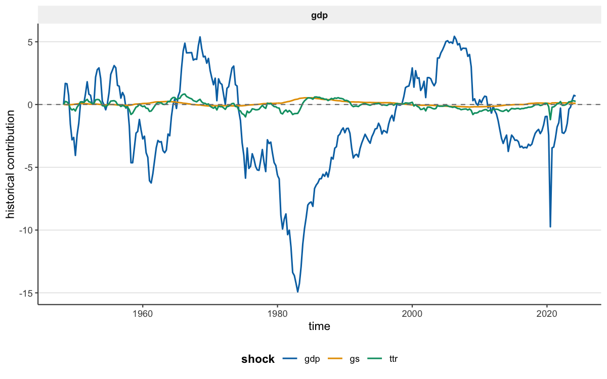
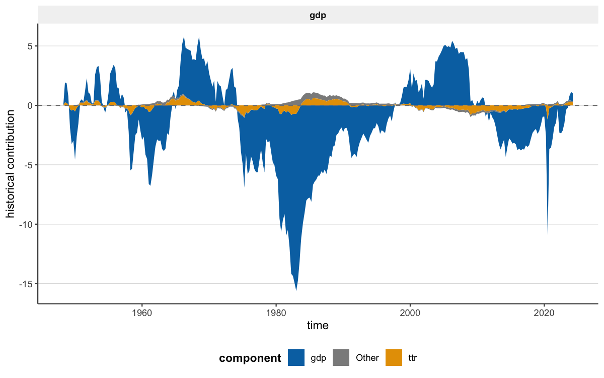

```{r, include = FALSE}
knitr::opts_chunk$set(collapse = TRUE, comment = "#>", eval = FALSE)
```

```{r setup, eval = TRUE, include = FALSE}
library(bsvarPost)
post     <- readRDS("fixtures/fiscal_post_bsvar.rds")
post_alt <- readRDS("fixtures/fiscal_post_bsvar_alt.rds")
```

`bsvarPost` is a companion post-estimation package for `bsvars` and `bsvarSIGNs`.
It does not estimate models. Instead it provides:

- tidy extraction of impulse responses, CDMs, FEVD, and forecasts
- model comparison utilities across lag specifications or identifying assumptions
- `ggplot2` plot methods and publication-oriented styling
- reporting helpers for `knitr`, `gt`, `flextable`, and CSV

The core question answered in this vignette is: **How do fiscal spending shocks
propagate through the US economy?** We use the `us_fiscal_lsuw` dataset from
`bsvars`, which contains quarterly US data on three variables — `ttr`
(tax-to-revenue), `gs` (government spending), and `gdp` — to estimate a
structural VAR and post-process the results with `bsvarPost`.

## Estimation setup

The code below produces two posterior objects. We use pre-computed results for
build speed — the `readRDS()` calls in the hidden setup chunk have already
loaded them.

```{r, eval = FALSE}
library(bsvars)
library(bsvarPost)

data(us_fiscal_lsuw)
# Variables: ttr (tax-to-revenue), gs (government spending), gdp

# Baseline: p = 1 lag
set.seed(123)
spec     <- specify_bsvar$new(us_fiscal_lsuw, p = 1)
post     <- estimate(spec, S = 200, thin = 1, show_progress = FALSE)

# Alternative: p = 3 lags
set.seed(456)
spec_alt <- specify_bsvar$new(us_fiscal_lsuw, p = 3)
post_alt <- estimate(spec_alt, S = 200, thin = 1, show_progress = FALSE)
```

## Extracting impulse responses

`tidy_irf()` returns a tidy table with posterior summaries (median, credible
interval bounds) for every variable-shock pair at each horizon. The column
`variable` names the responding variable and `shock` names the structural shock.

```{r, eval = TRUE}
irf_tbl <- tidy_irf(post, horizon = 20)
head(irf_tbl)
```

`ggplot2::autoplot()` produces a faceted fan chart — one panel per
variable-shock pair, with shaded credible bands:

```{r, eval = TRUE}
ggplot2::autoplot(irf_tbl)
```

The `gs` shock column shows how a one-standard-deviation increase in government
spending affects `ttr`, `gs`, and `gdp` over 20 quarters.

## Cumulative dynamic multipliers

Cumulative dynamic multipliers (CDMs) integrate the impulse responses over the
horizon, making them the natural quantity for fiscal multiplier analysis.

```{r, eval = TRUE}
cdm_obj <- cdm(post, horizon = 20)
summary(cdm_obj)
```

The pre-rendered figure below, generated from the same posterior at a longer
horizon, gives a cleaner view of the multiplier path:

```{r, echo = FALSE, eval = TRUE, out.width = "100%"}
knitr::include_graphics("figures/cdm-showcase.png")
```

The `gdp` row of the CDM table answers the fiscal-multiplier question directly:
by horizon 20, how much has cumulative GDP responded to the `gs` spending shock?

## Comparing model specifications

Different lag orders can shift the estimated multiplier meaningfully. The
comparison helpers place two posteriors side by side in a single tidy table.

```{r, eval = TRUE}
cmp_irf <- compare_irf(baseline = post, alternative = post_alt, horizon = 20)
head(cmp_irf)
```

The named arguments `baseline` and `alternative` become the `model` column
labels in the output. `ggplot2::autoplot()` overlays both posterior bands:

```{r, echo = FALSE, eval = TRUE, out.width = "100%"}
knitr::include_graphics("figures/compare-irf-showcase.png")
```

CDMs can be compared the same way:

```{r, eval = TRUE}
cmp_cdm <- compare_cdm(baseline = post, alternative = post_alt, horizon = 20)
head(cmp_cdm)
```

The `p = 3` alternative typically shows a slower decay in the `gdp` multiplier,
reflecting richer lag dynamics.

## Forecast error variance decomposition

FEVD measures which structural shocks account for most of the forecast error
variance in each variable. For fiscal analysis, the key question is: what share
of `gdp` volatility is explained by the `gs` shock?

```{r, eval = TRUE}
fevd_tbl <- tidy_fevd(post, horizon = 20)
head(fevd_tbl)
```

The `share` column sums to 100 within each variable-horizon cell (FEVD values
are on a 0-100 percentage scale).

## Plot styling

`bsvarPost` ships three layered styling helpers. They all accept any tidy output
object and apply theme and color presets.

```{r, eval = FALSE}
# Apply a publication theme to an existing autoplot
style_bsvar_plot(
  ggplot2::autoplot(irf_tbl),
  preset  = "paper",
  palette = c("#1b9e77", "#d95f02")
)

# Apply a family-aware template (adds axis labels, titles, etc.)
template_bsvar_plot(
  ggplot2::autoplot(irf_tbl),
  family = "irf",
  preset = "paper"
)

# One-shot publication-ready export
publish_bsvar_plot(irf_tbl, preset = "paper")
```

A pre-rendered representative-response showcase:

```{r, echo = FALSE, eval = TRUE, out.width = "100%"}
knitr::include_graphics("figures/representative-showcase.png")
```

## Historical decomposition plots

Historical decomposition is now split into two complementary workflows:

- full-sample contribution paths with `tidy_hd()`, `plot_hd_stacked()`,
  `plot_hd_overlay()`, and `plot_hd_total()`;
- event-window summaries with `tidy_hd_event()`, `plot_hd_event()`,
  `plot_hd_event_share()`, `plot_hd_event_cumulative()`, and
  `plot_hd_event_distribution()`.

```{r, eval = FALSE}
hd_tbl <- tidy_hd(post)
plot_hd_overlay(post, variables = "gdp", top_n = 3)
plot_hd_stacked(post, variables = "gdp", top_n = 3)
plot_hd_total(post, variables = "gdp", shocks = c("gs", "ttr"))

hd_times <- unique(as.character(tidy_hd(post, draws = TRUE)$time))
plot_hd_event_share(post, start = hd_times[1], end = hd_times[2], top_n = 3)
```

A pre-rendered full-sample HD overlay plot from the same S = 200 posterior:

```{r, echo = FALSE, eval = TRUE, out.width = "100%"}

```

For composition, the stacked view now shows the structural shock contributions
by default. Add `include_baseline = TRUE` when you want the explicit
`Baseline` component and the full displayed decomposition.

```{r, echo = FALSE, eval = TRUE, out.width = "100%"}

```

And `plot_hd_total()` shows the same decomposition from a validation angle by
comparing the observed path to the reconstructed total.

## Reporting helpers

Most `bsvarPost` outputs are tidy data frames and render directly to any table
format. The `preset = "compact"` argument selects a narrower publication column
set.

```{r, eval = TRUE}
as_kable(summary(cdm_obj), preset = "compact", digits = 3)
```

```{r, eval = TRUE}
write_bsvar_csv(cmp_irf, tempfile(fileext = ".csv"), preset = "compact")
```

```{r, eval = requireNamespace("gt", quietly = TRUE)}
as_gt(cmp_irf, caption = "Impulse-response comparison", digits = 3,
      preset = "compact")
```

```{r, eval = requireNamespace("flextable", quietly = TRUE)}
as_flextable(cmp_irf, caption = "Impulse-response comparison", digits = 3,
             preset = "compact")
```

## Next steps

- **Post-Estimation Workflows vignette** — covers historical decomposition,
  including full-sample HD plots and event-window composition views, plus
  hypothesis testing, peak/duration response summaries, and representative-draw
  selection.
- **Hypothesis Testing vignette** — formal posterior probability statements via
  `hypothesis_irf()`, `joint_hypothesis_irf()`, and `simultaneous_irf()`.
