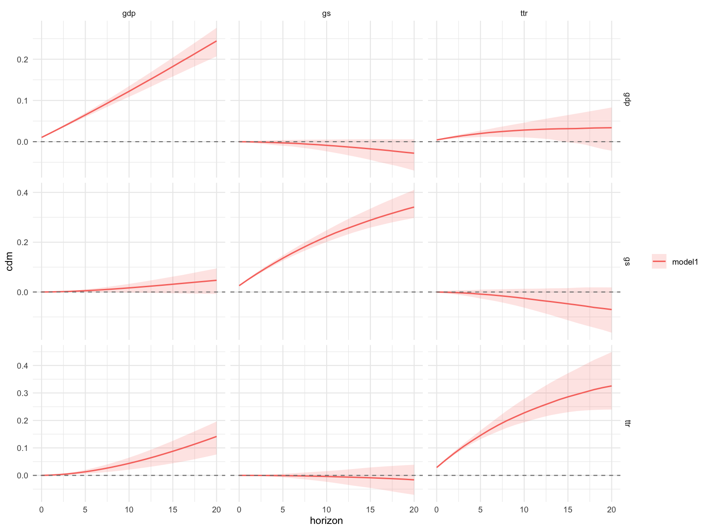

<!-- generated-by: gsd-doc-writer -->

```{r, include = FALSE}
knitr::opts_chunk$set(collapse = TRUE, comment = "#>",
                      fig.width = 7, fig.height = 4)
library(bsvarPost)
post <- readRDS("fixtures/fiscal_post_bsvar.rds")
post_alt <- readRDS("fixtures/fiscal_post_bsvar_alt.rds")
```

`bsvarPost` analyses posterior distributions estimated with `bsvars` and
`bsvarSIGNs`. It summarises posterior quantities in tidy tables and provides
methods for cumulative responses, model comparison, posterior hypothesis
evaluation, representative draws, response timing, and historical-event
analysis.

This guide assumes that you already know how to specify and estimate a model
with one of the parent packages. The examples examine the response of US GDP
(`gdp`) to the government-spending shock (`gs`) using the
`bsvars::us_fiscal_lsuw` data. Precomputed posterior draws reduce computation
time; the same functions can be applied to posterior objects from an empirical
analysis.

## Posterior input

The analysis begins with a posterior distribution estimated by a parent
package. For example, the following code specifies and estimates a Bayesian
structural vector autoregression with `bsvars`:

```{r estimate, eval = FALSE}
data("us_fiscal_lsuw", package = "bsvars")
spec <- bsvars::specify_bsvar$new(us_fiscal_lsuw, p = 1)
post <- bsvars::estimate(spec, S = 2000, thin = 1,
                         show_progress = FALSE)
```

The remaining examples use the precomputed `post` object loaded above. It is a
`PosteriorBSVAR` object and can be passed directly to `bsvarPost` functions.

## Summarise posterior quantities

The `tidy_*()` functions compute posterior summaries in long-format tibbles.
Here, `tidy_irf()` reports posterior medians and 90% pointwise credible
intervals for impulse responses. The resulting table is restricted to four
horizons of the GDP response to a government-spending shock.

```{r tidy-irf}
irf_tbl <- tidy_irf(post, horizon = 12, probability = 0.90)
irf_focus <- subset(irf_tbl, variable == "gdp" & shock == "gs" &
                    horizon %in% c(0, 4, 8, 12),
                    select = c(variable, shock, horizon, median, lower, upper))
irf_focus
```

The same tabular structure applies to other posterior quantities. Summary
tables contain posterior location and credible-interval columns. Set
`draws = TRUE` when an analysis requires the individual posterior draws.

```{r tidy-family, eval = FALSE}
tidy_cdm(post, horizon = 12)       # cumulative responses
tidy_fevd(post, horizon = 12)      # variance shares
tidy_hd(post)                      # historical contributions
tidy_forecast(post, horizon = 8)   # predictive paths
tidy_shocks(post)                  # structural shocks
```

The resulting tables can be filtered, combined with additional variables, or
visualised with a graphics system of the researcher's choice without directly
manipulating posterior arrays.

## Cumulative dynamic responses

`cdm()` computes cumulative dynamic responses for every posterior draw by
accumulating the impulse response through each horizon. `tidy_cdm()` reports
the corresponding posterior summaries and credible intervals.

```{r cdm}
cdm_draws <- cdm(post, horizon = 12)
cdm_tbl <- tidy_cdm(cdm_draws, probability = 0.90)
cdm_focus <- subset(cdm_tbl, variable == "gdp" & shock == "gs" &
                    horizon %in% c(0, 4, 8, 12),
                    select = c(variable, shock, horizon, median, lower, upper))
cdm_focus
```

These quantities are cumulative dynamic responses. Their interpretation as
economic multipliers depends on the transformations and scaling used in the
model; see `?cdm` for the `scale_by` and `scale_var` arguments.

```{r cdm-figure, echo = FALSE, out.width = "100%", fig.alt = "Posterior cumulative dynamic responses with pointwise credible bands"}

```

## Compare model specifications

The second posterior distribution is estimated for the same three-variable
system with a longer lag order. `compare_cdm()` computes comparable posterior
summaries for both specifications. Names assigned to the posterior arguments
identify the specifications in the `model` column.

```{r compare}
cdm_comparison <- compare_cdm(
  baseline = post,
  longer_lag = post_alt,
  horizon = 12,
  probability = 0.90
)
subset(cdm_comparison, variable == "gdp" & shock == "gs" &
       horizon %in% c(4, 8, 12),
       select = c(model, horizon, median, lower, upper))
```

The functions `compare_irf()`, `compare_fevd()`, and the remaining
`compare_*()` methods provide analogous comparisons for other posterior
quantities. These comparisons are descriptive: they report corresponding
posterior summaries across specifications but do not select a preferred model.

```{r comparison-figure, echo = FALSE, out.width = "100%", fig.alt = "Posterior impulse responses under two model specifications"}
knitr::include_graphics("figures/compare-irf-showcase.png")
```

## Evaluate a posterior hypothesis

Consider the posterior probability that the GDP response to the spending shock
is positive at each selected horizon. `hypothesis_irf()` evaluates this
inequality using the posterior draws.

```{r hypothesis}
prob_positive <- hypothesis_irf(
  post,
  variables = "gdp",
  shocks = "gs",
  horizon = c(0, 4, 8, 12),
  relation = ">",
  value = 0
)
prob_positive[, c("variable", "shock", "horizon", "posterior_prob")]
```

`posterior_prob` is a model-conditional posterior probability, not a
frequentist p-value. `joint_hypothesis_irf()` computes the probability that a
condition holds jointly across several horizons, `magnitude_audit()` evaluates
economically meaningful thresholds, and `simultaneous_irf()` constructs a
credible band for an entire selected response path. The
[Inference and Comparison](inference-and-comparison.html) article develops
these distinctions.

## Select a representative draw and summarise response timing

Pointwise medians need not correspond to any single posterior draw.
`median_target_irf()` selects the posterior draw whose response path is closest
to the pointwise posterior median over the requested variables, shocks, and
horizons. The selected path therefore preserves the joint dependence within a
single draw.

```{r representative}
representative <- median_target_irf(
  post,
  horizon = 12,
  variables = "gdp",
  shocks = "gs"
)
representative_path <- subset(summary(representative),
                              variable == "gdp" & shock == "gs")
subset(representative_path, horizon %in% c(0, 4, 8, 12),
       select = c(variable, shock, horizon, median, draw_index, method))
```

`peak_response()` computes the magnitude and horizon of the peak response for
every posterior draw, then reports posterior summaries of both quantities.

```{r representative-figure, echo = FALSE, out.width = "100%", fig.alt = "Representative posterior draw and pointwise posterior summary"}
knitr::include_graphics("figures/representative-showcase.png")
```

```{r timing}
peak <- peak_response(
  post,
  horizon = 12,
  variables = "gdp",
  shocks = "gs",
  absolute = TRUE
)
peak[, c("variable", "shock", "median_value", "median_horizon")]
```

For questions concerning response persistence, `duration_response()`,
`half_life_response()`, and `time_to_threshold()` report related posterior
summaries without reducing the posterior distribution to a single curve.

## Summarise historical decompositions over selected periods

`tidy_hd(draws = TRUE)` returns draw-level contributions of structural shocks
to each observed variable. `tidy_hd_event()` aggregates these contributions
over a substantively selected period, while `shock_ranking()` orders shocks by
their contributions. The following example uses an illustrative four-quarter
period.

```{r hd-event}
hd_draws <- tidy_hd(post, draws = TRUE)
event_tbl <- tidy_hd_event(
  hd_draws,
  start = "1958",
  end = "1958.75"
)

subset(event_tbl, variable == "gdp",
       select = c(variable, shock, event_start, event_end, median))

ranking <- shock_ranking(hd_draws, start = "1958", end = "1958.75",
                         variables = "gdp")
ranking[, c("variable", "shock", "median", "rank")]
```

These functions extend the historical decompositions computed by the parent
package with posterior summaries for selected periods. The choice of period
and the interpretation of shock contributions are discussed in
[Historical-Decomposition Analysis](historical-decomposition-events.html).

```{r hd-overview-figure, echo = FALSE, out.width = "100%", fig.alt = "Structural-shock contributions to GDP over the full sample"}
knitr::include_graphics("figures/hd-overlay-showcase.png")
```

## Present figures and tables

`publish_bsvar_plot()` visualises the representative posterior draw using a
consistent `ggplot2` style. It returns a `ggplot` object that can be annotated
or otherwise modified before saving.

```{r publication-plot}
publish_bsvar_plot(representative_path, family = "irf", preset = "paper",
  title = "GDP response to a government-spending shock",
  caption = "Median-target posterior draw")
```

`as_kable()` reports the selected posterior summary as a formatted table:

```{r publication-table}
as_kable(peak, caption = "Peak absolute GDP response",
         digits = 3, preset = "compact")
```

## Further analyses

- [Inference and Comparison](inference-and-comparison.html) covers joint and
  magnitude hypotheses, simultaneous credible bands, and model comparisons.
- [Historical-Decomposition Analysis](historical-decomposition-events.html)
  covers selected historical periods, structural-shock contributions, and
  shock rankings.
- [Analysis of Sign-Restricted Models](sign-restricted-workflows.html) covers
  `most_likely_admissible_*()`, `restriction_audit()`,
  `acceptance_diagnostics()`, and sign-model comparisons.

The [reference index](https://davidzenz.github.io/bsvarPost/reference/index.html)
documents all functions and their arguments.
