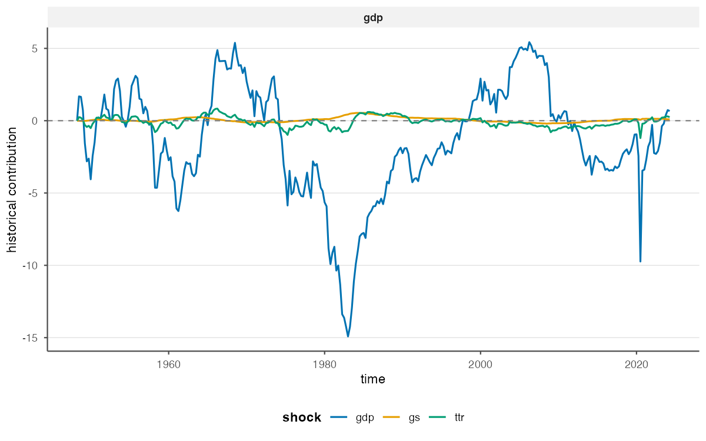
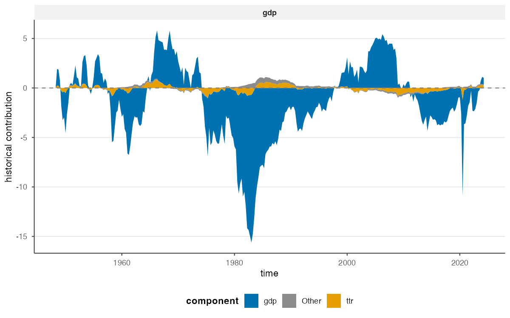

<!-- generated-by: gsd-doc-writer -->

```{r, include = FALSE}
knitr::opts_chunk$set(
  collapse = TRUE,
  comment = "#>",
  fig.width = 7,
  fig.height = 4
)
library(bsvarPost)
post <- readRDS("fixtures/fiscal_post_bsvar.rds")
post_alt <- readRDS("fixtures/fiscal_post_bsvar_alt.rds")
```

Historical decompositions from `bsvars` and `bsvarSIGNs` describe the
contributions of structural shocks to observed variables through time.
`bsvarPost` summarises these contributions over a substantively chosen period,
ranks the shocks within that period, and compares the same event across model
specifications.

This article assumes that you already have a fitted posterior and understand
the identification behind its shock labels. See the parent-package
documentation for estimation and the standard historical-decomposition
analysis. The precomputed fiscal posteriors used here avoid re-estimation and
make the numerical results reproducible.

## Posterior draws of shock contributions

Event-specific summaries require posterior draws rather than a table of
pointwise posterior intervals. Obtain the draw-level contributions with
[`tidy_hd(draws = TRUE)`](../reference/tidy_hd.html):

```{r hd-draws}
hd_draws <- tidy_hd(post, draws = TRUE)

data.frame(
  first = head(unique(as.character(hd_draws$time)), 1),
  last = tail(unique(as.character(hd_draws$time)), 1),
  draws = length(unique(hd_draws$draw))
)
```

Each row identifies a model, variable, shock, observation, and posterior draw.
Retaining the draws ensures that posterior uncertainty is summarised *after*
the contributions have been aggregated over the selected period.

The full-sample decomposition provides context for selecting an event period.
The first figure displays the principal shock contributions separately; the
second displays their composition.

```{r hd-overlay-figure, echo = FALSE, out.width = "100%", fig.alt = "Structural-shock contributions to GDP over the full sample"}

```

```{r hd-composition-figure, echo = FALSE, out.width = "100%", fig.alt = "Stacked structural-shock contributions to GDP over the full sample"}

```

## Define the event period before ranking shocks

The event period is determined by the empirical question rather than by the
estimated ranking of shocks. A defensible analysis therefore usually does
three things:

1. Define the dates from the research question or an external chronology,
   before inspecting which shock ranks first.
2. Match `start` and `end` to the model's time labels and use a window consistent
   with the data frequency.
3. Repeat the analysis over reasonable neighboring windows as a sensitivity
   check, without silently replacing the prespecified result.

For this example, we use the complete four-quarter period from `1958` to
`1958.75`. It is a convenient interval covered by both stored posterior
samples; the example does not assign a particular historical interpretation to
this period. The samples contain only 200 posterior draws, and the
interpretation of the shock names follows from the identification of the
fitted model.

```{r event-window}
event_start <- "1958"
event_end <- "1958.75"

event <- tidy_hd_event(
  hd_draws,
  start = event_start,
  end = event_end,
  probability = 0.90
)

subset(
  event,
  variable == "gdp",
  select = c(variable, shock, event_start, event_end,
             median, lower, upper)
)
```

[`tidy_hd_event()`](../reference/tidy_hd_event.html) sums each shock's
contribution across the inclusive period separately for each posterior draw,
then reports posterior summaries. Set `draws = TRUE` when a subsequent
calculation requires the aggregated draws themselves.

The largest posterior median should not be interpreted as certainty about a
shock's historical importance. The interval columns report posterior
uncertainty, while the structural interpretation of each shock follows from
the identification of the original model.

## Rank shock contributions

[`shock_ranking()`](../reference/shock_ranking.html) orders shocks separately
within each model-variable panel. Restricting to `gdp` keeps the result aligned
with one research question.

```{r rank-shocks}
ranking <- shock_ranking(
  hd_draws,
  start = event_start,
  end = event_end,
  variables = "gdp",
  ranking = "absolute",
  probability = 0.90
)

ranking[, c("variable", "shock", "median", "lower", "upper", "rank")]
```

`ranking = "absolute"` answers which shock has the largest median contribution
in absolute value. Use `ranking = "signed"` when the direction of the
contribution is part of the estimand. In either case, `rank` summarises the
posterior median; overlapping credible intervals may indicate substantial
uncertainty about the ordering.

The ranked-contribution plot displays the sign and scale of each contribution
while ordering the bars by the absolute posterior median.

```{r ranking-plot}
ranking_plot <- publish_bsvar_plot(
  ranking,
  family = "shock_ranking",
  preset = "paper",
  title = "GDP contributions during the selected window",
  caption = "Bars are posterior medians; uncertainty remains in the event table."
)
ranking_plot
```

To visualise contributions without ranking them, use
[`plot_hd_event()`](../reference/plot_hd_event.html). The more specialized
[`plot_hd_event_share()`](../reference/plot_hd_event_share.html),
[`plot_hd_event_cumulative()`](../reference/plot_hd_event_cumulative.html), and
[`plot_hd_event_distribution()`](../reference/plot_hd_event_distribution.html)
report the composition of contributions, their accumulation within the selected
period, and their posterior distributions, respectively.

## Compare the same event across specifications

When assessing sensitivity to the lag order or prior distribution, the event
definition should remain fixed. [`compare_hd_event()`](../reference/compare_hd_event.html)
applies the same period to named posterior objects and returns estimates
indexed by model specification.

```{r compare-event}
event_comparison <- compare_hd_event(
  baseline = post,
  alternative = post_alt,
  start = event_start,
  end = event_end,
  probability = 0.90
)

comparison_gdp <- subset(
  event_comparison,
  variable == "gdp",
  select = c(model, shock, event_start, event_end,
             median, lower, upper)
)
comparison_gdp
```

This comparison is descriptive. Similar estimates across specifications
provide evidence of robustness, but `compare_hd_event()` neither selects a
preferred model nor computes the posterior probability that the specifications
differ. When comparing additional periods, retain names such as `baseline` and
`alternative` to identify each specification in tables and figures.

## Report posterior summaries

The comparison can be reported in a labelled table, and the ranked-contribution
plot can be saved separately. Both objects remain standard R objects, so
captions, annotations, and journal-specific formatting can be added as needed.

```{r publication-table}
as_kable(
  comparison_gdp,
  caption = "GDP shock contributions in the selected event window",
  digits = 2,
  preset = "compact"
)
```

```{r save-plot, eval = FALSE}
ggplot2::ggsave(
  "shock-ranking-1958.pdf",
  ranking_plot,
  width = 7,
  height = 4
)
```

For an introduction to posterior summaries, response comparisons, and
posterior probability statements, see [Post-estimation Analysis with bsvarPost](bsvarPost.html). For
diagnostics specific to sign-restricted identification, continue to the
dedicated bsvarSIGNs article.
