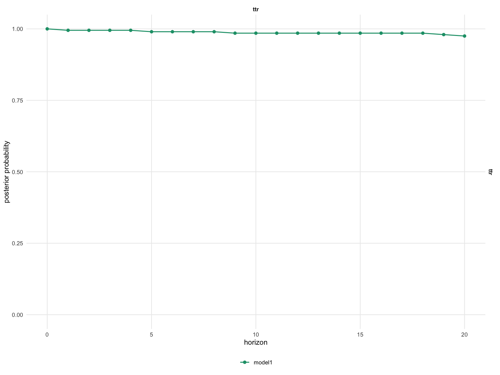

```{r, include = FALSE}
knitr::opts_chunk$set(collapse = TRUE, comment = "#>", eval = FALSE)
```

```{r setup, eval = TRUE, include = FALSE}
library(bsvarPost)
post     <- readRDS("fixtures/fiscal_post_bsvar.rds")
post_alt <- readRDS("fixtures/fiscal_post_bsvar_alt.rds")
```

Bayesian structural VARs produce full posterior distributions over impulse
responses and cumulative dynamic multipliers — not just point estimates.
`bsvarPost` turns this richness into formal probability statements: instead
of asking "is the effect significant?", researchers can ask "what fraction of
posterior draws show a positive GDP response to a fiscal spending shock at
horizon 8?"

This vignette demonstrates four tools: pointwise hypotheses (`hypothesis_irf()`),
joint hypotheses (`joint_hypothesis_irf()`), simultaneous credible bands
(`simultaneous_irf()`), and magnitude auditing (`magnitude_audit()`). All
examples use the same `us_fiscal_lsuw` fiscal policy narrative — does a
government spending shock (`gs`) increase output (`gdp`)?

Estimation code (not run during `R CMD check`):

```{r estimation-code}
library(bsvarPost)
library(bsvars)
data(us_fiscal_lsuw, package = "bsvars")
set.seed(123)
spec <- specify_bsvar$new(us_fiscal_lsuw, p = 1)
post <- estimate(spec, S = 200, show_progress = FALSE)
```

## Pointwise posterior probabilities

The most direct question: what fraction of posterior draws satisfy a condition
at a given horizon?

```{r hypothesis-irf, eval = TRUE}
# Posterior probability that gdp responds positively to gs at horizon 8
h_irf <- hypothesis_irf(
  post,
  variables = 3,
  shocks    = 2,
  horizon   = 8,
  relation  = ">",
  value     = 0
)
h_irf
```

The `posterior_prob` column reports the fraction of draws satisfying the
condition — a direct probability statement, not a p-value.

The same test applies to cumulative dynamic multipliers (CDMs), the standard
measure of fiscal multiplier effects:

```{r hypothesis-cdm, eval = TRUE}
# Same test for the cumulative dynamic multiplier at horizon 8
h_cdm <- hypothesis_cdm(
  post,
  variables = 3,
  shocks    = 2,
  horizon   = 8,
  relation  = ">",
  value     = 0
)
h_cdm
```

Both functions return a `bsvar_post_tbl` with the posterior probability,
mean and median gap from the threshold, and equal-tailed credible bounds.

## Joint posterior hypotheses

A stronger question is whether GDP is positive at *every* horizon from impact
through horizon 8. This joint probability is typically much lower than any
single pointwise probability.

```{r joint-hypothesis, eval = TRUE}
# Joint probability: gdp positive at ALL horizons 0 through 8
jh <- joint_hypothesis_irf(
  post,
  variable = "gdp",
  shock    = "gs",
  horizon  = 0:8,
  relation = ">",
  value    = 0
)
jh
```

`n_constraints` records how many conditions were intersected. A pre-rendered
figure showing the probability profile across horizons:

```{r hypothesis-figure, echo = FALSE, eval = TRUE, out.width = "100%"}

```

The figure illustrates how pointwise probabilities can remain high while the
joint probability is substantially lower — any draw that fails at even one
horizon is excluded from the joint count.

## Simultaneous credible bands

Pointwise credible intervals cover each horizon independently. Simultaneous
bands are wider but provide the stronger guarantee: with 90% posterior
probability, the *entire IRF path* lies inside the band.

```{r simultaneous-irf, eval = TRUE}
# 90% simultaneous band for the gdp response to the gs shock
sim_irf <- simultaneous_irf(
  post,
  horizon   = 20,
  variables = 3,
  shocks    = 2
)
head(sim_irf)
```

The `critical_value` column records the sup-norm threshold: draws whose
maximum deviation from the posterior median exceeds this value are excluded.
The same approach applies to CDMs:

```{r simultaneous-cdm, eval = TRUE}
# 90% simultaneous band for the cumulative fiscal multiplier
sim_cdm <- simultaneous_cdm(
  post,
  horizon   = 20,
  variables = 3,
  shocks    = 2
)
head(sim_cdm)
```

The CDM band covers the entire cumulative multiplier path from impact through
horizon 20 with 90% posterior probability.

## Magnitude auditing

Beyond sign, researchers often care about magnitude. What fraction of draws
show a fiscal multiplier exceeding 1.0 at horizon 8?

```{r magnitude-audit-baseline, eval = TRUE}
mag_base <- magnitude_audit(
  post,
  type     = "cdm",
  variable = "gdp",
  shock    = "gs",
  horizon  = 8,
  relation = ">",
  value    = 1
)
mag_base
```

`magnitude_audit()` reports how often the posterior satisfies a magnitude
condition — it does not constrain the model. Comparing across lag lengths:

```{r magnitude-audit-alt, eval = TRUE}
mag_alt <- magnitude_audit(
  post_alt,
  type     = "cdm",
  variable = "gdp",
  shock    = "gs",
  horizon  = 8,
  relation = ">",
  value    = 1
)
mag_alt
```

A higher `posterior_prob` in the alternative 3-lag specification indicates
more support for large multipliers when richer lag dynamics are allowed.

## Comparing hypothesis results across models

Collecting pointwise probabilities for both models and formatting with
`as_kable()` gives a compact comparison:

```{r compare-hypothesis, eval = TRUE}
h_base <- hypothesis_irf(post, variables = 3, shocks = 2,
                         horizon = 0:8, relation = ">", value = 0, model = "p=1")
h_alt  <- hypothesis_irf(post_alt, variables = 3, shocks = 2,
                         horizon = 0:8, relation = ">", value = 0, model = "p=3")
as_kable(h_base, digits = 2, preset = "compact")
as_kable(h_alt,  digits = 2, preset = "compact")
```

Stable probabilities across lag specifications strengthen the economic
conclusion; large shifts suggest specification sensitivity.

## Summary

`bsvarPost` provides a coherent hypothesis testing toolkit for Bayesian SVAR
analysis:

- `hypothesis_irf()` / `hypothesis_cdm()`: pointwise posterior probabilities
  at specified horizons
- `joint_hypothesis_irf()`: joint probability across all selected horizons
- `simultaneous_irf()` / `simultaneous_cdm()`: bands covering the full path
- `magnitude_audit()`: how often a magnitude condition is satisfied

All results are proper Bayesian posterior probability statements, not
frequentist p-values: a probability of 0.92 means 92% of posterior draws
satisfy the condition, with no asymptotic approximation required.
