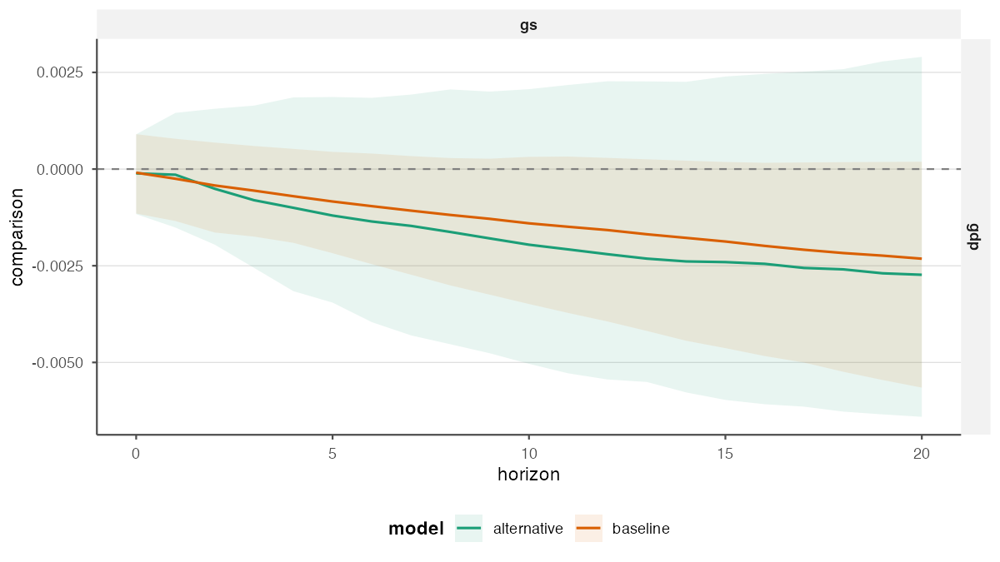
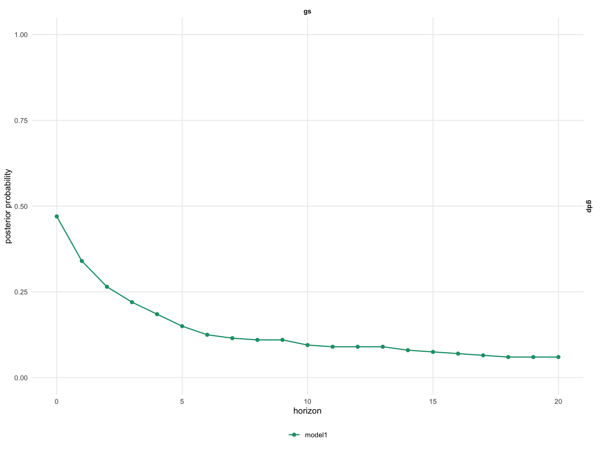
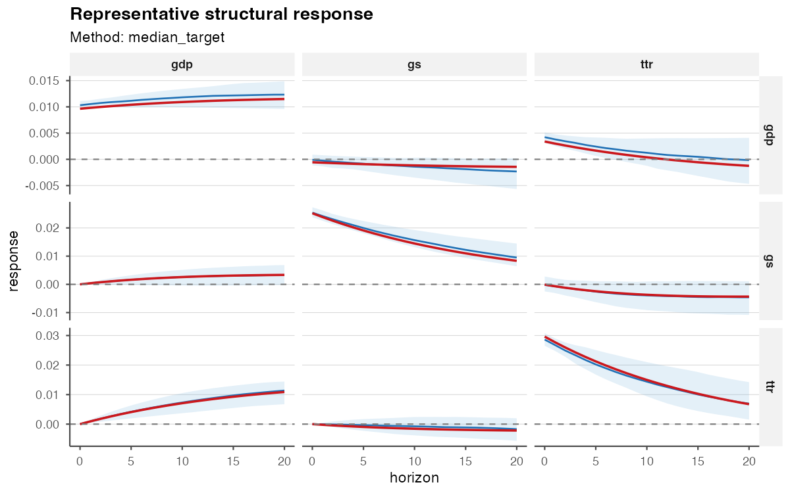

<!-- generated-by: gsd-doc-writer -->

```{r, include = FALSE}
knitr::opts_chunk$set(collapse = TRUE, comment = "#>")
library(bsvarPost)
post <- readRDS("fixtures/fiscal_post_bsvar.rds")
post_alt <- readRDS("fixtures/fiscal_post_bsvar_alt.rds")
```

This article considers inferential questions that cannot be answered from a
pointwise posterior median alone. The running example compares two lag orders
for a Bayesian structural VAR estimated with `bsvars::us_fiscal_lsuw`. The
quantity of interest is the response of GDP to a government-spending shock; no
sign or magnitude is imposed in advance.

The precomputed posterior objects contain 200 retained draws. They can be
replaced with any compatible posterior object estimated with `bsvars` or
`bsvarSIGNs`.

## Is the conclusion sensitive to specification?

To evaluate sensitivity to the lag order, `compare_irf()` computes posterior
summaries for both model specifications in a single table. Named arguments
identify the specifications, while the remaining columns have the same meaning
as in `tidy_irf()`.

```{r compare-specifications}
comparison <- compare_irf(
  baseline = post,
  longer_lag = post_alt,
  horizon = 12,
  probability = 0.90
)

subset(
  comparison,
  variable == "gdp" & shock == "gs" & horizon %in% c(0, 4, 8, 12),
  select = c(model, horizon, median, lower, upper))
```

Differences in posterior medians or credible intervals indicate sensitivity to
the model specification; they do not constitute a formal model-selection
criterion. Corresponding comparisons are available for
[CDMs](../reference/compare_cdm.html),
[FEVDs](../reference/compare_fevd.html),
[forecasts](../reference/compare_forecast.html), and
[historical-decomposition events](../reference/compare_hd_event.html).

```{r comparison-figure, echo = FALSE, out.width = "100%", fig.alt = "Posterior impulse responses under two model specifications"}

```

## How much posterior support does a statement have?

### Pointwise support

For a hypothesis at selected horizons, `hypothesis_irf()` reports the proportion
of posterior draws that satisfy the stated inequality. Here the hypothesis is
that the response of GDP is positive.

```{r pointwise-probability}
positive_gdp <- hypothesis_irf(
  post,
  variables = "gdp",
  shocks = "gs",
  horizon = c(0, 4, 8, 12),
  relation = ">",
  value = 0
)

positive_gdp[, c("horizon", "posterior_prob", "median_gap",
                 "lower_gap", "upper_gap")]
```

`posterior_prob` is the posterior probability of the stated inequality,
conditional on the model specification; it is not a p-value. The gap columns
summarise the posterior distribution of the response minus the threshold and
therefore retain information about the magnitude of the response. Use
[`hypothesis_cdm()`](../reference/hypothesis_cdm.html) for the same question
about cumulative responses.

```{r hypothesis-figure, echo = FALSE, out.width = "100%", fig.alt = "Posterior probability that an impulse response is positive at each horizon"}

```

### Joint support across a path

Pointwise probabilities do not give the probability that all conditions are
satisfied simultaneously. For the stronger hypothesis that the response is
positive from impact through horizon 8, `joint_hypothesis_irf()` evaluates the
intersection of the nine inequalities within each posterior draw.

```{r joint-probability}
positive_path <- joint_hypothesis_irf(
  post,
  variable = "gdp",
  shock = "gs",
  horizon = 0:8,
  relation = ">",
  value = 0
)

positive_path[, c("posterior_prob", "n_constraints")]
```

The joint posterior probability can be considerably smaller than its pointwise
counterparts because all nine inequalities must hold in the same posterior
draw. See
[`joint_hypothesis_cdm()`](../reference/joint_hypothesis_cdm.html) for cumulative
paths.

### A magnitude question

A hypothesis about the sign alone may not address the economically relevant
magnitude. Suppose `0.001` is a prespecified, substantively meaningful response
on the scale used to estimate the model. `magnitude_audit()` reports the
posterior probability that the absolute response exceeds this threshold at
horizon 8.

```{r magnitude-question, warning = FALSE}
material_response <- magnitude_audit(
  post,
  type = "irf",
  variable = "gdp",
  shock = "gs",
  horizon = 8,
  relation = ">",
  value = 0.001,
  absolute = TRUE
)

material_response[, c("posterior_prob", "median_gap",
                       "lower_gap", "upper_gap")]
```

The threshold should follow from the variable transformation and the empirical
application, and should not be selected from the posterior results. To evaluate
cumulative dynamic multipliers, set `type = "cdm"`; the available scaling
options are documented in
[`magnitude_audit()`](../reference/magnitude_audit.html).

## Does an interval cover the whole path?

Ordinary credible intervals have pointwise coverage. A 90% simultaneous
credible band uses a single sup-norm critical value for the selected response
path, so that 90% of posterior draws lie within the band over the complete
selection.

```{r simultaneous-band}
gdp_band <- simultaneous_irf(
  post,
  horizon = 12,
  probability = 0.90,
  variables = "gdp",
  shocks = "gs"
)

gdp_band[gdp_band$horizon %in% c(0, 4, 8, 12),
         c("horizon", "median", "lower", "upper", "simultaneous_prob")]
```

The band applies only to the response variables, structural shocks, and horizons
used in its construction. Expanding this set generally widens the band. Use
[`simultaneous_cdm()`](../reference/simultaneous_cdm.html) for cumulative
responses and [`plot_simultaneous()`](../reference/plot_simultaneous.html) when
a graphical representation facilitates interpretation of the response path.

## Which single draw represents the posterior center?

A response path formed from pointwise posterior medians need not correspond to
any retained parameter draw. `median_target_irf()` instead selects the draw
closest to the median target over the specified responses and horizons.
Including both GDP and government spending in the target ensures that the two
reported paths correspond to the same structural model draw.

```{r median-target}
representative <- median_target_irf(
  post, horizon = 12,
  variables = c("gdp", "gs"),
  shocks = "gs", horizons = 0:12
)

representative$draw_index

rep_path <- summary(representative)
subset(
  rep_path,
  variable == "gdp" & shock == "gs" & horizon %in% c(0, 4, 8, 12),
  select = c(horizon, median, draw_index, method))
```

This draw is appropriate when a subsequent calculation requires one internally
consistent structural model. It is a representative draw, not a measure of
posterior uncertainty; the full posterior distribution and its credible
intervals should also be reported. The same selection is available for
[CDMs](../reference/median_target_cdm.html). For sign-restricted models, a
distinct [most-likely admissible draw](../reference/most_likely_admissible_irf.html)
can be selected.

```{r representative-figure, echo = FALSE, out.width = "100%", fig.alt = "Representative posterior draw and pointwise posterior summary"}

```

## When does the response arrive and fade?

The response-timing functions compute the relevant quantity for each posterior
draw before summarising its distribution. Consequently, uncertainty about
timing is not inferred from a single posterior median response. As an example
of persistence, consider the response of government spending to its own shock
over 20 quarters.

```{r response-timing}
peak <- peak_response(post, horizon = 20, variables = "gs", shocks = "gs",
                      absolute = TRUE)
duration <- duration_response(
  post, horizon = 20, variables = "gs", shocks = "gs",
  relation = ">", value = 0, mode = "consecutive")
half_life <- half_life_response(
  post, horizon = 20, variables = "gs", shocks = "gs", baseline = "peak")
threshold <- time_to_threshold(
  post, horizon = 20, variables = "gs", shocks = "gs",
  relation = "<", value = 0.015)

data.frame(
  question = c("absolute peak", "positive spell", "half-life", "below 0.015"),
  posterior_median = c(
    peak$median_horizon,
    duration$median_duration,
    half_life$median_half_life,
    threshold$median_horizon
  ),
  unit = c("horizon", "periods", "periods after peak", "horizon"),
  reached_prob = c(NA, NA, half_life$reached_prob, threshold$reached_prob)
)
```

For half-life and threshold summaries, `reached_prob` is the posterior
probability that the event occurs within the selected horizon. A conditional
median may appear precise even when this probability is small.
`peak_response()` also reports the posterior distribution of the peak value.
Alternative definitions are documented for
[`duration_response()`](../reference/duration_response.html),
[`half_life_response()`](../reference/half_life_response.html), and
[`time_to_threshold()`](../reference/time_to_threshold.html).

## Choose the statement that matches the question

- Use `compare_*()` to evaluate sensitivity across model specifications.
- Use `hypothesis_*()` to compute pointwise posterior probabilities.
- Use `joint_hypothesis_*()` when all selected inequalities must hold
  simultaneously.
- Use `magnitude_audit()` to evaluate a prespecified, economically relevant
  threshold.
- Use `simultaneous_*()` when the inferential statement concerns coverage of an
  entire selected response path.
- Use a median-target draw only when one coherent retained model draw is
  required.
- Use response-timing summaries to report when, for how long, and with what
  probability a response reaches a specified event; these summaries do not
  replace the posterior distribution of the response.

For posterior diagnostics and representative draws in sign-restricted models,
see [Analysis of Sign-Restricted Models](sign-restricted-workflows.html). The
[reference index](https://davidzenz.github.io/bsvarPost/reference/index.html)
documents related variants and plotting methods.
