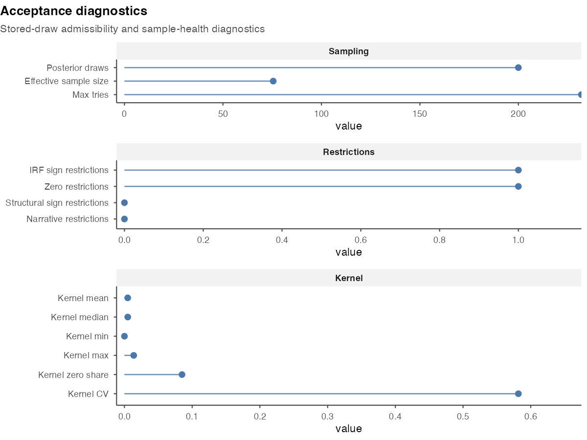
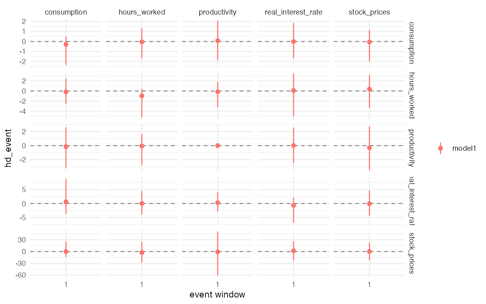
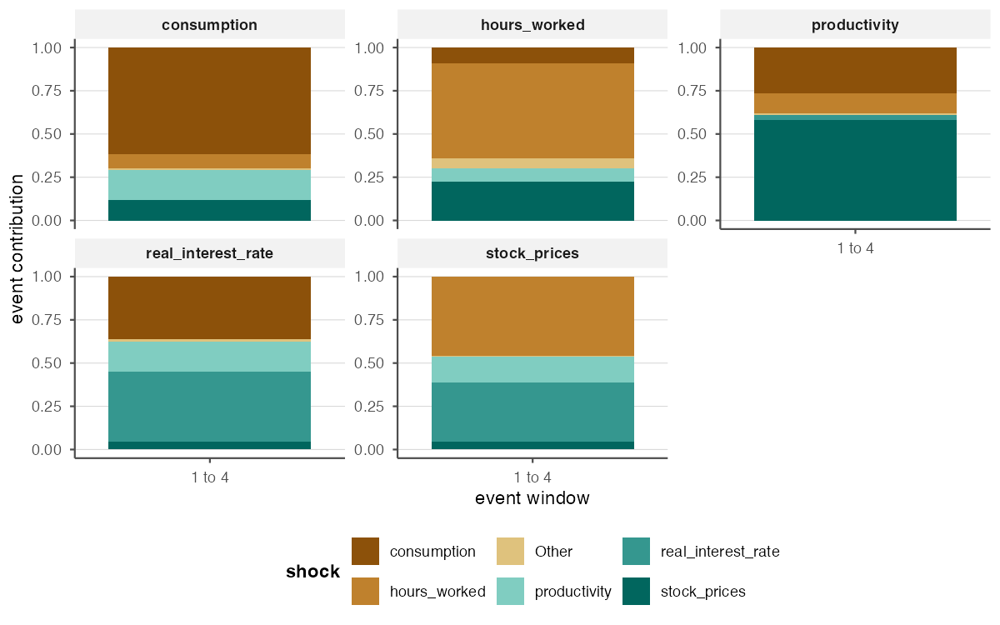

<!-- generated-by: gsd-doc-writer -->

```{r, include = FALSE}
knitr::opts_chunk$set(collapse = TRUE, comment = "#>", fig.width = 7,
  fig.height = 4)
library(bsvarPost)
```

This article presents posterior analyses for a `PosteriorBSVARSIGN` object
estimated with [`bsvarSIGNs`](https://bsvars.org/bsvarSIGNs/). The identifying
scheme can combine sign and zero restrictions on impulse responses, sign
restrictions on the structural matrix and structural shocks, and narrative
restrictions on structural shocks and historical decompositions.

Three distinct posterior quantities are considered:

| Question | Function | What the result means |
|---|---|---|
| Which admissible draw is representative of the posterior distribution? | `most_likely_admissible_irf()` or `most_likely_admissible_cdm()` | One posterior draw selected according to its admissibility weight |
| What is the posterior probability that each restriction is satisfied? | `restriction_audit()` | Posterior satisfaction probability for each fitted restriction |
| Does the stored sample contain sufficient effective information and admissibility support? | `acceptance_diagnostics()` | Effective sample size (ESS), search settings, restriction counts, and the distribution of admissibility weights |

These quantities have different interpretations. A representative draw is one
joint draw from the posterior distribution and does not imply high posterior
probabilities for all restrictions. Similarly, high restriction probabilities
do not imply a large effective sample size or a dispersed distribution of
admissibility weights.

## Posterior distribution

The example uses the `optimism` data from **bsvarSIGNs**. The zero restriction
excludes the contemporaneous response of productivity to the optimism shock,
whereas the sign restriction imposes a positive contemporaneous response of
stock prices. The model is specified with `specify_bsvarSIGN$new()` and its
posterior distribution is estimated with `estimate()`.

```{r estimate-sign-model, eval = FALSE}
data("optimism", package = "bsvarSIGNs")

sign_irf <- matrix(c(0, 1, rep(NA_real_, 23)), 5, 5)
spec_sign <- bsvarSIGNs::specify_bsvarSIGN$new(optimism * 100, p = 4,
  sign_irf = sign_irf)

set.seed(123)
post_sign <- bsvars::estimate(spec_sign, S = 2000, thin = 1,
  show_progress = FALSE)
```

The remaining examples can be evaluated after estimating `post_sign`. They are
not evaluated when building the article because a sign-restricted posterior is
not stored in the package.

## Representative admissible draws

`most_likely_admissible_irf()` orders posterior draws by the admissibility
kernel of the sign-restricted model. When several draws attain the largest
weight, it selects the draw closest to the posterior median impulse responses.
The result contains the impulse responses associated with one joint posterior
draw rather than pointwise marginal quantiles.

```{r representative-irf, eval = FALSE}
rep_irf <- most_likely_admissible_irf(post_sign, horizon = 12)

rep_irf$draw_index
rep_irf$score

rep_path <- subset(summary(rep_irf),
  variable == "productivity" & shock == "productivity" &
    horizon %in% c(0, 4, 8, 12),
  select = c(variable, shock, horizon, median, draw_index, method, score))
rep_path
```

The `plot()` method displays the selected impulse responses together with their
pointwise posterior summaries. The red line represents the selected posterior
draw. It is neither a credible interval nor a comparison of model
specifications.

```{r plot-representative, eval = FALSE}
plot(rep_irf)
```

`most_likely_admissible_cdm()` applies the same criterion to cumulative dynamic
responses computed for each posterior draw.

```{r representative-cdm, eval = FALSE}
rep_cdm <- most_likely_admissible_cdm(post_sign, horizon = 12)
summary(rep_cdm)
plot(rep_cdm)
```

The two functions answer different empirical questions. The first selects a
draw using impulse responses, whereas the second uses cumulative dynamic
responses. Therefore, they need not select the same posterior draw.

## Posterior probabilities of restrictions

`restriction_audit()` evaluates the impulse-response, zero, structural, and
narrative restrictions specified for a `PosteriorBSVARSIGN` object. For each
restriction, the posterior probability is estimated by the proportion of
stored posterior draws that satisfy it.

```{r restriction-audit, eval = FALSE}
audit <- restriction_audit(post_sign, zero_tol = 1e-6)
audit_focus <- audit[, c("restriction_type", "restriction", "relation",
                         "posterior_prob")]
audit_focus
```

The argument `zero_tol` sets the numerical tolerance for zero restrictions.
Its value should be chosen with respect to the scale of the responses and
reported with the results.

`plot_restriction_audit()` plots the posterior probabilities of the selected
restrictions. Formatted labels change their presentation but not their
definitions.

```{r plot-restrictions, eval = FALSE}
plot_restriction_audit(audit, label_style = "pretty",
  restriction_types = c("irf_sign", "irf_zero"))
```

These probabilities are conditional on the estimated posterior distribution
and, for zero restrictions, on the chosen tolerance. They are not sampler
acceptance rates and do not describe the concentration of admissible posterior
draws.

## Posterior sample diagnostics

`acceptance_diagnostics()` summarises the stored posterior sample. It reports
the number of draws, effective sample size, `max_tries`, the numbers of
restrictions, and the distribution of admissibility weights.

```{r acceptance-diagnostics, eval = FALSE}
diag <- acceptance_diagnostics(post_sign, ess_threshold = 100,
  sparse_threshold = 0.10)

subset(diag,
  metric %in% c(
    "posterior_draws", "effective_sample_size", "max_tries",
    "kernel_zero_share", "kernel_cv"),
  select = c(metric, value, flag, message))
```

`effective_sample_size` measures the effective number of posterior draws.
`kernel_zero_share` is the proportion of approximately zero admissibility
weights, and `kernel_cv` measures their relative dispersion. The restriction
counts and `max_tries` describe the search for admissible rotations.

The thresholds indicate a small effective sample or limited admissibility
support. They are not general decision rules. Moreover, the stored posterior
object does not contain the complete sequence of proposed and rejected draws.

The following figure presents these diagnostics for the sign-restricted model
above using 200 retained posterior draws.

```{r diagnostics-figure, echo = FALSE, out.width = "100%", fig.alt = "Posterior-sample and admissibility diagnostics for a sign-restricted model"}

```

```{r plot-diagnostics, eval = FALSE}
plot_acceptance_diagnostics(diag,
  metrics = c("effective_sample_size", "kernel_zero_share", "kernel_cv"),
  title = "Stored-sample diagnostics")
```

## Historical decompositions

Historical decompositions attribute the observed series to the estimated
structural shocks. For a selected period, the posterior contributions can be
reported in levels or as proportions of their total magnitude. The figures
below present both summaries over observations 1 to 4.

```{r sign-hd-event-figure, echo = FALSE, out.width = "100%", fig.alt = "Posterior structural-shock contributions over observations one to four"}

```

```{r sign-hd-share-figure, echo = FALSE, out.width = "100%", fig.alt = "Proportional structural-shock contributions over observations one to four"}

```

## Comparison of model specifications

The posterior probabilities and sample diagnostics can be compared across
alternative sign-restricted specifications. The specifications should contain
the same variables and comparable identifying restrictions. The argument
names identify the specifications in the resulting tables.

```{r fit-alternative, eval = FALSE}
spec_sign_alt <- bsvarSIGNs::specify_bsvarSIGN$new(optimism * 100, p = 2,
  sign_irf = sign_irf)

set.seed(456)
post_sign_alt <- bsvars::estimate(spec_sign_alt, S = 2000, thin = 1,
  show_progress = FALSE)
```

The restriction probabilities and posterior sample diagnostics are computed
separately.

```{r compare-sign-models, eval = FALSE}
restriction_comparison <- compare_restrictions(baseline = post_sign,
  shorter_lag = post_sign_alt, zero_tol = 1e-6)

diagnostic_comparison <- compare_acceptance_diagnostics(
  baseline = post_sign,
  shorter_lag = post_sign_alt,
  ess_threshold = 100,
  sparse_threshold = 0.10)
```

`compare_restrictions()` reports posterior restriction probabilities for each
specification. `compare_acceptance_diagnostics()` reports the corresponding
posterior sample diagnostics. These comparisons describe the estimated
posterior distributions and do not rank the economic plausibility of the
identifying assumptions.

```{r plot-sign-comparisons, eval = FALSE}
plot_compare_restrictions(restriction_comparison,
  restriction_types = c("irf_sign", "irf_zero"))

plot_acceptance_diagnostics(
  diagnostic_comparison,
  metrics = c("effective_sample_size", "kernel_zero_share", "kernel_cv"))
```

## Summary

For the analysis of sign-restricted models:

1. Report the effective sample size and the distribution of admissibility
   weights using `acceptance_diagnostics()`.
2. Report posterior restriction probabilities using `restriction_audit()`.
3. Use a most-likely-admissible impulse or cumulative response when one joint
   posterior draw is required.
4. Compare restriction probabilities and posterior sample diagnostics across
   economically relevant model specifications.

For posterior summaries, probability statements, response timing, plots, and
tables, see [Post-estimation Analysis with bsvarPost](bsvarPost.html). The
[function reference](https://davidzenz.github.io/bsvarPost/reference/index.html)
documents filters, tolerances, and plotting arguments.
